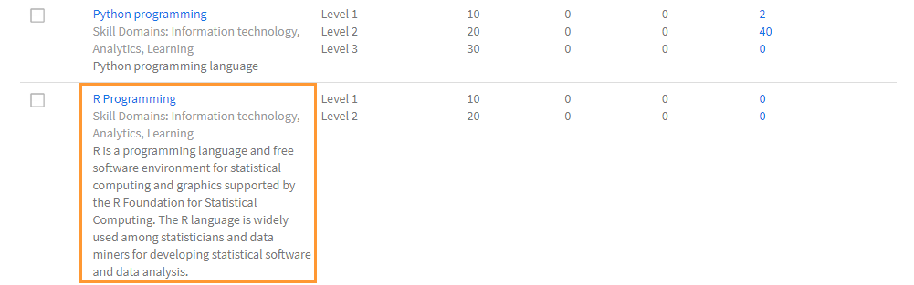
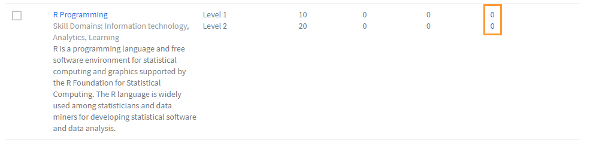
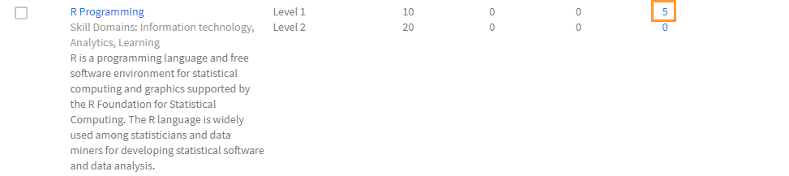
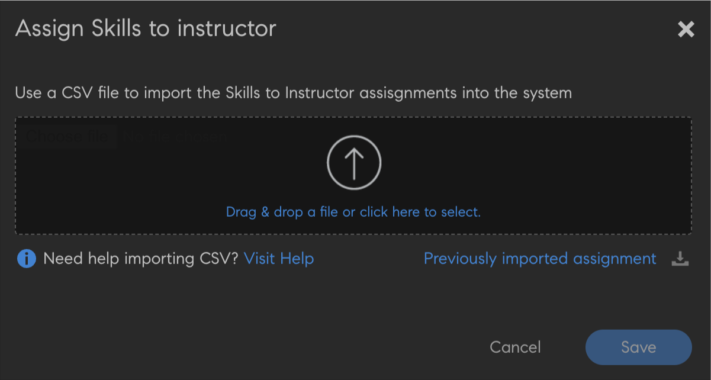

# Create and modify skills and levels

Create, assign, and modify skills and levels.

Skills map is a grouping of skill sets, knowledge, and traits of an employee in an organization. These skills maps help companies/organizations to set or raise the performance expectations for its employees. Skills enable employees to align their behaviors to organizational expectations.

Adobe Learning Manager enables you to map the performance of learners based on their skill sets using skills map. When learners complete taking up some courses, learners can know their standing against each skill by viewing the skill maps.

The fundamental purpose of Skills in the Learning Manager LMS is to provide the Administrator with a tool that aligns learning with business goals.

## Add a skill {#addaskill}

As an Administrator, you can perform the following:

* Map a domain to a skill.
* Add multiple levels of a skill.
* Add a badge to a level.

To add a skill, follow the steps below:

1. On the left pane, click **[!UICONTROL Skills]**. Give the skill a name and description.

   
   
   *Add name and description of a skill*

1. Assign a domain to the skill. While creating a skill, you can map it with the most relevant skill domains that Learning Manager supports. For more information, see [***Map skill with domains***](/help/migrated/administrators/feature-summary/curation-skills.md).

   Start typing the domain in the field and you can see recommendations. Pick the option or options that is/are relevant to the skill.

   
   
   *Add a domain*

1. Assign the levels to the skill. To add a level, click **[!UICONTROL Add]**.

   You can create and assign Skills to employees. There are various levels to skills and every level requires a certain number of credits to be earned.

   You can assign a maximum of three levels to one skill. The learning path is that of enrolling learners to various Learning Objects, which then translate to a certain number of credits that fulfill the requirements for the various levels of a skill.

   Once these Learning Objects (LOs) and levels have been achieved, the learner is now equipped to perform at a more productive level than before.

   
   
   *Add skill levels*

   When you add a skill, you can also assign decimals to credits. The credits are displayed up to two decimal places.

   Decimal support is only available in English.

1. Choose a badge for the level. From the **[!UICONTROL Badge]** drop-down list, select an image that must be used as a badge for that level.
1. To save the changes, click **[!UICONTROL Save]**.

   Once the skill has been created, you can locate the newly created skill on the **[!UICONTROL Skill]** page. You can also see the domains and the brief description of the skill. You can also view the levels and the credits that have been assigned to each level.

   
   
   *View list oif skills*

## Assign the skill to learners {#assigntheskilltolearners}

Administrators can assign the skills to learners.

After you create your skills and save them, they get listed in the skills page. Now, you can start assigning these skills to learners as follows:

1. On the **[!UICONTROL Skill]** page, click the hyperlink with the number of learners enrolled to the skill. For a newly created skill, the number of learners for all levels are zero.

   
   
   *View learners assigned to a skill*

   For this example, add learners for Level 1. Click the hyperlink adjacent to Level 1.

1. On the Learners dialog, click **[!UICONTROL Add Learners]**.

   
   
   *Add learners*

1. Search for learners and add the learners. You can also add user groups.

   
   
   *Search and add learners*

1. To save the changes, click **[!UICONTROL Save]**.

   After you assign the learners, all learners in a user group, if any, are auto-enrolled to the skill, by default. You can make the learners opt out of auto-enrollment by clicking the **[!UICONTROL Auto Enroll]** button.

   
   
   *Disable auto-enrollment*

   Individual learners can auto-enroll themselves or can be enrolled by the Administrator in a Learning Program.

1. After you click **[!UICONTROL Close]**, you can see the total number of learners who have been assigned to the skill that you had created.

   In this example, there are two individual learners and three learners in a user group.

   
   
   *Number of learners assigned to a skill*

## Assign the skill to a course {#assignskilltocourse}

Once you create the skill, an author can create a course, and assign the skill to the course.

*Assign skills to a course*

After the author publishes the course, on the **[!UICONTROL Skill]** page, you can see the count of the courses associated with a skill level, which is incremented when you assign the skill to a new course.

*Number of the courses associated with a skill level*

## Assign a job aid to the skill {#assignajobaidtotheskill}

Job aids are training content that a learner can access without enrolling in any specific learning object like a Course or Learning Program.

While creating a job aid, an author can associate a skill level with it. Creating a job aid with no skill and associating it to a course with a skill does not link the skill to the job aid.

*Create a Job Aid*

On the **[!UICONTROL Skill]** page, you can see the number of job aids associated with that skill level.

*Number of Job Aids of a skill*

## Search a skill {#searchskill}

Search for any skill by typing the name of the skill and choosing the skill from the options present. Type-ahead search is also applicable here.

You can search for skills in both the **[!UICONTROL Active]** and **[!UICONTROL Retired]** sections of the Skills page.

## Edit a skill {#editaskill}

On the **[!UICONTROL Skill]** page, click the skill that you want to modify. In the **[!UICONTROL Edit Skill]** dialog, make the required changes, for example, 

* Adding or deleting a skill domain.
* Editing the name and description of the skill.
* Adding a skill level or modifying an existing level.
* Adding or deleting a badge for a skill.

After you have made the changes, click **[!UICONTROL Save]**.

## Retire a skill {#retireaskill}

To retire a skill, on the **[!UICONTROL Skill]** page, select the skill that you want to retire.

From the **[!UICONTROL Actions]** menu, on the upper-right corner of the page, click **[!UICONTROL Retire]**.

When you retire a skill, the skill no longer appears on the course.

When a skill is retired, it cannot be associated with any more courses or job aids or assigned to learners until it is republished. The existing associations and assignments are not affected by retirement of the skill.

## Republish a skill {#republishaskill}

Once you have retired a skill, the retired skill appears in the **[!UICONTROL Retired]** tab. The tab displays the list of all skills that are retired.

To republish a retired skill, choose the skill, and from the **[!UICONTROL Actions]** menu, click **[!UICONTROL Republish]**.

This restores the skill and you can see the skill again in the **[!UICONTROL Active]** tab.

## Delete a skill {#deleteaskill}

You can only delete a skill that has been previously retired.

In the **Retired** tab, select the skill that you want to delete, and from the **[!UICONTROL Actions]** menu, click **[!UICONTROL Delete]**.

You can delete a skill only when it is not associated with any learners, courses, or job aids.

## Assign skills to instructors

Add a CSV file that consists of the skills of instructors. These skills are then added to the list of skills.

1. On the upper-right corner of the screen, select **[!UICONTROL Add]** > **[!UICONTROL Assign skills to instructor]**.
1. Upload a csv. The columns in the CSV are:

   * Skill Name
   * Skill Level
   * Instructor Email or Instructor UUID

   For UUID-enabled accounts, replace the Instructor Email column with Instructor UUID.

   Click Save.

   
   
   *Add instructor skills from a CSV*

1. You'll see a confirmation pop-up message.

   Note: The following error message pops up if the CSV has incorrect fields.

   
   
   *Error message for incorrect fields*

### Skills page

On the Skills page, there is a column called Instructors, which denotes the number of instructors assigned to a skill. If you click the number of instructors, you see a pop-up, which displays the instructors assigned to the skill.

*Skills page*

### Download the skill assignment CSV

1. On the Skills page, click **[!UICONTROL Add]** > **[!UICONTROL Assign Skills to instructor]**.
1. On the dialog, click **[!UICONTROL Previously Added Assignment]**.
1. The CSV that you uploaded last will be downloaded.

>[!NOTE]
>
>We recommend that you download the skill assignment CSV first, edit it, and then upload the file.

## Frequently Asked Questions {#frequentlyaskedquestions}

+++How can I remove a learner from a skill?

   You cannot remove a learner from a skill. You can however add new learners or user groups to the skill.
+++

+++How to auto-enroll learners to a skill?

   Auto enrollment feature is for user groups only. When you enroll a user group, for example, All Authors, to a skill and save it, by default, Auto enrolment is enabled. So any new additions to the user group All Authors are also assigned the skill.

   If you stop auto enrollment for that skill level for All Authors, any new users that get added to the All Authors user group are not assigned the skill.
+++

+++How to restart auto enrollment?

   Enroll the same user group to the skill level again for which Auto Enrollment had been stopped.

   Doing so restarts Auto Enrollment, and also the learners that were added to the group when this feature was Off, are assigned the skill now.

   That is, whenever you re-enroll a user group to start Auto Enrollment, it refreshes the user group members and assigns the skill to all current members.
+++

+++How can I assign a skill to a course?

   See the section [Assign skills to a course](skills-levels.md#assignskilltocourse) for more information on the procedure.
+++

+++How do I change a skill level?

   To change a single or more levels in a skill, edit the skill, and modify the properties of the existing levels.
+++

+++How do I enable badges and skills so that they are tied to course completion?

   Skills can be tied to course completion while creating a course as an author. In the Settings section, you can set the skill criteria for course completion.

   

   To enable badges for course completion, in the **[!UICONTROL Instances]** section of the Author app, enable the required badge.
+++

+++Can an Admin mark a badge as complete even if the badge shows "In Progress"?

   An Administrator can mark a Learning Object as complete. Skill and badges are associated with the Learning Object, and they cannot be marked **[!UICONTROL Complete]** separately.

   In other words, to achieve the badge, **one must complete the associated Learning Object**.
+++

### More like this

* [Skills and Adobe Learning Manager](https://elearning.adobe.com/2018/11/skills-captivate-prime/)
