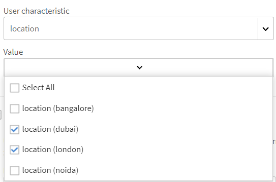
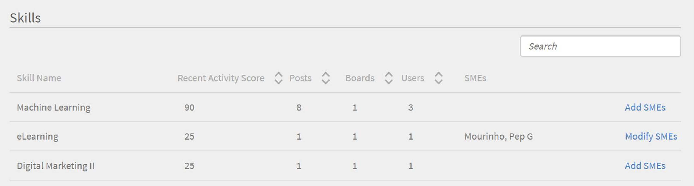

# Monitoring and moderating Social Learning as an admin

As an administrator, you can enable, disable, and monitor activities performed in Social Learning. Once the Social Learning feature is enabled, learners can view it and they can start participating in Social Learning.

## Enable and configure settings in social learning {#enableandconfiguresettingsinsociallearning}

To enable and configure the Social Learning feature, do the following:

1. Click **Social Learning** from the left navigation panel. You are redirected to the activity page. 
1. Enable **Social Learning** feature using the **Enable** button in the Activity page if you are turning it on for the first time. Otherwise it can be enabled from the **Settings** page. 

   A pop-up dialog box appears like the screenshot below.

      

1. The admin can configure  settings for Social Learning. Settings include types of Content Curations like **Manual-Only Curation** and **No Curation**. Scope settings can be set to different scope like the user type (internal/external) or any other active fields present in the account. Admin can set the URL path from where learners can download the Adobe Learning Manager desktop application.

## Content curation {#contentcuration}

Since Social Learning is an informal learning, its functionality is similar to other social media platforms. People often find social media distracting because  they frequently consume irrelevant content which affects their productivity. This thought can be catered by content moderation and curation.

**Manual-Only Curation** and **No Curation** are two curation options that can be selected by the admin.

**Auto-assisted Manual Curation:** Learning Manager has an artificial intelligence-based auto curation engine that can intelligently find out the essence of the content of any format that can later be served to the desired learners. It can also approve or reject a content from being posted based on its given confidence score.

For example, Adarsh is a learner and he found a blog interesting, so he posts it on Adobe Learning Manager's Social Learning platform. The post is then fed to the AI-powered Content Curation Engine which predicts the skills present in the content and compares those skills with the associated board skills. If any of the skills match, then the content is posted otherwise it is sent for manual-only curation. 

The minimum confidence score required for posting is 50%. 

**Manual-Only Curation:** To check the authenticity of the content before it goes live, Administrator can enable Manual-Only Curation setting. Once Manual-Only curation setting is enabled, it goes to the Top SMEs (Maximum 3) for curation. Based on the average response,  the post is approved/rejected accordingly. If the response is greater than equal to 50 percent, the post goes live else rejected. For more information on SMEs, [click here](social-learning-configurations-as-an-admin.md#SubjectMatterExpertsSMEs).

## Auto-curation of content {#autocuration}

Moderating content manually is often prone to errors and time-intensive. In addition, the process is not scalable and is unsuitable for high volume of social activities. Therefore, curating content automatically becomes critical when serving many users who are active socially.

In Learning Manager, there is an option to curate content automatically. The curation is driven by an AI-enabled engine, which maps works with the pre-defined skills, after the Admin maps the pre-defined skills with a skill. For more information, see [Skill domain mapping](curation-skills.md).

In auto-curation, the following types of content are allowed:

* PDF
* Audio and video files
* Presentations- PPT or PPTX
* Documents- .doc, .docx

An Administrator can enable the option to curate content automatically from within the Administrator app. 

1. On the left pane of the Admin app, click **Social Learning**.
1. On the page, click the tab **Settings**.
1. Enable the option **Auto-assisted Manual Curation**.

   

When a user uploads a content in a board, an AI-based algorithm scrapes the text from the content, and the text is then passed onto the curation engine. The curation engine tries to find the skills present in the content.

The predicted skills from the uploaded content are matched with the ones with the board in which the content was uploaded.  If any skill matches with a confidence score of more than 50% of the board skill, the content is posted in the board. If the confidence score is less than 50%, the content is sent for manual curation.

Whenever a content gets auto-curated, the user gets a notification that the content is available in the board where it was previously uploaded.

It is recommended that the Administrator adds SMEs for skills if Manual-Only curation is ON. Administrator can add SMEs by providing SME points in advance to users with expertise in a skill. To know more about how to provide points to  SMEs,  [click here](social-learning-configurations-as-an-admin.md#SubjectMatterExpertsSMEs).

**No Curation:** All learner's post gets posted automatically without any content moderation.

## Frequently asked questions on auto curation of content {#faq-auto-curation}

+++How much time does a SME get to curate a post?

An SME gets a minimum of 24 hours to curate a post. Due to timezone differences, it may be increase to 47 hours.

+++

+++Does it go to the next set of three SMEs if all three are available? Is it always three SMEs who get invoved?

The request for curation goes to the top the SMEs on the first day. If they do not respond, then the request goes to the next three SMEs the following day.

If the three new SMEs do not respond, the request goes to the moderators of the board.

If the board moderators do not respond, the request is auto approved.

+++

+++If two SMEs curate and one do not - does the request go to the fourth SME or does the request take the average of whatever the first round of SMEs rate the post?

50% approval rating is required to approve the post. Similarly, 50% rejection rating is used to reject the post. At every approval done by a SME, it is evaluated if it has reached 50%.

If it does not reach 50% after one day, then it is sent to the next set of SMEs expiring the previous un-answered curation requests.

For example, On the first day, the curation request is sent to three SMEs; and one of them approves it, two of them didn't respond. Next day, the curation request goes to the next set of three SMEs; at this level now, there are four active SME's in total. At least two SEMs must approve it to get the curation approved.(In case if 2 approves and 2 rejects, whatever reaches first 50% will be taken.)

+++

+++From what I see a 'Moderator' is only assigned (and it is not mandatory) when someone creates a new board - What is the use case for a Learner to assign a 'Moderator' to a board if SMEs will be assigned to the skill that a board is associated with?

The following are the responsibilities of a Social Board moderator:

* Ability to edit the board name, description, board visibility settings, and other configuration.
* Ability to delete a post on the board in case the post is not suitable to the audience.
* Moderator receives 'Report Abuse' notifications for the board.
* Moderator receives curation requests if no SME is present for the board.

+++

+++Our training team will be adding / monitoring the skills associated to skill level as well as the SMEs assigned to the skills.

SMEs are added/assigned based on skill, not skill level. This is as designed.

+++

+++What is the difference between a Social Learning 'Moderator' and a Social Learning 'SME"?

**Moderators:** Secondary owners of the board. They are added by the creators while board creation of the board so that they can control the board in absence of creator. By default, the creator of the board is the moderator.

**SME:** Subject Matter Experts are experts in specific skills. Admin can assign SMEs to a particular skill to curate content of that skill. SMEs receive the curation requests for boards linked to their skills. Learners can also become SMEs by gaining SME points.

+++

+++If there are two or three SMEs assigned to a skill - Does a Social Learning post approval or rejection depend on all SMEs curation or whomever curates first?

50% approval rating is required to approve the post. Similarly, 50% rejection rating is used to reject the post. At every approval done by a SME, it is evaluated if it has reached 50%.

If it does not reach 50% after one day, then it is sent to the next set of SMEs expiring the previous un-answered curation requests.

+++

## Scope settings {#scopesettings}

In Social Learning, a Scope determines the boards you that you see, which controls the visibility of the content. If a user has a  scope, for example, ***Vendor_A***, he/she can only see boards and associated posts that have been created by others belonging to the same scope ***Vendor_A***.

This allows the Administrators to maintain a cohort of users, for example, vendors, partners or departments in an organization separate. 

Enable social learning and leaderboard for both internal and external users.

There are separate sections to enable internal and external users.

**Enable for Internal learners**

In this section, you can choose the user characteristic to define the scope of social learning for internal users. Users with the same characteristics **value** share the same Social Learning space.

From the **User characteristic** drop-down list, choose the required option.

By default, the option **All Internal Users** in the User characteristic drop-down list option is always selected.

You can scope internal users based on their active fields.

**Enable for External learners**

To define the scope of learning for external users, use an external profile. Learners with the same external profile share a common Social Learning space.

External users are scoped based on their external profiles.

For example, from the list above, if you enable **Acme Corp**, all learners belonging to Acme Corp can see the boards that they have created. If you disable the option **Henry Cavill**, the learners cannot see any board created by Henry Cavill.

Admin can scope the visibility of the content based on active field displayed in the **User characteristic** field.

For example, the admin can set the scope to **User Type (Internal/External)** users. On setting the scope to User Type, the content shared on the Social Learning platform by any internal learner is only visible to other internal learners  in the organization and not the external users and conversely.

After a User Characteristic is selected by the Admin, he or she can limit Social Learning feature to Learners and Learner groups by selecting the check box below the User characteristic field. Click the value field to select the learner or learner groups for whom you want to enable the Social Learning feature. 

By default, the scope is set by the **User Type** that is Internal or external learners.

If the active field does not contain any value, then the **Value** field drop-down list will not be visible to the admin.

 

Users can also post their content by using Adobe Learning Manager desktop application. Depending on whether you are a Mac or Windows user, click the given links to download the desktop application and follow the given steps to install it onto your system. If you are facing any difficulties in installation, [click here](../../kb/troubleshooting-issues-with-adobe-learning-manager-desktop-app.md).

## Board Creation Permissions {#permission}

To restrict the creation of boards by all learners and to moderate the boards effectively, an Administrator can grant permissions to create boards to a select group of users.

By default, the option **All Learners** is enabled.

**All Learners:** If you choose this option, all internal and external users can create boards. 

**A group of learners:** If you choose this option, only users having permissions to create a board see the **Create New Board** link in Social Learning. Choose the user group that must be granted permission to create a board. You can also add auto generated as well as custom user groups.

Users who share the same scope can only see the board. For users who do not have permission, the **Create New Board** link remains invisible.

For any changes to take effect, wait for 60 minutes.

## Special Users {#privilege}

An Administrator can grant special privileges to a user group, using which members of the group can participate in all boards. Any restrictions that were set in the Scope Settings section is bypassed by the special user group.

The user group can be either auto-generated or custom.

A user who has been granted this privilege has access to all boards, except **private boards**.

When the Administrator selects a user group, by default, all users in the group can access all boards, irrespective of the scope of the user. Any user with these elevated privileges can view and participate in all internal and external boards.

Special users receive curation requests across all scopes if users have sufficient SME points for that skill.

If the user does not have the required SME points, then the curation privileges are passed on to the top three SMEs of that skill.

In the new scope, he/she gets points for activities across boards.

On the Social leader-board sections, a user can see all users of his/her scope along with special users.

If you have been granted special user privileges, you can see all users in the account in your leader-board, irrespective of the users' scopes.

If special users become SMEs by gaining sufficient points, they appear in the **Top Subject Matter Experts** list in the social leader-board.

For any changes to take effect, wait for 60 minutes.

## Customize the social banner {#customize-social-banner}

The Administrator can customize the title and the subtitle that appear on the header image on the Social Learning homepage. Whatever the Administrator decides to enter as title and subtitle, the same features on the Learner's social learning homepage.

1. On the Admin app, click **Social Learning > Settings**.
1. Click **Customize**.  

1. Change the banner image. The dimensions of the image must be at least **1600 px X 240 px**.  

1. Toggle the option to hide or display the **Know More** link on the banner.   

1. Enter the title and the subtitle in the fields specified below:

   

   You have a few other options:

   * **Language:** From the drop-down list, choose the language to translate the title and subtitle to. You can also add custom text for different languages.   
   
   * **Replicate:** Click this button to replicate the title and subtitle across all languages.
   * **Reset:** Click this button to revert to the original title and subtitle.

   On the Social Learning homepage, the information provided by the Administrator displays as the page header.

   

## Trends {#trends}

Learner's social activity trends can be viewed and tracked in the Activity tab in trends section. This data can be viewed for different time periods like last seven days, last month, last three months, and all time.

Last seven days is the default value in the date filter.

>[!NOTE]
>
>Last seven days is the default value in the date filter.

The first visual provides the admin with the following information for the time period selected from the date filter:

1. **New Posts**: Displays the number of new posts created within the date period. Also displayed is the total number of posts for the entire period.
1. **Percentage of Active users**: Displays the total percentage of active users in social learning compared to the total number of users available in the account.
1. **New Boards**: Displays the number of new boards that have been created. Also displayed is the total number of boards for the entire period.

The second visual is a line graph displaying the trend of number of boards or posts created based on the time period selected from the date filter. Click the filter to view the different time options like last seven days, last month, last three months, and all time.

## Skills {#skills}

You can view all the skills that have been used in the social activity platform in this section. The admin can use the search field to look for a skill that is not used yet while creating a board and mapping SMEs to it. By performing this, SMEs would get a notification when a board is created using this skill and they can review the post as part of the manual curation workflow. 

For an account with Social Learning disabled, no skills are displayed. The search bar is available for such accounts as well so that the admin has the functionality to search for a skill and add SMEs to it.

The administrator can view the Activity Score, number of posts, boards, users, and name of SMEs for each skill that was used while creating a board or post.

<table>
 <tbody>
  <tr>
   <td>
    
Sl. No.
</td>
   <td>
    
Column Name
</td>
   <td>
    
Explanation
</td>
  </tr>
  <tr>
   <td>
    
1
</td>
   <td>
    
Skill Name
</td>
   <td>
    
Displays names of skills that are used in Social Learning.
</td>
  </tr>
  <tr>
   <td>
    
2
</td>
   <td>
    
Activity Score
</td>
   <td>
    
Displays the sum of activity points of all the boards that belong to the skill.
</td>
  </tr>
  <tr>
   <td>
    
3
</td>
   <td>
    
Posts
</td>
   <td>
    
Displays the total number of posts created using a skill.
</td>
  </tr>
  <tr>
   <td>
    
4
</td>
   <td>
    
Boards
</td>
   <td>
    
Displays the total number of boards created using a skill.
</td>
  </tr>
  <tr>
   <td>
    
5
</td>
   <td>
    
Users
</td>
   <td>
    
Displays the total number of learners that have used that skill.
</td>
  </tr>
  <tr>
   <td>
    
6
</td>
   <td>
    
SMEs
</td>
   <td>
    
Displays the current top 3 SMEs for that skill. Admin can add or modify SMEs by clicking the link.
</td>
  </tr>
 </tbody>
</table>

## Skill domain {#skilldomain}

Based on the skills mostly used by Learning Manager end users, Adobe Learning Manager has categorized a list of 25 skill domains that the auto curation system uses to curate content. The admin must map the configured enterprise skills to the skill domains provided by Prime. The mapping of skills can be done from the admin skill page while creating a skill or by modifying an existing skill. For more information on how to map or add a skill, [click here](skills-levels.md#Createaskillandalevel).

+++List of skill domains that is used by Learning Manager's curation system

1. Accounting
1. Analytics
1. Business ethics
1. Business law
1. Business process
1. Computer security
1. Customer relationship management
1. Design
1. Finance
1. Human resource management
1. Information technology
1. Learning
1. Management
1. Marketing
1. Medicine
1. Production and manufacturing
1. Quality management
1. Sales
1. Scientific research and engineering
1. Social media
1. Soft skills
1. Strategic management
1. Supply chain management
1. Technical communication
1. Workplace safety

+++

## Subject Matter Experts (SMEs) {#subjectmatterexpertssmes}

**Subject Matter Experts **are people who have a considerable knowledge and expertise in a skill. An **SME **plays an important role in social learning when the admin has set the curation settings as manual or when the auto-curation method fails to curate the content. Only top three SMEs are displayed in the SMEs column.

## Requirements to be an SME {#requirementstobeansme}

SME status can only be gained by earning SME points through activities in Social Learning. The administrator can award points to a SME based on their expertise in the skill level.  

## Adding SMEs to a skill {#addingsmestoaskill}

To add SMEs to a skill, follow the given steps:

1. Click **Add SMEs or Modify SMEs**.

   

1. Click **Advanced Options** from the pop-up dialog box.

   

1. Search for the user with expertise in the skill. Once the user is found, type the number of points you want to give him or her in the **Add Points** input box. 

   If the user already has points, then the number of new points given to the user is added to the current number of points.

   By default, for every new user to social learning, the current point is 0.

   

1. By selecting the **Enable Minimum SME Points** check box, you can set a limit to the minimum number of points a user requires to be displayed as an SME in Top SMEs list. Once the threshold value is set, SMEs with points less than or equal to the minimum point value required is not listed in the SME lists.

   If the **Enable Minimum SME Points** check box is not selected then the top three users with highest points are considered as the SMEs for that particular skill.

1. Click **Save** button to display the changes that have been made.

## SME point system {#smepointsystem}

**SMEs are awarded number of points based on the following:**

* 2 points are given to a user every time another user upvotes a post created by him/her.
* 2 points are given to a user every time another user upvotes his/her comment.
* 5 points are given to a learner for answering a question.
* 2 more points are given to the learner every time the answer provided receives an upvote.

## SME status points based on curation activity {#smestatuspointsbasedoncurationactivity}

**SMEs are awarded number of points also based on curation activities for the following:**

* When a post is sent for manual curation because the auto curation is not sure if content is relevant or not, the SME gains 5 points on submission of moderation.

## Download configurations {#downloadconfigurations}

For Enterprise Servers, admin can change the location from where learners can download the desktop application for both Windows and Mac.

Enterprise Server URL must be publicly hosted.

## Social activities for Monthly Active Users billing plan {#socialactivitiesformonthlyactiveusersbillingplan}

Every time a user creates a new social board, social post or social comment, it would count as valid activity to be counted against the **Monthly Activation User**(MAU) plan if the account follows the MAU billing model. For more information, refer to [billing management](billing-management.md).

## Frequently Asked Questions {#frequentlyaskedquestions}

**1. How to enable social learning for external learners?**

In **Social Learning > Settings**, in the section Scope Settings, enable the option **Enable for External learners**. From the drop-down, choose an external profile and define the scope of learning for that profile.

