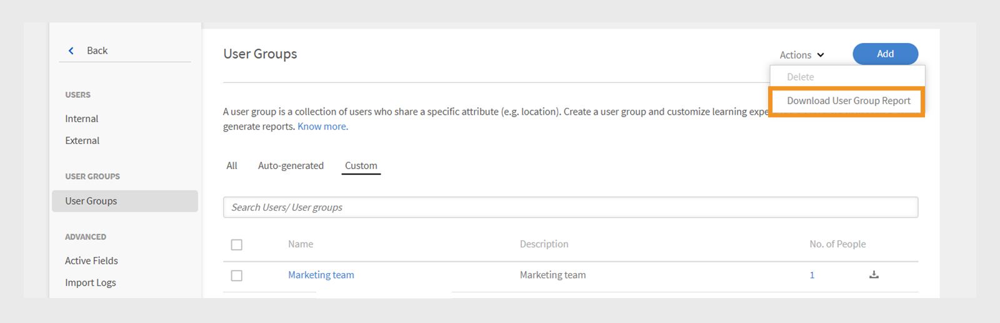

# User groups in Adobe Learning Manager

User groups in Adobe Learning Manager help you organize learners based on common attributes like department, location, or role. Grouping users makes it easier to assign courses, manage permissions, and track learning progress for multiple users at once.

>[!INFO]
>
>Watch this ALM Academy training to learn how to create a user group by names, email IDs, and combining multiple auto-generated user groups.   

## Types of user groups

Adobe Learning Manager supports the following user groups:

1. **Auto-generated user groups:** In Adobe Learning Manager, the system automatically creates some user groups based on user roles and attributes. These system-defined groups include All Authors, All Admins, All Learners, and All Managers. Adobe Learning Manager generates these groups to help organize users by role. You can't rename or delete these system-defined groups.

2. **Custom user groups:** In Adobe Learning Manager, administrators can create custom user groups to organize learners based on specific criteria. These groups are dynamic, automatically adding users who meet the defined conditions. Custom groups help assign targeted learning paths, apply custom branding, and generate focused reports. They're a flexible tool for managing and personalizing the learning experience.

## Create a custom user group

Administrators manually create user groups to organize users based on defined attributes. These groups can be dynamic, automatically adding users who meet the specified criteria. User groups simplify tasks such as assigning learning paths, applying custom branding, and generating targeted reports.

To create a custom user group:

1. Select **Users** on the administrator homepage.
2. Select **User Groups** and then select **Add**.

   
   _Button to add a new user group in the User Groups page_

3. Type the group name and description.

   
   _Input fields to enter group name and optional description_

## Add users to the user group

Administrators can add users to a user group in two ways:

### Users section

Administrators can use the inclusion and exclusion sets to add or remove users or user groups in the Users section.

* **Inclusion Sets** add users to a custom user group. You can include one or more user groups, and Adobe Learning Manager uses logic (AND/OR) to decide which user to include. Refer to this [section](#_Inclusion_and_exclusion) to learn more about AND/OR logic.
* **Exclusion Sets** remove users from the group, even if they were part of the inclusion set. This refines the group's user list.

To add users to the group:

1. Search and select users or existing user group in the **Include Learners** field.

_Inclusion settings to add specific users or groups to a custom user group_

### Email IDs section

1. Type the user email addresses in a comma-separated, semi-colon or line break format to add the users to the group.

2. Select **Validate Email Ids**.

   
   _Select Validate Email Ids to validate the entered email IDs_

   You will see an error if Adobe Learning Manager does not have the email ID or if the email ID is incorrect.

   
   _Field to enter multiple email addresses manually for adding users to a group_

3. Select **Save** to create the group.

## Exclude users from the group

Administrators can exclude specific users from a user group even if they meet the group's criteria. This is helpful when you want to make exceptions, such as preventing certain users from receiving assigned courses or appearing in reports linked to that group.

To exclude specific users or entire user groups when creating a custom user group:

1. Select any **User Groups** and then select **Add**.
2. Navigate to the **Exclude Learners** section.
3. Select the users or groups you want to exclude.

_Exclusion settings to remove users or groups from a custom group_

## View group members

Administrators can view a list of users in a user group, including details such as name, email ID and state. To view the list of users:

1. Select **Users** and then select **User Groups**.
2. Select a group and then select the value in the **No. of People** column.

_List of users currently included in a selected user group_

_List of users available on the selected user group_

## Download group members

Administrators can download a list of group members to review user details including name, email, status, date added (UTC time zone), deletion date (UTC time zone), and last login date (UTC time zone). This helps with tracking, reporting, and auditing group membership.

1. Select **Users** and then select **User Groups**.
2. Select the download icon next to a group to export the report as a CSV file.

_Download icon to export group member data as a CSV file_

The following are the columns of the group member report:

* **Name**: Name of the user
* **Email**: Email ID of the use
* **Status**: Status of the user (Registered or Not Registered).
* **Date Added (UTC TimeZone)**: Date the user was added in UTC time zone.
* **Deletion Date (UTC TimeZone)**: Date the user was deleted in UTC time zone.
* **Last Login Date (UTC TimeZone)**: Date the user last logged in UTC time zone.

_Sample CSV contains the user details_

## Edit a user group

Administrators can edit a group to change its name, description, or other details.

To edit a user group:

1. Select **Users** on the administrator home page.
2. Select **User Groups**.
3. Select the user group you want to edit.
4. Make the necessary changes, like updating the name, description, or other details.
5. Select **Save** to apply the changes. The changes will be applied to the user group.

_Fields to modify user group name, description, or membership rules_

## Delete a user group

Administrators can delete user groups that are no longer needed to keep the group list organized and up to date.

To delete a user group:

1. Select **Users** and then select **User Groups**.
2. Select the group you want to delete.
3. Select **Actions** and then select **Delete**.

   
   _Delete option in the Actions menu to remove a user group_

4. Confirm the deletion when prompted. The user group will be deleted.

## Download user group report

Adobe Learning Manager's user group reports provide administrators and managers with insights into the performance of different user groups, such as departments, roles, or external partners. These reports enable comparisons across groups to assess learning progress, course completion rates, and engagement levels.

To download the report:

1. Select **Users** and then select **User Groups**.
2. Select **Actions** and then select **Download User Group Report**.

_Option to download group-level information and metadata from the Actions menu_

This report includes:

|Column |Description|
|---|---|
|User Group Type |The category of the user group, such as auto-generated or custom group.|
|Name |The name assigned to the user group.|
|Description |A brief explanation of the purpose or scope of the user group.|
|Created by (Name) |The full name of the administrator who created the group.|
|Created by (Email)|The email address of the administrator who created the group.|
|Created on (UTC TimeZone)|The date and time when the group was created, shown in Coordinated Universal Time (UTC).|
|Number of users|The total number of users currently included in the group.|

_User group report contains all the fields_

## Inclusion and exclusion rules for creating custom user groups

When creating a **custom user group** by adding auto-generated or existing user groups, Adobe Learning Manager applies specific **inclusion and exclusion rules** based on **AND/OR logic**. These rules depend on how user groups are combined in the inclusion and exclusion sets.

You can add one or more auto-generated user groups to the inclusion set. The logic applied depends on how you select these groups:

### Use AND logic in user groups

If you select multiple user groups within the same inclusion set, users must meet all conditions to be included.

For example,

* Sales team group: 120 users
* Location (Bangalore) group: 80 users
* Common users in **both** groups: 40 users

Adobe Learning Manager uses AND logic to create a group with only 40 users. These users are part of the Sales Team and are also located in Bangalore, meeting both conditions.

_Example showing multiple groups combined using AND logic_

### Use OR logic in user groups

If you add user groups in separate inclusion sets, users meeting any condition are included. For example:

* Sales team group: 120 users
* Location (Bangalore) group: 80 users
* Total users in either group: 160 users (Some users may be in both groups)

When you use OR logic, Adobe Learning Manager adds users who are in either the Sales Team or located in Bangalore. This means it includes users who match any one of the two conditions. As a result, the group includes 160 users after removing duplicates.

_Example showing multiple groups combined using OR logic_

