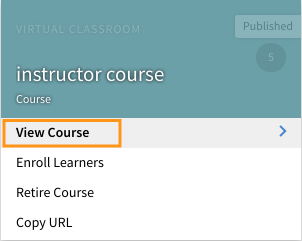

# Notifications {#notifications}

Notifications feature is applicable to all the users of Adobe Captivate Prime. But, each user based on their role gets different kinds of notifications under various scenarios. All the alerts and notifications to users are displayed through notifications pop-up dialog.

## Access notifications {#accessnotifications}

Users can see notifications by clicking notifications icon at the upper right corner of the window. This pop-up dialog displays highlights of all the notifications along with time of occurrence with a scroll bar. To view more information about all the notifications, click Show All Notifications at the bottom of the pop-up dialog. Notifications page appears.

You can know the number of latest notifications by the highlighted number on top of the notifications icon. For example, if there are five latest notifications after your previous login, you can see the number 5 being displayed on top of the notifications icon. These numbers disappear once you read all the latest notifications.

## Types of notifications for Administrators {#typesofnotificationsforadministrators}

Administrators get notifications under following instances:

* Whenever a csv list of users is successfully uploaded.
* Whenever the upload of a csv list of users is unsuccessful. The Admin gets a message with the reason for failure.
* Administrator can also set up instance level notification alerts for courses and learning programs. In this case, Administrator gets the notifications based on the frequency selected at instance level. 

**Note*** 
*If an administrator has author or manager privileges in addition to his role, then the administrator gets notifications pertaining to each role.

A sample notification window for admin role is shown in the following screenshot:

This pop-up window displays highlights of all the notifications along with time of occurrence and a scroll bar. You can know the number of latest notifications based on the highlighted number on top of the notifications icon. For example, if there are five latest notifications after your previous login, you can see the number 5 being displayed on top of the notifications icon. These numbers disappear once you read all the latest notifications.

Click **Show all notifications** link at the bottom of the notifications pop-up window to view all the notifications in a separate page.

## Set up multi level escalation notifications {#setupmultilevelescalationnotifications}

Escalation emails when learners miss deadlines can be sent to the manager and a skip manager. You can set up multi-level escalation notifications for the non-completion of the course during the process of creating a course, or even after it has been created. Escalation notifications can be set up to be sent at a set frequency to be sent to a manager or a skip manager.

1. Log in as Administrator or Author and click on Courses.
1. Select the Course for which you want to modify the escalation notifications and click on **[!UICONTROL View Course.]**

   

1. Click on **[!UICONTROL Instances > Notification Alerts]**.

   

1. A calendar opens indicating the deadline set for the course highlighted in red. Click on the highlighted date to see the reminders are set for the learner.

   

1. Set reminders by selecting dates prior to the deadline. This allows you to set up reminders for the learner about the approaching deadline.

   

1. Select a date after the deadline to set up a schedule of reminders for the learner and escalation notifications to the manager.

   

1. If the learner still fails to complete the course even after escalation to the manager, settings allow you to escalate to the learner’s skip manager. Click on a date after the extended deadline, select the recurrence of reminders, the number of days for the schedule and select Manager & Skip Level Manager under the Escalation drop down. Click on the blue checkmark to save notification settings.

   

## Frequently Asked Questions {#frequentlyaskedquestions}

**1. How to setup reminder notifications on the instance?**

On an instance, click Notification Alerts. A calendar opens indicating the deadline set for the course highlighted in red. Click on the highlighted date to see the reminders are set for the learner. Set the reminders, as explained in this [section](user-notifications.md#Setupmultilevelescalationnotifications).
