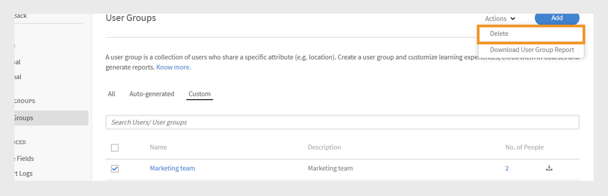
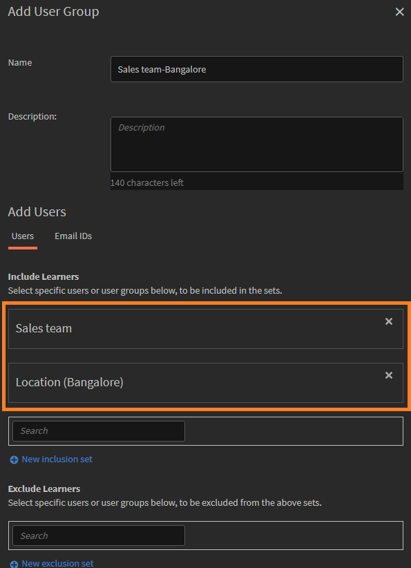

# Add Users in Adobe Learning Manager

In Adobe Learning Manager, users are people who use the platform for learning or training. There are two types of users: internal users and external users.

Internal users are employees or team members from your organization.

External users are people outside your company, such as customers, partners, vendors, or clients, who can access your learning content.

Adobe Learning Manager (ALM) allows administrators to onboard and manage both internal and external users using various methods, including manual entry, CSV upload, self-registration, and system integrations.

## Internal users

Internal users in Adobe Learning Manager refer to employees or team members within your organization. You can add them manually, upload them in bulk, or import them through system integrations. After adding these users, you can organize them into groups, assign courses, and monitor their learning progress.

Users in Adobe Learning Manager can take on different responsibilities and manage various tasks based on their assigned roles. Each role, including Administrator, Author, Instructor, and Integration Admin, offers a set of specific capabilities tailored to support the user's responsibilities within the platform.

Adobe Learning Manager supports the following user roles:

* **Administrator**: Manages users and user groups, assign roles, and configure system-wide preferences such as data sources, allowed domains, and display options. Administrators are also responsible for creating and organizing learning content, tracking learner progress, generating reports, and setting up integrations with external systems. 
* **Author**: Creates and manages content, including modules and courses.
* **Manager**: Oversees team learning activities, nominates team members for courses, approves requests, and provides feedback.
* **Integration Admin**: Manages system integrations and data connections between ALM and external platforms. 
* **Custom roles**: Admins can create custom roles to give users tailored access based on their responsibilities. Refer to this article for more information about the custom roles.

### Methods to add internal users

Administrators can add internal users using the following methods:

* **Add a single user**: Manually add one user at a time.
* **Self-Registration profile**: Allow learners to self-register as learners in Adobe Learning Manager using a registration link created by the administrator.
* **Bulk upload via CSV**: Upload a CSV file to add multiple users at once.

### Manually add an internal user

Administrators can manually add individual users by entering their name, email ID, unique identifier, and manager's name. The Unique Identifier in Adobe Learning Manager is a required identifier that administrators assign when creating a user. It must be unique for each user and serve as a consistent reference throughout the system.

>[!INFO]
>
>Watch this ALM Academy training to learn more about adding single users in Adobe Learning Manager.  

To add a single user to Adobe Learning Manager:

1. Log in as an administrator.
2. Select **Users** and then select **Internal**.
3. Select **Add** and then select **Single User**. 
   
   
   _Administrator interface showing the option to manually add a single internal user_
4. On the **Add User** prompt, type the **Name**, **E-mail** and **Profile** (job title) of the user. 

   
   _Fields to enter name, email, unique identifier, and profile for a new user_
5. Search for the user's manager and select the name from the list of managers.
6. Select **Add**. 
   The user receives a welcome email containing a login URL for access. 

### Allow self-registration for internal users

Self-registration is a self-service onboarding process where users can visit a registration URL, input their details, and automatically enroll in the platform. This method minimizes administrative effort by allowing users to register themselves through the provided URL.

To create a self-registration URL for a user:

1. Log in as an administrator.
2. Select **Users** and then select **Internal**. 
3. Select **Add** in the upper-right corner and then select **Self-Registration.**

   
   _Dropdown menu for selecting the self-registration option_
4. On the **Add Self-Registration Profile** prompt, type the profile in the **Profile Name** (Job title of the user) field.
5. Select the user's manager by searching for the manager in the **Manager's Name** field. The manager assigned to the self-registration profile should be a registered user in Adobe Learning Manager.

   
   _Input fields for setting the job title and assigning a manager to a self-registration profile_
6. Select an image using **Add Image** option. This image will be visible to the learners in the profile section.
7. Select **Save**.

   Adobe Learning Manager creates a user profile and generates a self-registration URL, which can be shared with the users to complete their registration.

   
   _Confirmation message indicating successful creation of a self-registration URL_
8. Share the URL with the users who want to self-register.

   
   The URL can be shared with multiple users for registration. For example, you can generate a URL for the **Sales Associate** profile and share it with the Sales Associate team so they can register themselves.

_Self-registration link opens a sign-up page_

### View the list of self-registration URLs

To view the list of self-registration URLs:

1. Select **Users** and then select **Internal**. 
2. Select **Self-Registration**.

   Administrators can see the list of self-registration URLs.

_List view showing existing self-registration URLs available for internal users_

### Bulk upload internal users

Adobe Learning Manager allows administrators to add multiple users at once by uploading a CSV containing the user's information, including name, email ID, and manager's name. This bulk upload feature saves time and effort compared to adding users individually.

>[!INFO]
>
>Watch this ALM Academy training to learn how to add users in bulk through a CSV.   

To add multiple users:

1. Log in as an administrator.
2. Select **Users** and then select **Internal**.
3. Select **Add** in the upper-right corner and select **Upload a CSV**.

   
   _Option to upload a CSV file for bulk user import_

4. Prepare a CSV file with the following fields:

   * Employee's Name*
   * Employee's Email*
   * Employee's Profile/Designation
   * Manager's ID/Email  
   (*) Required fields.

5. Before adding a manager's email ID for any employee, make sure the manager is already included as an employee in the CSV file. For example, see the employee named Howard Walters in the snapshot below.

   
   _Image of sample CSV with all the fields_

6. Upload the CSV file and map the data fields accordingly.
   
   
   _CSV mapping interface to align spreadsheet columns with system fields_
7. Select **Save** to import the users.

   A confirmation message appears after the upload is successful.
   
   
   _Image shows the status of the CSV upload as successful_

>[!NOTE]
>
>Maintain a master CSV for all additions and deletions. Updating and re-uploading an existing CSV file is not supported.

When uploading a CSV file to add users, it's important to include all related information in the correct order. If you assign a manager's email ID to an employee, the manager's details must appear earlier in the CSV file. This ensures the system recognizes the manager as an existing user before linking them to their team members. For example, if Howard Walters is a manager, include his full user details in the CSV before listing employees who report to him.

### Manage user registration

After adding users individually or in bulk, you need to register them to activate their accounts. This allows users to access Adobe Learning Manager and start using the platform.

To register the users:

1. Select **Users** on the administrator home page.
2. Select the checkboxes next to the names of the users you want to register.
3. Select **Actions** and then select **Register**.
   
   
   _Register button to activate selected users in Adobe Learning Manager_

4. Select **Yes** to activate the user.

A verification email is sent to the user. The user must select the link in the email to activate their account and start using Adobe Learning Manager.

## External users

Adobe Learning Manager allows you to add users outside your company, such as customers, partners, vendors, or clients, to access the learning content. After they are added, you can group them, assign courses, and track their learning progress.

Adding external users in Adobe Learning Manager involves the following steps:

* Create an external registration profile
* Enable the registration profile
* Share the registration link with external users
* Pause or resume the profile when needed

Adobe Learning Manager supports enrollment of such users through external registration profiles.

To create an external user, follow these steps:

1. Log in as an administrator.
2. Select **Users** and then select **External**.
3. In the upper-right corner, select **Add** to create a registration for an external user.
4. In the **Add External Registration Profile** dialog, provide the following:

   * **Profile Name:** Type the name of the partner organization that wants to access Adobe Learning Manager
   * **Manager Email:** Type the manager's email address of the user.
   * **Seat Limit:** Set the maximum number of enrollments allowed.
   * **Expiry:** Define the last date for new registrations. After it expires, the link will not work for new user registration.

   
   _Dialog box for entering profile name, manager email, seat limit, and expiration_

5. Select an image using the **Add Image** option. This image will be visible to the learners in the profile section.
6. Select the **Advanced Settings** section to expand it and type the required details:
   * **Login Requirement:** Type the number of days. If learners remain inactive for the entire period, they will be automatically removed.
   * **Allowed Domains:** Type the comma-separated list of allowed email domains. Only users with email addresses from approved domains can sign up.
   * **Email Verification Required:** Select this to enforce email verification during registration.
   
   
   _Advanced Settings panel to set login requirements, allowed domains, and email verification_

7. Select **Save**.

A registration URL is generated.

### Enable the external profile

To enable the external profile:

1. Locate the newly created profile in the list of external profiles.

2. Select the **Status** toggle button to enable it.

The administrator can share this URL with the external partner so they can sign up and log in to Adobe Learning Manager using it.

_Select the toggle to enable the external profile_

### Copy and share registration URL of external profile

The registration URL for an external profile can be copied from the **External Users** section. 

_Copy the registration URL of an external profile_

### Key differences between internal and external user registrations

There are a few differences between internal and external registrations:

|Internal users|External users|
|---|---|
|Can log in using Adobe ID or SSO credentials.|Can log in using any email ID.|
|Gamification is available. |Gamification is available. The administrator must enable gamification for external learners in the [Gamification settings](https://experienceleague.adobe.com/en/docs/learning-manager/using/admin/gamification).|

### Pause external registration profile

In Adobe Learning Manager, administrators can manage external user registration by pausing their profiles. This is helpful when you want to temporarily pause new users from joining using a specific external user profile. Pausing a profile prevents users who have received invitations but have not registered yet from completing the sign-up process. This action does not affect users who have already completed their registration.

To pause an external profile:

1. Select **Actions** in the upper-right corner of the **External Users** page.
2. Select **Pause** to pause the external user profile.

This blocks the registration process for users who have yet to accept their invitations. Note that this action only affects users who have yet to complete their registration.

_Option to pause an existing external user profile from the Actions menu_

### Resume external registration profile

If an external profile was previously paused, administrators can resume it to allow new users to complete their registration. This reactivates the registration process for users who were invited but did not complete their sign up.

To resume an external user:

1. Select **Actions** in the upper-right corner of the page.
2. Select **Resume** to resume a paused partner's access.

_Option to resume a previously paused external user profile_

### Monitor external seat usage

Administrators can track the number of users added to each external profile in Adobe Learning.

To check the used seats:

1. Select **Seats Used** in the list of external profiles.

You can view the number of learners added to the partner organization and whether the learners are active.

## Manage users

Admins can edit user details, delete users, assign roles, and remove roles. This helps make sure each user has the right access and tasks.

>[!INFO]
>
>Watch this ALM Academy training to learn how to assign and remove roles, send a welcome email, and delete and purge users. [![button]](https://content.adobelearningmanageracademy.com/app/learner?accountId=98632#/course/7555586) 

### Edit a user

Use the **Edit User** option in Adobe Learning Manager to update a user's profile information, such as name, email address, unique identifier, profile and manager's name. Administrators can make these changes to ensure user data remains accurate and up to date.

To edit a user:

1. Select **Users** on the administrator home page.
2. Select the user you want to edit from the **Users** list.
3. Select **Edit Profile**.

   
   _Delete User option under Actions menu to remove a user from the platform_ 

4. Select **Yes** to delete the user.

A confirmation message appears when the user is successfully deleted.

## Assign a role to a user

User roles in Adobe Learning Manager define what actions each person can perform in the system. Each role comes with specific permissions based on the user's responsibilities.

To assign roles to users:

1. Select **Users** on the administrator home page.
2. Select the user you want to assign a role.
3. Select **Actions** in the upper-right corner.
4. Select **Assign Role**.
5. Select the required role.

   
   _Assign Role menu options display available roles for the selected user_

6. Select **Yes** on the confirmation dialog.

## Remove a role

Removing a user role revokes the permissions granted by that role.

To remove roles from users:

1. Select **Users** on the administrator homepage.
2. Select the user(s) whose roles you want to remove.
3. Select **Actions** and then select **Remove Role**.

   
   _Option to remove assigned roles from a user under the Actions menu_

4. Select **Yes** on the confirmation dialog.

## User groups in Adobe Learning Manager

User groups in Adobe Learning Manager help you organize learners based on common attributes like department, location, or role. Grouping users makes it easier to assign courses, manage permissions, and track learning progress for multiple users at once.

>[!INFO]
>
>Watch this ALM Academy training to learn how to create a user group by names, email IDs, and combining multiple auto-generated user groups.   

## Types of user groups

Adobe Learning Manager supports the following user groups:

1. **Auto-generated user groups:** In Adobe Learning Manager, the system automatically creates some user groups based on user roles and attributes. These system-defined groups include All Authors, All Admins, All Learners, and All Managers. Adobe Learning Manager generates these groups to help organize users by role. You can't rename or delete these system-defined groups.

2. **Custom user groups:** In Adobe Learning Manager, administrators can create custom user groups to organize learners based on specific criteria. These groups are dynamic, automatically adding users who meet the defined conditions. Custom groups help assign targeted learning paths, apply custom branding, and generate focused reports. They're a flexible tool for managing and personalizing the learning experience.

## Create a custom user group

Administrators manually create user groups to organize users based on defined attributes. These groups can be dynamic, automatically adding users who meet the specified criteria. User groups simplify tasks such as assigning learning paths, applying custom branding, and generating targeted reports.

To create a custom user group:

1. Select **Users** on the administrator homepage.
2. Select **User Groups** and then select **Add**.

   
   _Button to add a new user group in the User Groups page_

3. Type the group name and description.

   
   _Input fields to enter group name and optional description_

## Add users to the user group

Administrators can add users to a user group in two ways:

### Users section

Administrators can use the inclusion and exclusion sets to add or remove users or user groups in the Users section.

* **Inclusion Sets** add users to a custom user group. You can include one or more user groups, and Adobe Learning Manager uses logic (AND/OR) to decide which user to include. Refer to this [section](#_Inclusion_and_exclusion) to learn more about AND/OR logic.
* **Exclusion Sets** remove users from the group, even if they were part of the inclusion set. This refines the group's user list.

To add users to the group:

1. Search and select users or existing user group in the **Include Learners** field.

_Inclusion settings to add specific users or groups to a custom user group_

### Email IDs section

1. Type the user email addresses in a comma-separated, semi-colon or line break format to add the users to the group.

2. Select **Validate Email Ids**.

   
   _Select Validate Email Ids to validate the entered email IDs_

   You will see an error if Adobe Learning Manager does not have the email ID or if the email ID is incorrect.

   
   _Field to enter multiple email addresses manually for adding users to a group_

3. Select **Save** to create the group.

## Exclude users from the group

Administrators can exclude specific users from a user group even if they meet the group's criteria. This is helpful when you want to make exceptions, such as preventing certain users from receiving assigned courses or appearing in reports linked to that group.

To exclude specific users or entire user groups when creating a custom user group:

1. Select any **User Groups** and then select **Add**.
2. Navigate to the **Exclude Learners** section.
3. Select the users or groups you want to exclude.

_Exclusion settings to remove users or groups from a custom group_

## View group members

Administrators can view a list of users in a user group, including details such as name, email ID and state. To view the list of users:

1. Select **Users** and then select **User Groups**.
2. Select a group and then select the value in the **No. of People** column.

_List of users currently included in a selected user group_

_List of users available on the selected user group_

## Download group members

Administrators can download a list of group members to review user details including name, email, status, date added (UTC time zone), deletion date (UTC time zone), and last login date (UTC time zone). This helps with tracking, reporting, and auditing group membership.

1. Select **Users** and then select **User Groups**.
2. Select the download icon next to a group to export the report as a CSV file.

_Download icon to export group member data as a CSV file_

The following are the columns of the group member report:

* **Name**: Name of the user
* **Email**: Email ID of the use
* **Status**: Status of the user (Registered or Not Registered).
* **Date Added (UTC TimeZone)**: Date the user was added in UTC time zone.
* **Deletion Date (UTC TimeZone)**: Date the user was deleted in UTC time zone.
* **Last Login Date (UTC TimeZone)**: Date the user last logged in UTC time zone.

_Sample CSV contains the user details_

## Edit a user group

Administrators can edit a group to change its name, description, or other details.

To edit a user group:

1. Select **Users** on the administrator home page.
2. Select **User Groups**.
3. Select the user group you want to edit.
4. Make the necessary changes, like updating the name, description, or other details.
5. Select **Save** to apply the changes. The changes will be applied to the user group.

_Fields to modify user group name, description, or membership rules_

## Delete a user group

Administrators can delete user groups that are no longer needed to keep the group list organized and up to date.

To delete a user group:

1. Select **Users** and then select **User Groups**.
2. Select the group you want to delete.
3. Select **Actions** and then select **Delete**.

   
   _Delete option in the Actions menu to remove a user group_

4. Confirm the deletion when prompted. The user group will be deleted from Adobe Learning Manager.

## Download user group report

Adobe Learning Manager's user group reports provide administrators and managers with insights into the performance of different user groups, such as departments, roles, or external partners. These reports enable comparisons across groups to assess learning progress, course completion rates, and engagement levels.

To download the report:

1. Select **Users** and then select **User Groups**.
2. Select **Actions** and then select **Download User Group Report**.

_Option to download group-level information and metadata from the Actions menu_

This report includes:

|Column |Description|
|---|---|
|User Group Type |The category of the user group, such as auto-generated or custom group.|
|Name |The name assigned to the user group.|
|Description |A brief explanation of the purpose or scope of the user group.|
|Created by (Name) |The full name of the administrator who created the group.|
|Created by (Email)|The email address of the administrator who created the group.|
|Created on (UTC TimeZone)|The date and time when the group was created, shown in Coordinated Universal Time (UTC).|
|Number of users|The total number of users currently included in the group.|

_User group report contains all the fields_

## Inclusion and exclusion rules for creating custom user groups

When creating a **custom user group** by adding auto-generated or existing user groups, Adobe Learning Manager applies specific **inclusion and exclusion rules** based on **AND/OR logic**. These rules depend on how user groups are combined in the inclusion and exclusion sets.

You can add one or more auto-generated user groups to the inclusion set. The logic applied depends on how you select these groups:

### Use AND logic in user groups

If you select multiple user groups within the same inclusion set, users must meet all conditions to be included.

For example,

* Sales team group: 120 users
* Location (Bangalore) group: 80 users
* Common users in **both** groups: 40 users

Adobe Learning Manager uses AND logic to create a group with only 40 users. These users are part of the Sales Team and are also located in Bangalore, meeting both conditions.

_Example showing multiple groups combined using AND logic_

### Use OR logic in user groups

If you add user groups in separate inclusion sets, users meeting any condition are included. For example:

* Sales team group: 120 users
* Location (Bangalore) group: 80 users
* Total users in either group: 160 users (Some users may be in both groups)

When you use OR logic, Adobe Learning Manager adds users who are in either the Sales Team or located in Bangalore. This means it includes users who match any one of the two conditions. As a result, the group includes 160 users after removing duplicates.

_Example showing multiple groups combined using OR logic_

## Active fields

Active fields in Adobe Learning Manager are custom user attributes that help administrators organize and manage users effectively. They allow you to capture extra information about user, such as department, location, or job title. Admins can use this data to create user groups, personalize learning, and filter reports more effectively.

User attributes are pieces of information such as a user's first name, last name, and email address. These attributes help administrators to:

* Identify users
* Group users
* Manage user permissions and access restrictions

By adding custom attributes to user profiles, active fields capture additional information relevant to your organization.

>[!INFO]
>
>Watch this ALM Academy training to learn how to add, customize, and configure active fields.  

## Add active fields

Active fields apply to both internal and external learners, allowing organizations to define and manage custom user attributes for all users.

To add or manage active fields for internal users:

1. Select **Users** on the administrator homepage.

2. Select **Active Fields**.

3. Type the active field name and then select **Add**. The process to add active fields for external learners is the same as for internal learners.

   
   _Field to enter the name of a new custom attribute for users_

4. Select **Save**.

## Add custom values to active fields

Active fields can include predefined or custom values that match your organization's structure. Adding custom values helps capture details that are specific to your internal users, such as department names, job levels, or regional offices.

To add custom values for internal users:

1. Select **View Values** under the **Active Field** section.
2. In the **Values in Custom Fields** dialog:
 
   * Select an active field from the **Select Field** dropdown.
   * Type the values of the active field in the **New Value** field.
   
   
   _Dialog to input custom values for a specific active field_

3. Select **Done** and then select **Save** to apply changes.

## Configure active field settings

Customize active fields to help with user management and reporting tasks, and configure the active fields properties:

* **Groupable**: This option allows you to group learners based on active field values.
* **Reportable**: This option allows you create a reporting user group based on the active field value and enables the reporting filter for the field in dashboard reports.
* **Learner-Configurable**: This option allows learners to configure the field themselves.
* **Exportable**: This option includes the active field in exported user group reports.
* **Multi-Valued**: This option supports multiple values for the active field.

To configure active fields settings:

1. Select the **Settings** tab and then navigate to the **User Display** section.

   
   _Select the Settings tab to customize the active fields_

2. Select one or both options, as needed.:

   * **Show only unfilled fields on learner login:** When selected, learners will see only the active fields they haven't filled out yet. This prompts them to complete their profile, helping ensure that user data is accurate and up to date. Displaying these fields supports complete learner profiles and enables personalized learning experiences.
   * **If unchecked, the 'Complete Your Profile' page is not shown to users:** When this option is disabled, learners won't see the **Complete Your Profile** page upon login. They will not be prompted to update or fill in any profile information and can access the platform directly.
   
   
   _Settings interface to control how and when active fields are shown_

3. Select **Save** to apply your changes.

## Multi-valued active fields

Multi-valued active fields allow you to assign multiple values to a single user attribute, such as locations, job titles, or project teams. This helps capture more detailed and flexible user information.

You can configure up to three multi-valued active fields per account. These are available for both internal and external users. After a field is set as multi-valued, this setting cannot be changed back.

To assign multiple values to an active field:

1. Select **Users** and then select **Active Fields**.
2. In the **Settings** tab, select **Multi-valued**.

_Settings interface to control how and when active fields are shown_

You can add multiple values via the CSV or through User Interface. Once the multi-valued field is used in a user group, it cannot be changed to single-valued.

## Add active fields by uploading a CSV

Add active fields when uploading users via CSV by including matching headers for each defined field. Administrators can upload users in bulk using a CSV file. The CSV should include the new active fields that define the users to be imported. Ensure the header names in the file exactly match the active fields set up in the system so the data maps correctly. Upload the CSV file from the **Users** section.

View this [article](/help/migrated/administrators/feature-summary/add-users-user-groups.md) for more information about adding users in bulk.

## Restrict values for CSV fields

The **Restrict Selection** option in **Values in Custom Fields** controls whether users importing data through CSV files can only select from predefined values for custom fields. When enabled, users must choose from the set list of values, ensuring data consistency and preventing new or unexpected entries. If disabled, users can enter any value, offering more flexibility but less control over data accuracy.

_Checkbox to enable value restriction during CSV upload_

## Manage missing active fields in user CSV import

In some cases, administrators prefer learners to manually fill certain active fields when they log in to Adobe Learning Manager. This is supported for users imported via a CSV file. Refer to this [article](/help/migrated/administrators/feature-summary/add-users-user-groups.md) for how to add users in bulk.

If a CSV file does not include all active fields, the administrator must manually enter the missing values after the import.

By default, every active field must be mapped to a corresponding field in the source CSV. However, if you do not want to map a specific active field to any column in the CSV, you can select the value **DontImportFromSource** from the drop-down list during both the Box and FTP import processes. This option is available when importing users via FTP or Box connectors. Refer to this [article](https://experienceleague.adobe.com/en/docs/learning-manager/using/integration/connectors) for more information about the connectors.

