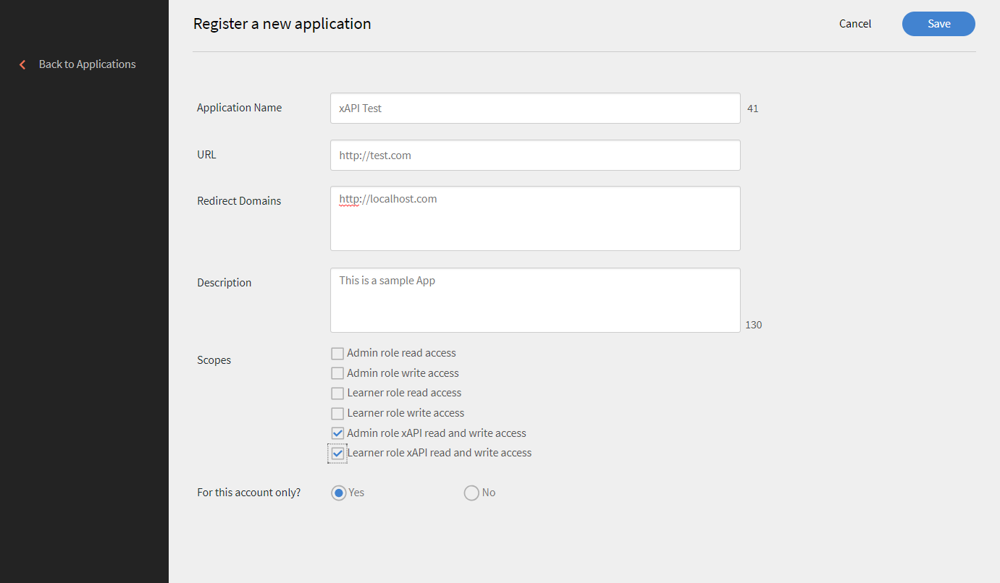
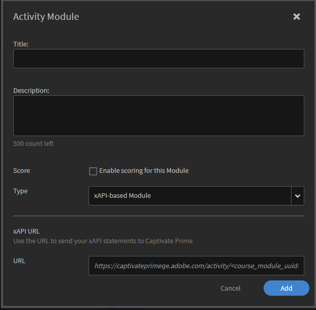

# What is xAPI? {#whatisxapi}

The Experience API (xAPI), is an e-learning software specification that allows learning content and learning systems to speak to each other in a manner that records and tracks all types of learning experiences. Learning experiences are recorded in a Learning Record Store (LRS). LRSs can exist within traditional learning management systems (LMSs) or on their own.

For&nbsp;more information on xAPI,  see: &nbsp; [https://github.com/adlnet/xAPI-Spec](https://github.com/adlnet/xAPI-Spec).

# How does Learning Manager support xAPI? {#howdoescaptivateprimesupportxapi}

Learning Manager has an inbuilt Learning Record Store. This LRS has the full capability of accepting xAPI statements from content that has been hosted within Learning Manager. It even accepts xAPI statements that third parties generate. These xAPI statements are stored within Prime and they can then be exported outside Prime to be visualized into any third-party data warehousing system.

# When do you use xAPI? {#whendoyouusexapi}

Increasingly there is a need to capture learning experiences of the end user which span across multiple systems.&nbsp; There is also a need to track the exact engagement of the learner with training content. It goes beyond Start, In Progress and Completion (which are the only attributes captured by SCORM).

# Using xAPI in Prime {#usingxapiinprime}

## Set up your application {#setupyourapplication}

1. Log in as Integration Admin. Select **[!UICONTROL uicontrol Applications > Register]**.

   

1. Register a new application.

   

1. Define the&nbsp;scope for the application.

   * If **[!UICONTROL uicontrol Admin role xAPI read and write access]** is enabled, the Admin is able to post and get xAPI statements and documents.
   * If **[!UICONTROL uicontrol Learner role xAPI read and write access]** is enabled, the Admin is able to post and get xAPI statements and documents.

1. Save changes. You get your developer id and secret.

** End points **:

Click the link below to view the xAPI swagger document:

[https://captivateprimeeu.adobe.com/docs/primeapi/xapi/](https://captivateprimeeu.adobe.com/docs/primeapi/xapi/)

Note:  xAPI  version supported in Prime is 1.0.3.

## API authentication {#apiauthentication}

Learning Manager xAPI use OAuth 2.0 framework to authenticate and authorize your client applications.&nbsp;Once you register your application, you can get the clientId and clientSecret. Get URL is used in  browser  as it authenticates the Learning Manager users using their pre-configured accounts such as SSO, Adobe ID.&nbsp;

GET&nbsp;https://captivateprime.adobe.com/oauth/o/authorize?client_id=<Enter&nbsp;your clientId>&redirect_uri=<Enter a url to redirect to>&state=<Any String data>&scope=<admin:xapi or learner:xapi>&response_type=CODE.

## Tracking xAPI statements as Prime LO {#trackingxapistatementsasprimelo}

As an Author you can now choose xAPI module while creating courses to monitor user experience outside Prime. For example, you can use this feature to evaluate the activities of users on a third-party platform used for course consumption.

1. While creating an **[!UICONTROL uicontrol Activity Module]**, in the  **[!UICONTROL uicontrol Type]**option, use the pop-up menu to select  **[!UICONTROL uicontrol xAPI-based Module.]**

   

1. You are requested to provide an IRI. If not provided, prime generates one automatically.

   IRI for an activity is unique across an account. That means, two modules in Learning Manager cannot have  same  IRI. A new IRI is generated in the following cases:

   * When a course with  xAPI  module is shared across accounts.
   * When a certification with xAPI module recurs

   &nbsp;

   Any xAPI&nbsp;statement&nbsp;with the mentioned IRI&nbsp;is&nbsp;tracked in the above module and are reflected in the Prime reports.&nbsp;

1. To copy the auto-generated IRI, revisit the Activity Module page.
1. Publish the Module.

**Points to note:**

* Captivate&nbsp;Prime currently supports  only   mbox  as an identifier. Other identifiers including&nbsp;mboz_sha1,  openid , account are not supported.

* The&nbsp;stateId and profileId is a UUID when used with Prime.
* PUT request does not overwrite the document for xAPIs&nbsp;agents/profile, activity/profile, and&nbsp; activity/state
* Unidentified  group is not supported in Actor.
* The parameter "related_activities"&nbsp;is not supported in&nbsp; GET  statement.
* The parameters 'format=ids' & 'format=canonical' is not supported in GET statements.
* Voiding of  xAPI  statement does not undo any actions that happened in Prime when the statement was posted.

# Generate reports {#generatereports}

xAPI  reports can be generated as excel reports. As an Administrator, open **[!UICONTROL uicontrol Reports > Excel reports > xAPI activity report]**.

The downloaded report&nbsp;fetches all the information posted by the Learner and Administrator for any statement.

Same reports can be  gernerated / scheduled using FTP and Box connectors for any  third- party integration. Follow these steps:

Log in as Integration Admin > Open FTP/Box connector > Select xAPI Activity report from the left pane> Choose to schedule/ generate a report.

* When  only  raw score is sent in  xAPI  statement without  max  score, Quiz score is not shown in LT.

* To get the percentage score in Prime,  scaled  scores are sent through xAPI.

# Sample report {#samplereport}

`<download_section>  <download text="Sample xAPI report." filereference="/content/dam/help/en/captivate-prime/administrators/feature-summary/xapi/jcr:content/main-pars/download_section/download-1/xapireport8842560559890766717csv.zip"></download> </download_section>`  