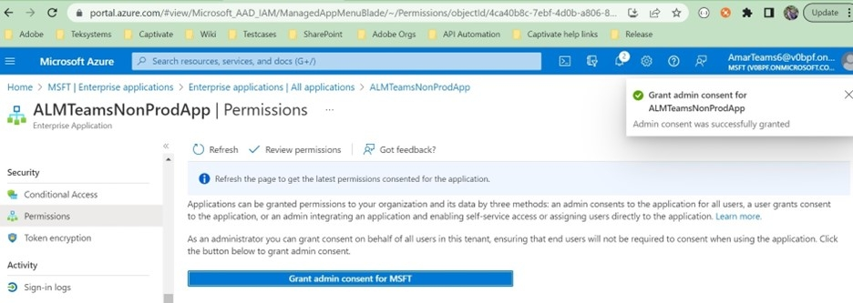
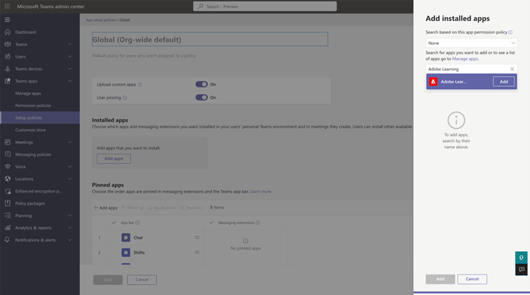

# Adobe Learning Manager App for Microsoft Teams

## How to set up

Setting up ALM on MS Teams involves three steps and needs assistance from the ALM Administrator and Microsoft Azure Administrator. In some organizations, the Azure Administrator and MS Teams Administrators are not the same, and therefore require additional MS Teams Administrators as well.

**ALM Admin - Integration Admin role approves Teams app**

After the Integration Admin approves the MS Teams app, the Adobe Learning Manager app will be available in the MS Teams app store, and your learners can access it. However, the app will not have notifications, silent login, and the app will not be pinned for the learners in MS Teams.

**Microsoft Azure Admin approves the permission for ALM app in Azure dashboard**

The Azure administrator will have to approve the permissions required for the ALM app. This will allow that ALM app to send notifications to MS Teams and allow silent login. In silent login, users need not log in separately to Adobe Learning Manager on the browser.

**MS Teams admin creates a policy for ALM teams**

The MS Teams Admin in their Admin Center should pin the ALM app for all their users and allow it as a global policy. In case ALM is only used by a certain group in the company, then the MS Teams administrator must choose a custom policy and apply it to that specific group only.

## Integration Admin role approves Teams app

Follow the steps below: 

1. On the Integration Administrator app, select **[!UICONTROL Applications]** > **[!UICONTROL Featured Apps]**, and select **[!UICONTROL ALM Teams app]**.

   
   *Select ALM Teams app*

1. On the upper-right corner of the screen, select **[!UICONTROL Approve]**. 

   
   *Select Approve on the app settings page*

1. Select **[!UICONTROL OK]** on the dialog box that appears. 

   
   *Select OK after approval*

1. Once approved, you will be able to see 'ALM Teams App' in the External Apps section. 

   
   *ALM Teams app appears on the Apps page*

Now, users can access the ALM app on MS Teams. 

## Microsoft Azure Admin approves the permission for ALM app in Azure dashboard

Follow the steps below: 

1. As an Azure Admin, navigate to the Manage Azure Active Directory section in the Azure dashboard. 

   
   *Launch Azure dashboard*

1. Paste the following link in a separate browser window:  

   `https://login.microsoftonline.com/<tenantIdTobeReplaced>/oauth2/authorize?client_id=8d349d9f-bf59-4ece-8022-a41e87d81903&response_type=code&redirect_uri=https://learningmanager.adobe.com` 

1. In the above link, replace `<tenantIdTobeReplaced>` with the tenant id available in the Overview page below. Enter the new URL.   

1. Add Adobe Learning Manager app to your Azure applications. 

   
   *Add to Azure*

1. Select the Enterprise Applications tab and select All Applications. You will see ALMTeamsApp listed there. 

   
   *View the ALM app*

1. Click the app and navigate to the Permissions tab. 

   
   *View the Permissions tab*

1. In the Permissions tab, select ' **[!UICONTROL Grant admin consent for MSFT]**' to give ALM teams app permissions. 

   
   *Select Permissions*

1. Select **[!UICONTROL Accept]**.

   
   *Select Accept*

1. Once granted, these permissions will give the ALM app to allow silent logins and send notifications to the learners in the MS Teams app. 

   
   *Access is granted*

## MS Teams admin creates a policy for Teams app

Follow the steps below: 

1. As an MS Teams admin, in the Admin Center, create a policy for adding the Teams app to your learners' Teams app. 

   
   *Create a policy*

1. Navigate to the section, Setup Policies. Create a Global policy and select **[!UICONTROL Add apps]** in Pinned Apps sub-section. 

   
   *Add the policy*

1. In the dialog that follows, search for **[!UICONTROL Adobe Learning Manager]**, and add the app. This adds Adobe Learning Manager in the Installed Apps section. 

   
   *Install the app*

1. Save this policy. This makes the app available to everyone in the organization. 

Alternatively, admins can create a custom policy instead of a global policy. Add Adobe Learning Manager to that custom policy, and then apply the custom policy to only those set of users who need to access Adobe Learning Manager.   
