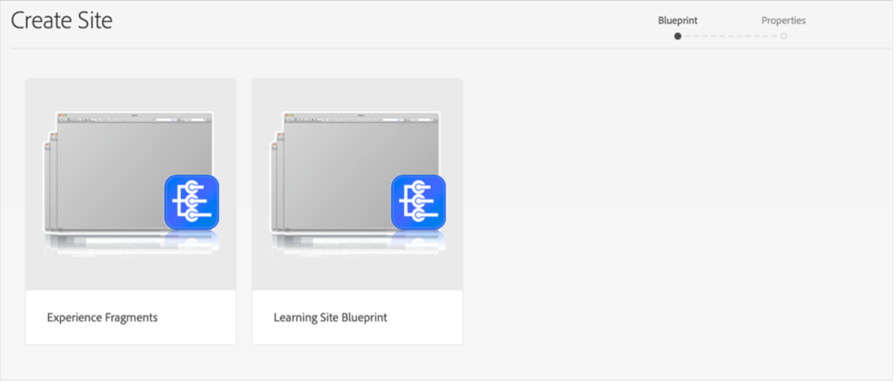

# Adobe Learning Manager reference site (ALM reference site) package for AEM Sites {#adobe-learning-manager-reference-site-alm-reference-site-package-for-aem-sites}

Adobe Learning Manager (ALM) integrates with Adobe Experience Manager (AEM) sites. This enables you to create your own website and responsive mobile interfaces for Adobe Learning Manager with minimum coding effort. With this integration, you can create customized learning experiences for your users.

To build such an experience, ALM provides an Adobe Learning Manager reference site package (ALM reference site package) for AEM Sites in the form of a ZIP file that you can install on your AEM Sites instance.

The package includes AEM Sites web page templates and website components along with embeddable widgets, for example, Learning catalog, embeddable widgets, calendar, and so on.

After you install the ALM reference site package, you can start building a website for Adobe Learning Manager that you can host on your AEM Sites instance. Your users can then drag and drop the components on the website.

Install ALM reference site package

### Pre-requisites

* Licenses for AEM Sites and Adobe Commerce
* AEM on-premise 6.5 or Adobe Experience Manager – Cloud Service
* Adobe Commerce 2.4.3

After you secure your environment of AEM Sites, you must install the ALM reference site package. This package includes AEM web pages and website components that help construct the learning platform.

The reference site package is hosted on the [**GitHub repository**](https://github.com/adobe/adobe-learning-manager-reference-site/releases/tag/1.0.0).

For more information, see the README.

### Create application in Adobe Learning Manager

After you install the AEM site package, you must configure an ALM application to connect your learning portal with the AEM site.

This scenario is applicable when AEM is used with Adobe Learning Manager.

Follow the steps below:

1. As an Integration Administrator, click **Applications**.
1. To create a new application, on the upper-right corner of the page, click **Register**.
1. In the Register a new application screen, enter the following details:

   1. Application Name: The name of the application that you are creating.
   1. URL: The URL of your organization.
   1. Redirect Domains: The hosting domains of the AEM website. You can also specify wildcards.
   1. Description: The description of the application.
   1. Scopes: Select Learner role read access and Learner role write access.
   1. For this account only?: Select Yes if you want to use the application for the existing ALM account.

1. After making the changes, click Save.

Note the application credentials from the screen.

To approve the application, click **Approve**.

### Get the tokens

1. In the Developer Resources tab, click **Access Tokens for Testing and Development**.&nbsp;

   

1. Enter the following details:

   

   1. Get OAuth Code: Enter the client ID from the previous section and change the scope. Click Submit to get the Oauth code.  
   1. Get Refresh Token: Enter the client ID and secret from the previous section. Also enter the OAuth code that you got from the previous step. Click Submit.  
   1. Get Access Token: Enter the client ID and secret from the previous section. Also enter the Refresh token that you got from the previous step. Click Submit.  
   1. Get Access Token Details: Enter the access token that you got from the previous step. Click Submit.

1. You can get the details from the JSON response that follows. The response consists of the access token, refresh token, user role, account id, user id, and the time to expire. Note the refresh token, as you will reuse that.&nbsp;

## Configure ALM account in AEM

1. Launch your AEM instance.
1. Click Settings > Cloud Services.&nbsp;  

1. Click Adobe Learning Manager Configuration.

   

1. Click Create > Configuration Folder. Name your folder.

   

1. In the learning project, select the configuration that you created.  

1. Enter the details of the configuration.&nbsp;

   

   1. Adobe Learning Manager mode: Choose how you want the learning experience for both logged-in and non-logged in learners.  
   1. Adobe Learning Manager URL: Enter the URL of the ALM instance where the learning services are hosted.  
   1. Account ID: The ID of the ALM account.  
   1. Client ID, Client Secret, and Author Refresh Token: Enter the credentials that you got while creating the application in ALM.&nbsp;  
   1. Customization of Widget: For more information, see [Integrate with AEM](https://helpx.adobe.com/learning-manager/integrate-aem-captivate-prime.html) `.`

1. Save and close the configuration.

### AEM + Adobe Learning Manager (logged-in/non-logged-in users)

Adobe Learning Manager now enables you to showcase your product and training to your existing and prospective customers and partners without mandating account creation or sign-in. This functionality will help you drive product and training adoption by providing learners with a quick and easy preview of the training, which helps highlight and promote product features. Therefore, you can effectively showcase your products and offerings, especially to prospective customers and partners resulting in increased product awareness. The ease of access and better reachability lead to heightened interest, which helps drive training enrollments and learning adoption.&nbsp;

Using this workflow a learner can preview a training, access training information, or search for training without signing into Adobe Learning Manager. This workflow is not applicable for the native Learning Manager interface (applicable ONLY for AEM Sites, and other headless interfaces).

**Configure and enable the learning platform connector**

This section underlines the steps needed to configure and enable the following connector:

**Training Data Access**

This connector enables your AEM Sites-based or another custom-made headless user interface to retrieve and render training information to the learners and realize a seamless training information search either before or after a learner logs in.&nbsp;

This connector is only required if you are using AEM Sites-based or other headless interfaces.&nbsp;

The connector exports training metadata to a data storage and retrieval solution as well as a search enablement system. Therefore, you can configure your AEM Sites-based or another custom-made headless user interface to use these two services to retrieve training data, render web pages, and provide optimized training search functionality to the learners. For example, a non-logged in AEM Sites-based interface can use the exported metadata to help a learner search, browse, and access training pages that show training information.&nbsp;

Enable this connector to build and render your AEM Sites-based web pages and deliver customized experiences to your learners both before and after login. Enable this connector to build and render your AEM Sites-based web pages and deliver customized experiences to your learners both before and after login.

* Adobe Learning Manager cdn base URL – Enter the base URL of the data retrieval CDN service path from the Training Data Access connection page.  
* Admin refresh token – Enter the refresh token that you determined in the earlier section.&nbsp;  
* Training Metadata base URL – Enter the base URL of the search enablement and search data retrieval service path from the Training Data Access connection page.
* Adobe Learning Manager Register URL - Enter the self-registration URL generated by the integration administrator for the account, which is used by learners to enroll in training.

### AEM + Adobe Learning Manager + Adobe Commerce (logged-in/ non-logged-in users)

Adobe Learning Manager now provides solutions to help you seamlessly integrate the learning platform with Adobe Commerce. This release will enable you to easily connect your native, AEM sites-based or other headless Learning Manager interfaces to Adobe Commerce. This integration enables you to realize e-commerce abilities within your learning platform. You can now offer paid training to your customers and business partners as well as enable training purchases easily on both native and non-native Learning Manager interfaces. A learner can also preview a training, access training information, or search for training without signing into Adobe Learning Manager.

A user can use the already AEM application and approve it, instead of creating one.

* Adobe Learning Manager cdn base URL – Enter the base URL of the data retrieval CDN service path from the Adobe Commerce connection page.  
* Adobe Commerce URL – Enter the URL of the Adobe Commerce instance that you are using.&nbsp;  
* GraphQL proxy path – The client-side Learning Manager components access the Adobe Commerce GraphQL endpoint directly, and therefore, CORS error may occur. To avoid this error, all calls must either be served from the same endpoint as AEM or served via a proxy that adds CORS headers.  
* Adobe Commerce store name – Enter the Adobe Commerce store name that you determined in the earlier section.&nbsp;  
* Adobe Commerce customer token lifetime (in secs) – Enter the customer token lifetime indicating the pre-determined period for a login session.&nbsp;  
* Admin refresh token – Enter the refresh token that you determined in the earlier section.

## Customize webpages

Customize your webpages by using the AEM references site and the available widgets.&nbsp;

1. Launch your AEM instance.  

1. Click Sites and open the configuration page.  

1. Click **Learning Site > Language Masters > English**. All webpages in the project are included in the folder.&nbsp;

   

1. Select any template and click **Edit**.  

1. On the page, click the component settings button and change the properties of the component.

   

1. Preview your changes or you can publish the page.&nbsp;

## Create webpages

Apart from the templates that you can use that are provided by the reference site package, you can also create webpages based on the templates ibn AEM.

1. On the main AEM page, click Create > Page.&nbsp;  

1. Choose the template that you want to customize. Click Next.&nbsp;  

1. Enter the page properties.&nbsp;

   

1. To create the page, click **Create**.  

1. Select the new page and click Edit.  

1. Insert a component on the page, for example, **Learning- Content**.

   

1. Choose the required Catalog filters that will be displayed on the page.

# Create site from Blueprint

The ALM reference site package provides a "Learning Site Blueprint," which enables you to create a website for your learning platform. AEM blueprints allow you to build webpages directly from AEM Sites components. You need not use any templates.&nbsp;

1. On the AEM start page, click **Sites**.  

1. Click **Create > Site**.&nbsp;  

1. Click Learning Site Blueprint.&nbsp;

   

1. Click Next.&nbsp;  

1. On the properties page, enter the page metadata.&nbsp;Click Create.&nbsp;

   

1. Click the Home hyperlink to navigate to the home page of the site that you have created. On this page, you can customize the widgets and catalog components.

# Code your website

In addition to using the built-in templates and creating your website from scratch using the WYSIWYG components, you can also write code and build the site.

The code is in the [Reference site GitHub repository](https://github.com/adobe/adobe-learning-manager-reference-site) for you to get started.

The main parts of the template are:&nbsp;

* core: Java bundle containing all core functionality like OSGi services, listeners or schedulers, as well as component-related Java code such as servlets or request filters.  
* ui.apps: contains the /apps (and /etc) parts of the project, ie JS&CSS clientlibs, components, templates.  
* ui.content: contains sample content using the components from the ui.apps  
* ui.frontend: contains React components.

All the code is in the repo to get you up and running.&nbsp;

# Import and add learning manager components to existing web-page or template

Installing AEM reference site package adds the Learning Manager components to your AEM Sites instance. By default, you can add these components to the web project (website) Learning Site that we provide out-of-the-box. These components are also available in the website that you create from the Learning Site Blueprint.

However, if you want to use these newly added Learning Manager components to your existing web project or website, you should import them using the following procedure.

1. Install the ALM reference site package.  

1. Open the web project and navigate to the HTML file (for the webpage or web template where you want to add the Learning Manager components). 
1. Joining a meeting

   Open the HTML file and add the following code snippets to the page component so that the code executes before the learning components present in the page render.

   *<sly data-sly-use.configModel="com.adobe.learning.core.models.GlobalConfigurationModel"/>*

   *<meta name="cp-config" content="${configModel.config}" />*

   The preceding code adds the mapped configuration in the meta tag of the page, which is required for the learning components to render. For more details, see [https://github.com/adobe/adobe-learning-manager-reference-site/blob/master/ui.apps/src/main/content/jcr_root/apps/learning/components/page/customheaderlibs.html](https://github.com/adobe/adobe-learning-manager-reference-site/blob/master/ui.apps/src/main/content/jcr_root/apps/learning/components/page/customheaderlibs.html).

1. Ensure that you have mapped the configuration with the web project.  

1. Open the AEM Sites template where you want to import the Learning Manager components.  

1. On the template page editor, navigate to the Allowed Components container and select **Policy**.
1. In the Policy page, navigate to Properties > Allowed Components and select the following components "Learning - Content," "Learning - Form," and "Learning - Structure"

The following procedure enables the template to fulfill the client library dependencies of the imported Learning Manager components.

The web pages that include these components should load these libraries to successfully render and use the components.

1. On the template page editor, click Page Information and then click Page Policy.
1. In the Policy page, navigate to Properties > Client Libraries and add these to your template page:

   1. learning.site
   1. learning.ui
   1. learning.commerce

After you save this template, you can add the Learning Manager components in all web pages derived from this template.
