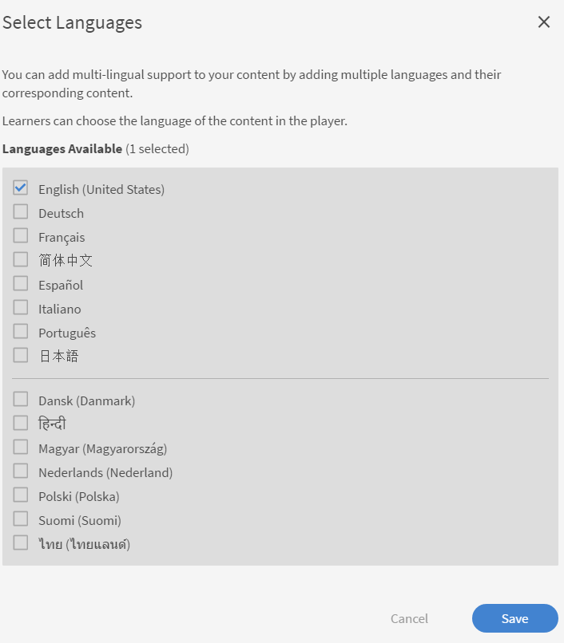

# Add learning objects in different locales

Read this topic to know how to add courses, certifications, and learning plans in different languages.

As authors, you have the ability to create learning objects such as courses, certifications, learning plans. You can also create these learning objects in different languages.

Captivate Prime allows you to create learning objects in several languages. You can add the content and/or metadata in additional languages when you create the learning object. You can also edit your the details of your learning object any time and offer your learning object in additional languages.

To add a new language, click the Course, certification, or learning plan for which you want to add new locales. From the Basic Info page, click Add New Language at the top.

From the pop-up dialog box, select the additional language or languages that you want to offer to learners and click Save.

Republish your course for your changes to take effect.
