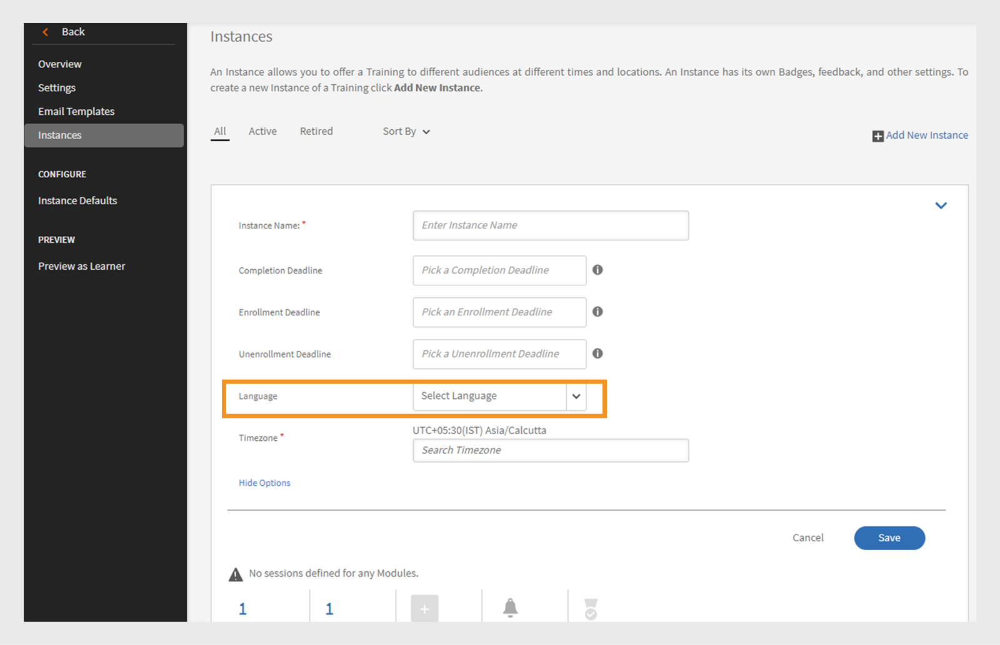

# Add learning objects in different locales

Read this topic to know how to add courses, certifications, and learning plans in different languages.

As authors, you have the ability to create learning objects such as courses, certifications, learning plans. You can also create these learning objects in different languages.

Learning Manager allows you to create learning objects in several languages. You can add the content and/or metadata in additional languages when you create the learning object. You can also edit your the details of your learning object any time and offer your learning object in additional languages.

To add a new language, click the Course, certification, or learning plan for which you want to add new locales. From the Basic Info page, click Add New Language at the top.

*Add a new language*

From the pop-up dialog box, select the additional language or languages that you want to offer to learners and click Save.

*Select a language*

Republish your course for your changes to take effect.

## Multi-Language Support for CR/VC Instances with Language Tagging

Adobe Learning Manager (ALM) allows authors to create language-specific instances using language tagging for Classroom and Virtual Classroom modules. This feature allows learners to access CR/VC modules in their preferred language. For example, an author can create a CR/VC module with two instances: one in English and one in French. Learners can select the instances in their preferred language.

### Workflow

First, the author creates and publishes a course in multiple languages, enabling the language options on the instance creation page. The author can then create different instances by selecting a language for each. Learners can choose the instance based on the language mapped to them.

### Create a course with multiple languages

Follow these steps to create a course with multiple languages:

1. Log in as an **[!UICONTROL Author]**.
2. Select **[!UICONTROL Courses]** > **[!UICONTROL Add]** to create a course.
3. Type the **[!UICONTROL Name]** and **[!UICONTROL Description]** of the course.
4. Select **[!UICONTROL Add New Language]** and select the required languages. This will create multiple tabs for each language.
 
   
   _Add new language - Course_
5. Go to the respective languages tabs and type the **[!UICONTROL Name]** and **[!UICONTROL Description]** of the course.
6. In the English (United States) tab, select **[!UICONTROL Add Module]** > **[!UICONTROL Virtual Classroom Module]**.

   >[!NOTE]
   >
   >The procedure will also be the same for the Classroom Module.
 
   
   Add new language for VC module

7. Type the **[!UICONTROL Title]** and **[!UICONTROL Description]** on each language tab and select **[!UICONTROL Add]**.
8. Enter the required details for the course and publish the course. 

### Create instances for each language

You can create the instances for each language from the Admin and Author apps. Follow these steps to create the instances from the Author App:

1. Log in as an **[!UICONTROL Author]**.
2. Select **[!UICONTROL Courses]** and select the multi-language course.
3. Select **[!UICONTROL Instances]** > **[!UICONTROL Add New Instance]** to create the instances. 
4. Type the **[!UICONTROL Instance Name]** and select the **[!UICONTROL Completion Deadline]**.
5. Select **[!UICONTROL Show More Options]** to see the other options.
6. Select the required language from the **[!UICONTROL Language]** dropdown.
 
   
   _Select the language for the instance_

7. Enter the other details and select **[!UICONTROL Save]**.
8. Create instances for other languages using the same steps. Learners will be able to see all the language instances for this course.

### Select the instance and enroll – Learner workflow

Learners can see these language instances in their app. They can choose their preferred language instance, enroll, and attend the CR/VC sessions in that language.

Follow these steps to select the instance and enroll:

1. In the learner app, go to the **[!UICONTROL Catalog]** and select the course.
2. You can see the following screen with multiple instances.
 
   
   _VC module for learners_

3. You can filter out using the Language filter option. Select your preferred language and enroll in the course.
4. Once selected, you can see the following details on the course overview page.

  
   _Instance details_

