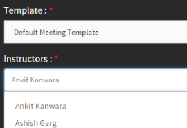

# Adobe Connect integration

Authors can create virtual classroom courses with Adobe Connect during course creation process. To enable Adobe Connect for your Captivate Prime account, you need to contact the Administrator of your organization. 

## Create Virtual Classroom (VC) course with Adobe Connect {#createvirtualclassroomvccoursewithadobeconnect}

1. In My Courses page, click Add Modules and choose Virtual Class room. Create Virtual Classroom dialog appears.   
1. In the **dialog>Conferencing System** option, choose Adobe Connect.

   

1. Enter title, description, VC date, start time and end time.

   If Adobe Connect is not configured for your account, a warning message appears as shown in the screenshot above. Template, instructors and other Adobe Connect options are disabled. You need to contact your Administrator to configure Adobe Connect for your account. 

1. Adobe Learning Manager application fetches the default templates (meeting, training and event) and instructors list (users with host permissions) from Adobe Connect. Choose the template of your choice.
1. Choose the instructor for your VC course from the list of instructors.

   

1. Provide completion criteria for the VC course. Completion criteria is the percentage of total duration of the course a learner has to attend in order to be considered as course complete. For example, say, the duration of course is 1 hour. If you provide 50% as completion criteria, then if a learner attends the course even for 30 minutes, it is considered as course complete for the learner.
1. Click **Done**.

## Shared templates of Adobe Connect {#sharedtemplatesofadobeconnect}

By default, all the shared templates created in Adobe Connect account are fetched into Captivate Prime application. You can add customized templates by making them as shared templates in Adobe Connect account.
