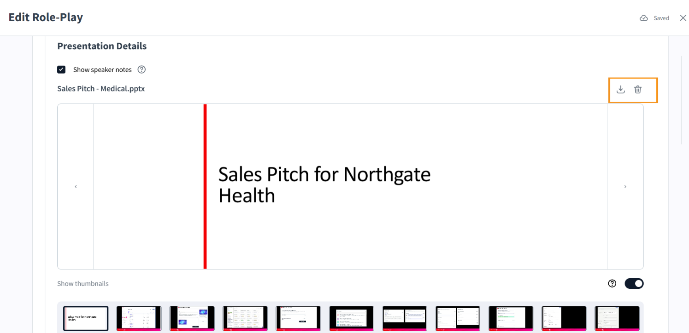
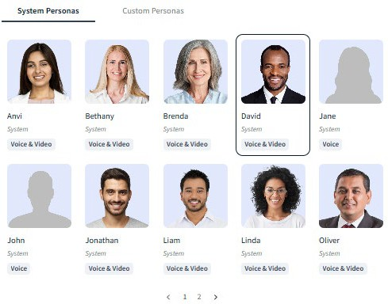
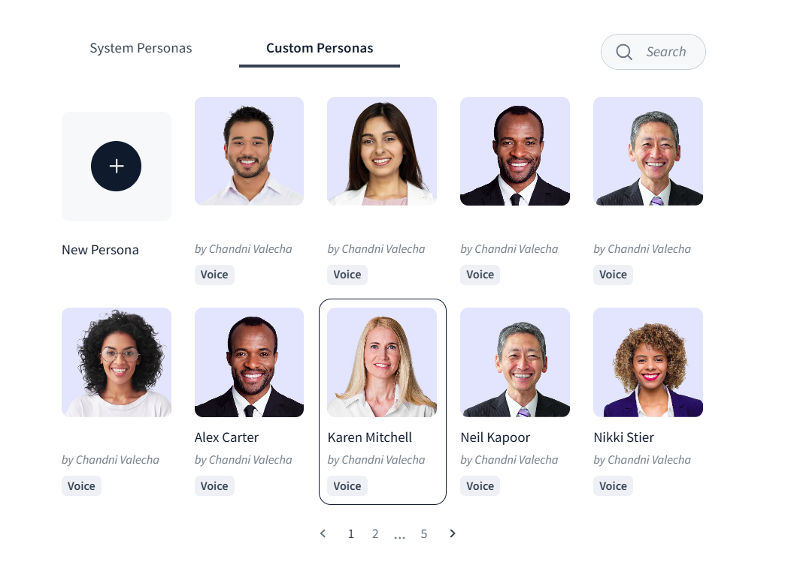
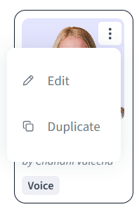
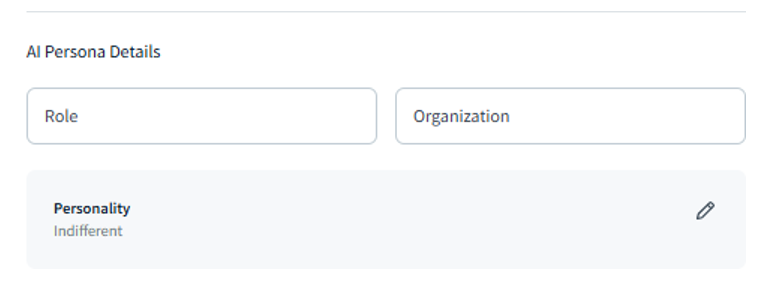
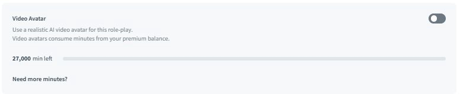
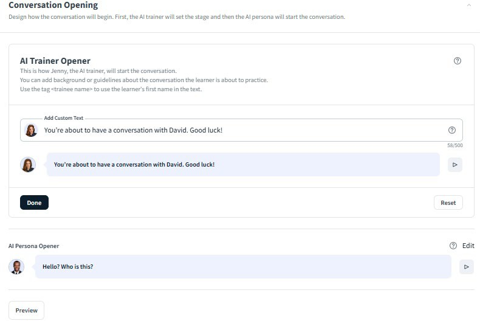

# Configure a presentation for your simulation and set up an AI persona

This is the next section that you'll see after you save the **Personalize Your Simulation** section. In the **Presentation Settings** section, select **Edit**. 

Use the **Presentation Settings** section to attach a slide deck to your roleplay simulation. When a presentation is attached, learners can view it during the session as a reference or talking aid, for example, a product overview deck used during a sales pitch simulation.

>[!NOTE]
>
>Make sure the presentation you upload is accessible. Use sufficient color contrast, include alt text for images, and avoid content that relies on color alone to convey meaning.

## Attach a presentation

1. Select **Upload PDF or PPTX** under **Presentation Details**.
2. Select your file. The maximum file size is 100 MB. Both .pdf and .pptx formats are supported.
3. Once uploaded, the file name appears below the button confirming the attachment.
4. Select **Done** to save the setting and return to the roleplay configuration. Once you upload a presentation file, the **Allow learners to upload their own presentation** option will turn on.
5. You can download the same presentation file or delete it. Buttons for both the options are present on the right.
    

## Allow learners to upload their own presentation

Select **Allow learners to upload their own presentation** if you want each learner to practice with their own version of a deck rather than a shared one. This is useful for scenarios where learners are assessed on a presentation they have personally prepared, for example, a business review or a custom sales pitch.

This toggle is disabled by default. When enabled, learners see an upload prompt at the start of their session.

## Set up the AI persona

The **AI Persona Setup** section controls who the learner speaks with during the simulation , their appearance, voice, role, and behavioral personality. A well-configured persona makes the roleplay feel realistic and ensures the AI behaves consistently with the scenario you have designed.

The **AI Persona Setup** section on the **Edit Role-Play** screen shows a summary of the current persona. Select **Edit** to open the full configuration.

### Choose a persona

Two tabs are available: **System Personas** and **Custom Personas**.

**System Personas** are pre-built characters provided by Adobe. Each system persona has a name, a photo, and one or two supported interaction modes:

* **Voice & Video:** The persona appears as an animated avatar with a spoken voice during the simulation
* **Voice:** The persona uses a spoken voice only, with no video avatar

Select a system persona by selecting their tile. The selected persona's photo appears in the
**AI Persona Details** summary on the **Edit Role-Play** screen.

**Custom Personas** are personas you have previously created. Select this tab to reuse a persona from an earlier roleplay rather than building one from scratch.
 

You can reuse a persona in two different ways. 

1. You can edit the details of a persona directly to change the persona and use it as a different persona.
2. You can use the Duplicate option to create a duplicate of the persona and change the duplicate persona's details.

To see both the options, click the vertical ellipsis which appears on the upper right corner of the image of the persona when you either hover over or select it.
 

### Configure persona details and personality

After selecting a persona, complete the **AI Persona Details** fields below the persona grid:

1. Enter the persona's Role, their job title as it should appear in the simulation. For example: Medical Affairs Director
2. Enter the persona's Organization, the company or institution they work for. For example: Northgate Health.
     
3. Select a Personality that matches the challenge level and scenario context.

    | Personality              | Behavior                                              |
    |--------------------------|-------------------------------------------------------|
    | Skeptical                | Questions everything and demands proof                |
    | Indifferent              | Disengaged and hard to excite                         |
    | Enthusiastic             | Excited about the solution and ready to engage        |
    | Relationship Oriented    | Values trust and personal connection above all        |
    | Neutral                  | Stays balanced and evaluates options without bias     |
    | Assertive                | Blunt, fast-paced, and tends to challenge others      |

4. Optionally enable **Allow learners to select this option before role-play starts** to let learners choose the persona's personality before launching the session. This is useful for practice-mode scenarios where learners want to control the difficulty.
5. Select **Done** to save the persona configuration.

>[!NOTE]
>
>Match the personality to the scenario challenge. A cold-call scenario benefits from a Skeptical or Indifferent persona to simulate a difficult prospect. A leadership feedback scenario works well with Assertive or Relationship Oriented to reflect realistic manager-employee dynamics.

## Create a custom persona

If the system personas do not fit your scenario, create a new one from the Custom Personas tab.

1. Select **Custom Personas**, then select **Create New Persona**.
2. Upload a photo for the persona. The image must be at least 640 × 360 pixels and no larger than 1 MB.
3. Enter the persona's First Name.
4. Select a **Voice** from the drop-down menu to set the AI's speaking voice.
5. Adjust the Voice rate slider to control speaking speed. The scale runs from -100 (slowest) to +100 (fastest). The default is 0 (neutral pace). Select **Test Voice** to preview how the voice sounds before saving.
6. Select **Create persona**. The new persona is saved to your **Custom Personas** tab and available for use in any future roleplay.

>[!NOTE]
>
>Custom personas support voice interaction. Confirm the voice rate sounds natural for the scenario before publishing; a very fast or very slow rate can make the simulation feel unnatural and affect learner performance on the pace metric. 

### Video Avatar

Enabling Video Avatar adds a realistic AI video avatar to the roleplay. Video avatars are available for personas that support Voice & Video mode and consume minutes from your premium balance. Your remaining balance is shown below the toggle.

## Configure the conversation opening

The **Conversation Opening** section controls the first two things a learner hears when a simulation starts: a brief context statement from the AI trainer, followed by the AI persona's opening line. Together, they establish the scenario and put the learner immediately into the situation.

### AI Trainer Opener

The AI Trainer Opener is a short message spoken by the trainer — not the persona — before the conversation begins. It sets the stage for the learner: who they are about to speak with, what the objective is, and any relevant context they need going in.

Select **Edit** to update the text. Keep it brief and direct. The learner reads or hears this once before the persona speaks.

**Example:**

"You're about to have a conversation with David. Good luck!"

For more demanding scenarios, use the opener to include the objective explicitly:

"You're about to make a cold call to a senior procurement lead. Your goal is to secure a follow-up meeting. Once you are done, select End Simulation to finish."

### AI Persona Opener

The AI Persona Opener is the first line the AI persona delivers to the learner, starting the conversation. It should reflect the persona's personality and put the learner on the spot from the first exchange.

Select **Edit** to update the text. The opener should be realistic for the scenario — abrupt for a cold call persona, polite but measured for a formal meeting.

**Examples by scenario type:**

| Scenario                      | Example opener                                                      |
|-------------------------------|---------------------------------------------------------------------|
| Cold call                     | "Hello? Who is this?"                                               |
| Scheduled discovery call      | "Hi, thanks for reaching out. What did you want to cover today?"    |
| Feedback conversation         | "Do you have a minute? I wanted to talk about last week."           |
| Executive pitch               | "I only have ten minutes. What have you got for me?"                |

### Preview the opening

Select **Preview** to hear both openers played in sequence, exactly as the learner will experience them at the start of a session. Use this to confirm the tone and pacing feel natural before publishing.

>[!NOTE]
>
>If the AI Trainer Opener and AI Persona Opener feel too similar in tone, the transition between them can be confusing. Keep the trainer opener neutral and instructional; let the persona opener carry the personality.
