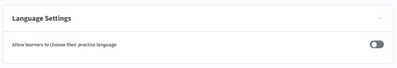
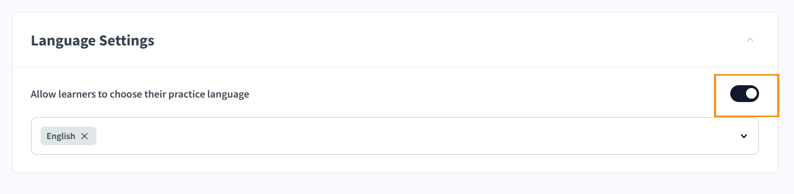
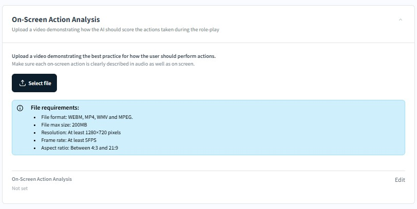
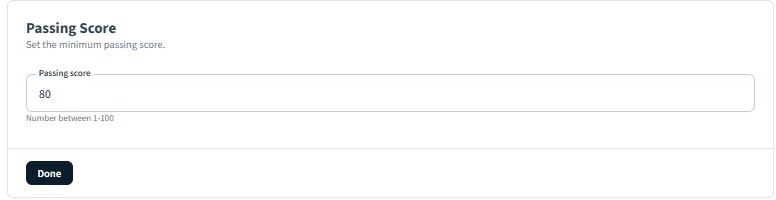
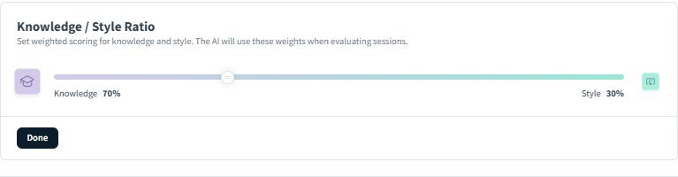
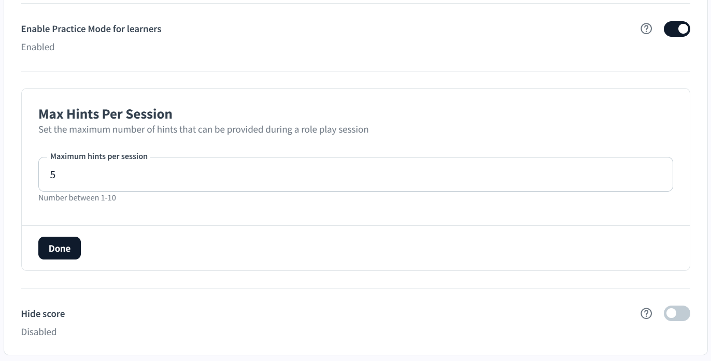
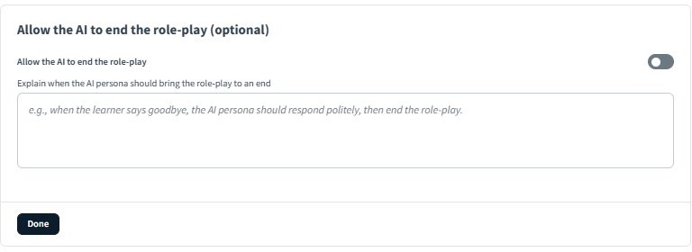
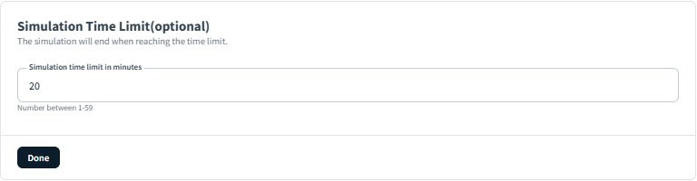
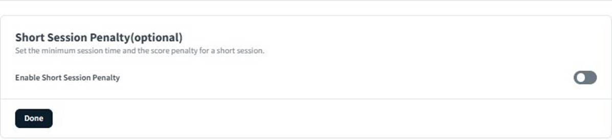

# Configure score settings and advanced options

## Configure language settings

The **Language Settings** section controls whether learners can choose the language they practice in when they launch the simulation.

Enable Allow learners to choose their practice language to let each learner select their preferred language at the start of the session. When enabled, a language selection prompt appears before the simulation begins.

Leave this toggle disabled if you want all learners to practice in the language the roleplay was authored in. This is the recommended setting for formal assessments where language consistency is part of the evaluation criteria.

>[!NOTE]
>
>Virtual Coach supports simulation content in 16 languages. Learner language selection is only meaningful if your scenario content and persona are appropriate for multilingual use. If your evaluation guidelines and persona background are written in a single language, enabling this setting may yield inconsistent AI responses for learners who select a different language.

## Configure on-screen action analysis

The **On-Screen Action Analysis** section lets you upload a best-practice video that shows the AI how to score the actions a learner takes during the roleplay. The AI uses this video as a reference when evaluating whether the learner's on-screen behavior matches the expected standard. However, remember that this option will be disabled if you have uploaded only PowerPoint (pptx) or PDF files in the **Presentation Settings** section.

This setting is most useful for simulations where the learner is expected to demonstrate specific actions visibly on screen, for example, navigating a software interface, completing a form, or following a defined process step by step.

### Upload a best-practice video

1. Select **Select file** to open the file browser.
2. Select your video file and confirm the upload.
3. Once uploaded, the file name appears in the **On-Screen Action Analysis** summary row at the bottom of the section.

If you need to replace or update the video later, select **Edit** in the summary row to upload a new file.

### File requirements

Your video must meet the following technical specifications before upload:

| Requirement        | Specification           |
|--------------------|-------------------------|
| File format        | WEBM, MP4, WMV, or MPEG |
| Maximum file size  | 200MB                   |
| Minimum resolution | 1280×720 pixels         |
| Minimum frame rate | 5 FPS                   |
| Aspect ratio       | Between 4:3 and 21:9    |

* **How to record an effective best-practice video:** The AI scores learner actions by comparing them against your uploaded video, so the quality and clarity of the recording directly affects scoring accuracy.
* **Describe every action in audio and on screen:** Each step the demonstrator takes should be narrated aloud at the same time it appears visually. For example, if clicking a button is a required action, say "I'm now selecting the **Submit** button" while doing so. The AI relies on both the audio description and the visual action to understand what is being demonstrated.
* **Keep the video focused on the task:** Avoid extended pauses, off-topic commentary, or navigation that is not part of the required process. Each section of the video should correspond to a discrete, assessable action.
* **Use a clean screen recording:** Remove notifications, browser tabs, and any content unrelated to the scenario. A cluttered screen makes it harder for the AI to identify which actions are part of the expected behavior.
* **Match the video to your evaluation guidelines:** If your topics table includes a topic for a specific on-screen action, the best-practice video should demonstrate that action clearly at the point in the workflow where it is expected to occur.

## Configure score settings

The **Score Settings** section controls how learner performance is measured, weighted, and displayed. These settings determine what score a learner must achieve to pass, how knowledge and communication style contribute to that score, and whether learners receive hints or see their result after the session.

**Passing Score:** The Passing Score is the minimum overall score a learner must achieve for the simulation to be marked as passed. It applies to the weighted combination of knowledge and style scores.

1. Enter a number between 1 and 100 in the **Passing Score** field. The default is **80**.
2. Select **Done** to save.
    

>[!NOTE]
>
>For formal assessments, a passing score of 75–80 is typical. For practice-mode roleplays where the goal is skill development rather than certification, consider a lower threshold or enable **Practice Mode** so no pass/fail results are shown at all.

**AI Scoring Weights:** The Knowledge / Style ratio sets how much each component contributes to the learner's overall score. The AI uses these weights to evaluate each session.

* Knowledge measures what the learner said — whether they covered the required topics and provided accurate information.
* Style measures how the learner communicated — pace, clarity, filler words, sentence length, and energy.

Drag the slider to adjust the balance between the two. The two values always total 100%. The default is Knowledge 70% / Style 30%.
Select **Done** to save.

Choose the right ratio:

|Scenario type | Recommended ratio | Reason |
|---------|----------|---------|
| Skills assessment or certification | 80% Knowledge/20% Style | Content accuracy is the primary measure |
| Sales enablement | 60% Knowledge/40% Style | Delivery matters as much as message in customer conversations |
| Leadership development | 70% Knowledge/30% Style | Balanced — both content and tone are critical in people conversations |
| Communication coaching | 40% Knowledge/60% Style | Style is the primary learning objective |

**Enable Practice Mode for Learners:** When **Enable Practice Mode for Learners** is on, learners can request hints during the simulation to help them stay on track. Practice mode is useful for early-stage learning, where the goal is skill-building rather than formal assessment.

When practice mode is enabled, two additional settings appear:

**Hint visibility duration:** Controls how long each hint stays visible on screen before disappearing. The default is 30 seconds. Adjust this if your scenario involves complex topics that require more reading time.
**Max Hints Per Session:** Sets the maximum number of hints a learner can request in a single session. The default is five hints. Select **Edit** to change the limit. Setting a lower number encourages learners to attempt responses independently before requesting help.

>[!NOTE]
>
>Hints are not available during formal assessments. If you are using this roleplay as a graded assessment, disable Practice Mode to ensure all learners are evaluated under the same conditions.

**Hide score:** Enable Hide score to prevent learners from seeing their numerical score after the session. When enabled, learners still receive qualitative feedback and topic-level analysis, but the overall knowledge and style scores are not displayed.

This setting is disabled by default. Use Hide score when:

* The roleplay is used for practice only, and you want learners to focus on the feedback rather than the number.
* The scenario is part of a manager-reviewed assessment where only the evaluator should see the result.
* You want to reduce score anxiety in early learning stages and encourage repeated attempts without judgment.

## Configure advanced roleplay settings

The Advanced Settings section controls how and when the simulation ends, whether a time limit applies, and how the session environment is configured for the learner. These settings are all optional and can be left at their defaults for most scenarios.

### Allow the AI to end the role-play

Select **Edit**. By default, only the learner can end a simulation by selecting **End Simulation**. Enable **Allow the AI to end the role-play** to let the persona close the conversation naturally when a defined condition is met.
 

1. Enable the **Allow the AI to end the role-play** toggle.
2. In the text field that appears, describe the condition under which the AI persona should bring the conversation to a close.
3. Select **Done**.

**Example conditions:**

| Scenario | End condition to enter | 
|---------|----------|
| Cold call | When the learner successfully schedules a follow-up meeting or the persona declines three times, the persona should end the call politely. |
| Feedback conversation | When the learner and the persona reach an agreed action plan, the persona should thank the learner and close the conversation. |
| Discovery call | When the learner says goodbye or signals they are done, the AI persona should respond politely and end the role-play. |

Tip: Use AI-ended conversations for advanced scenarios where the natural endpoint of the conversation, not a timer, should determine when the session closes. This makes the simulation feel more realistic. For beginner practice scenarios, leave this disabled so learners can end at their own pace.

### Simulation time limit

Select **Edit**. Set a maximum session duration. When the time limit is reached, the simulation ends automatically, and the learner is taken to the analysis page.
 

1. Enter a number between 1 and 59 in the **Simulation time limit in minutes** field. The example shown is 20 minutes.
2. Select **Done**.

Leave this setting unset if you want learners to control the length of the conversation themselves.

### Guidance on setting time limits

| Scenario type | Suggested limit | 
|---------|----------|
| Cold call or brief opener practice | 3–5 minutes | 
| Discovery call or needs assessment | 10–15 minutes | 
| Full sales conversation or leadership discussion | 15–20 minutes |
| Formal assessment with multiple topics | Set to match the expected real-world conversation length |

>[!NOTE]
>
>If both a time limit and AI-ended conversation are configured, whichever condition is met first will end the session.

### Short Session Penalty

The Short Session Penalty discourages learners from ending sessions too quickly by applying a score reduction if the session falls below a minimum duration.
 

1. Enable the **Enable Short Session Penalty** toggle.
2. Set the minimum session time and the penalty amount that apply when a learner ends before that threshold.
3. Select **Done**.

Use this setting when session length is meaningful to the learning objective, for example, in a discovery call scenario where the learner must spend enough time uncovering needs before proposing a solution. Without a penalty, a learner could end the session immediately after covering a single topic and still receive partial credit.

>[!NOTE]
>
>Do not use the Short Session Penalty in practice-mode roleplays where learners are still building confidence. Penalizing early exits can increase anxiety and discourage repeated attempts.

### Enable screen sharing

Enable **Screen Sharing** to allow learners to share their screen during the simulation. This is relevant for scenarios that include an **On-Screen Action Analysis** component, in which the learner's on-screen behavior is part of the assessment.

If you have uploaded only PowerPoint or PDF documents in the **Presentation Settings** section, this setting is disabled by default.

### Enable AI persona subtitles

Enable AI persona subtitles to display on-screen text showing what the AI persona is saying during the simulation, in real time.

This setting is disabled by default. Enable it for:

* Learners who have hearing difficulties or are practicing in a second language
* Noisy environments where audio clarity may be reduced
* Scenarios where reading the persona's exact words is important for understanding nuanced objections or complex questions
