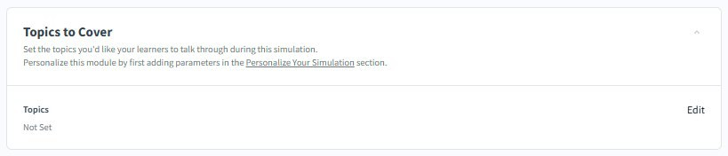
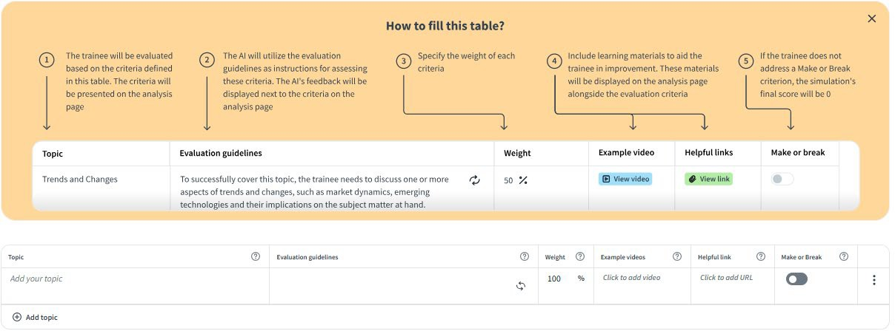
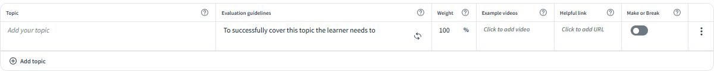
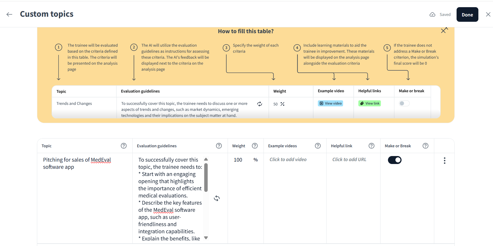

# Configure topics and evaluation criteria

The **Topics to Cover** section defines what the learner must address during the simulation and how the AI evaluates their performance on each topic. Every topic you add becomes a scored component in the learner's knowledge report after the session.

**Before you begin:** Complete the **Personalize Your Simulation** section first. The AI uses your conversation context and persona background to generate accurate evaluation guidelines for each topic.

## How the topics table works

Each row in the topics table represents one required area of conversation. The table has five columns:

| Column | Purpose |
|-------|--------|
| Topic | The name of the conversation area that the learner must cover |
| Evaluation guidelines | The criteria the AI uses to assess whether the topic was addressed adequately. These guidelines also appear as feedback on the learner's analysis page |
| Weight | The percentage of the knowledge score this topic contributes. All topic weights must total 100% |
| Example video | An optional video that the learner can watch on their analysis page to see how the topic should be handled |
| Helpful link | An optional URL shown on the learner's analysis page alongside the evaluation criteria, linking to reference material or further reading |
| Make or Break | When enabled, if the learner does not address this topic at all, the simulation's final score is 0, regardless of performance on other topics |

## Add a topic

1. Select Edit in the Topics to Cover section to open the topics table.
2. Select Add topic. A new row appears with empty fields.
3. Enter the topic name in the Topic field. Use a short, descriptive label that reflects the conversation area — for example: Opening and Rapport, Handling Objections, or Agreeing Next Steps.

4. Enter the evaluation guidelines in the Evaluation guidelines field. Write these as a completion statement starting with: To successfully cover this topic, the learner needs to…

    For example: To successfully cover this topic, the learner needs to discuss one or more aspects of the product's security architecture, confirm audit trail capabilities, and address the persona's concern about compliance before moving on.

5. Enter a percentage in the Weight field. Distribute weights across all topics so the total equals 100%.
6. Optionally, select **Click to add video** to attach an example video. The video appears on the learner's analysis page next to this topic's feedback.
7. Optionally, select **Click to add URL** to attach a helpful link, for example, a knowledge base article, a product one-pager, or a training resource.
8. Optionally, enable **Make-or-Break** for non-negotiable topics. If the learner fails to address a Make-or-Break topic, their final simulation score is 0.
9. Repeat the same process for each topic you want to include. Select **Add topic** to add another row.
10. After all the necessary topics are added, select **Done** on the upper right.
     

## Edit or remove a topic

* To edit any field in an existing topic row, select the field directly and update the text or value.
* To regenerate the evaluation guidelines using AI based on your persona and context, select the refresh icon (↻) in the **Evaluation guidelines** cell.
* To remove a topic, select the options menu (⋮) at the end of the row and select **Delete topic**.
* To duplicate a topic and use it as the basis for a similar one, select **Duplicate topic** from the same menu.
* After you have edited the topics, select **Done**.

## Guidelines for writing effective topics

**Name topics after conversation stages, not product features.** Topics like _Opening and Rapport, Needs Discovery, and _Agreeing Next Steps_ reflect the structure of a real conversation and map naturally to how the AI evaluates dialogue flow.
**Write evaluation guidelines as observable actions.** The AI assesses what the learner said; so, guidelines must describe specific, audible behaviors, not intentions. Compare:

| Weak                                                        | Strong                                                                                                      |
|-------------------------------------------------------------|-------------------------------------------------------------------------------------------------------------|
| The learner should understand the persona's concerns        | The learner needs to ask the persona to name their primary concern and confirm they heard it before responding |
| The learner covers pricing                                  | The learner needs to address the price objection by linking cost to measurable business outcomes and offering a comparison to current costs |

**Use Make or Break sparingly.** Reserve it for one or two topics where total omission would make the conversation a clear failure — for example, failing to introduce yourself on a cold call, or failing to propose any next step at the end of a discovery call. Applying it to too many topics makes it difficult for learners to pass even a reasonable attempt.
**Balance weights to reflect conversation importance.** A topic that occupies most of a typical conversation — such as needs discovery in a sales call — should carry a higher weight than a brief opener or close.
Add helpful links to low-scoring topics. If learners consistently score low on a particular topic across sessions, attach a resource link so they have something to study between attempts.
