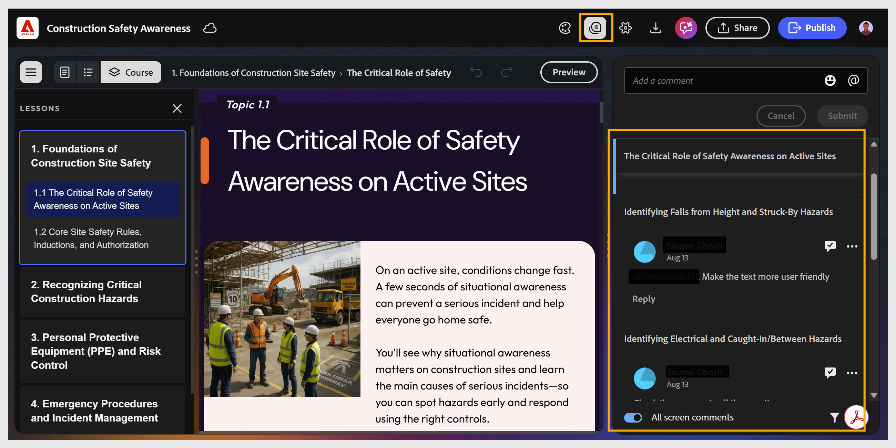
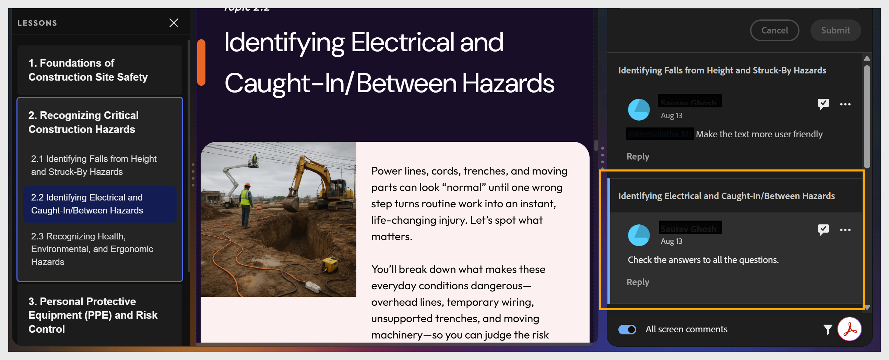
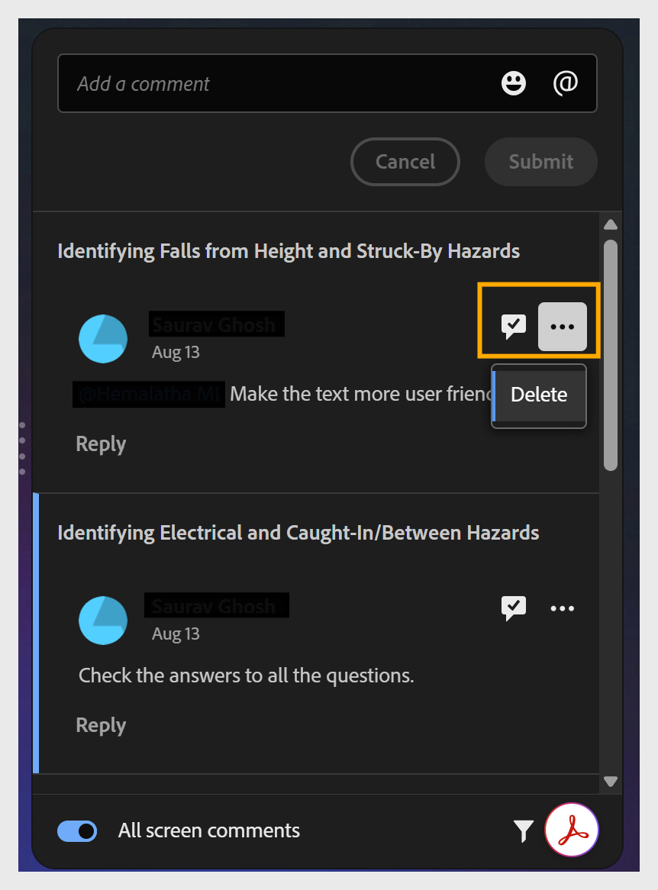

# Manage and respond to comments

If you are the course creator, You can use the **Comments** panel in your project to view and reply to the comments.

1. Select **Comments** from the top toolbar. The **Comments** panel opens showing all reviewer comments.  

    

2. Select any comment to view it in context on the canvas.  

    

3. Select the checkmark icon to mark a comment as resolved, or the **More options** icon to edit or delete it.  

    

4. Save the updated course.  

5. Select **Share** to update the review link, so reviewers see the latest version.  
