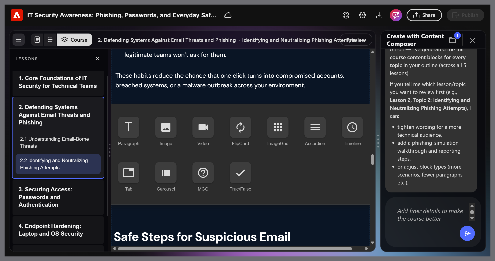
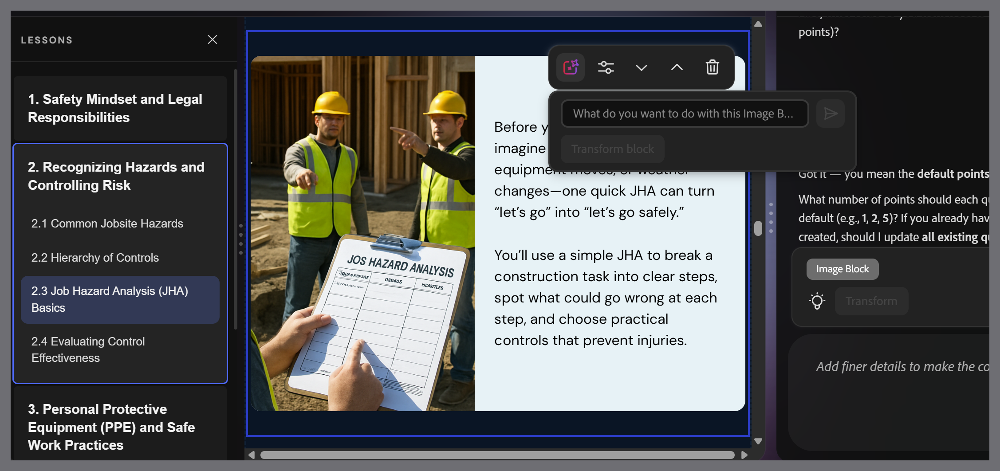

# Add a content component

Select between two existing elements. The + button appears. Select it to open the component picker.

Available components:

| **Component**  | **Use for**                                       |
|----------------|---------------------------------------------------|
| **Paragraph**  | Body text and explanations                        |
| **Image**      | Illustrations, screenshots, diagrams              |
| **Video**      | Embedded MP4 or linked video                      |
| **Flip Card**  | Term or definition pairs, reveal interactions     |
| **Image Grid** | Multiple images in a grid layout                  |
| **Accordion**  | Expandable sections, step-by-step procedures      |
| **Timeline**   | Sequential events or process steps                |
| **Tab**        | Parallel content - comparisons, regional variants |
| **Carousel**   | Swipeable series of images or content cards       |
| **MCQ**        | Inline ungraded knowledge check                   |
| **True/False** | Inline ungraded true or false check               |

>[!NOTE]
>
>Use **Accordion** for step-by-step procedures where learners benefit from controlling their pace. Use **Flip Card** for term or definition content.

## Move content blocks within a topic

You can reorder content blocks within a topic using either the edit options in the toolbar or the AI.

