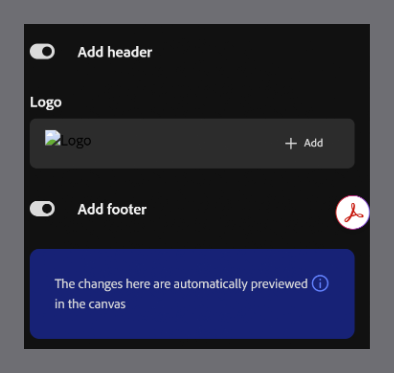

# Add a header and footer

Add a header and footer to include elements such as your logo.

1. Select **Themes** from the toolbar, then hover over the applied theme and select **Edit**.

2. Turn on the **Add header** toggle to add a header to your course.

3. Under **Logo**, select **Add** to upload a logo for the header.

4. Turn on the **Add footer** toggle to add a footer to your course.

>[!NOTE]
>
>Content Composer automatically previews your changes in the canvas as you make them.

