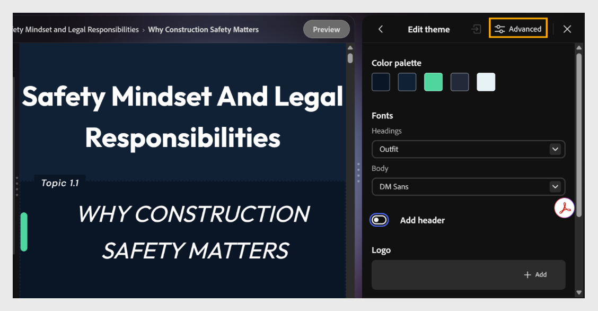
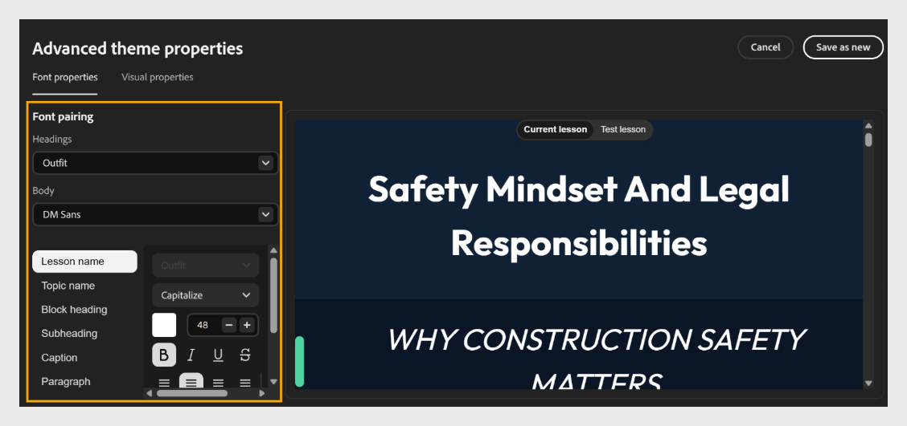
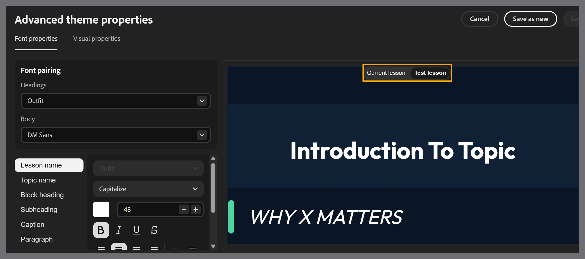

# Advanced theme customization in Content Composer

## Customize advanced theme properties in the app

Use advanced theme properties for more granular control over individual elements, such as lesson names, topic names, block headings, subheadings, captions, and paragraphs.

1. Select **Themes**, hover over the applied theme, select **Edit**, then select **Advanced**.
   

2. In the Font properties panel, set the **Font pairing** for your course:

   - Select the **Headings** dropdown and choose a font for all headings.

   - Select the **Body** dropdown and choose a font for body text.
   

3. Set the list of elements: **Lesson name**, **Topic name**, **Block heading**, **Subheading**, **Caption**, and **Paragraph;** select the element you want to customize.

4. In the [!UICONTROL Visual properties] panel, you can adjust the layout and spacing across the course.

   - Set the amount of spacing between elements, using the content density options.

   - To set **Card/image corner radius**, drag the slider or enter a value to set the roundness of cards and images. For example, set the radius to 17 px.

   - Select **Lesson** to change the background color or image of a lesson.

   - Select **Topic** to set the background color or border of a topic.

   - Select **Header/Footer** to set the header and properties.

   Content Composer automatically previews your changes in the canvas as you make them.

5. For the selected element, customize its properties as needed:

   - Choose a **font style**, such as Capitalize.

   - Set the **font size** using the **+** and **-** controls.

   - Choose a **font color**.

   - Apply formatting, such as **Bold**, *Italic*, <u>Underline</u>, or ~~Strikethrough~~.

   - Set the **text alignment**.

6. Preview your changes in the canvas on the right. Use the **Current lesson** and **Test lesson** tabs to check how your changes appear across different lessons.
   

7. Select **Save as new** or **Save**.
