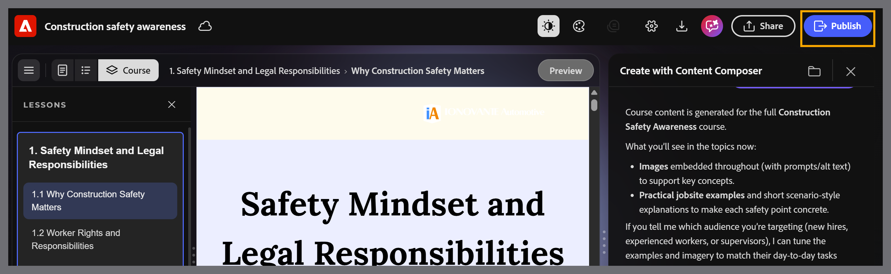
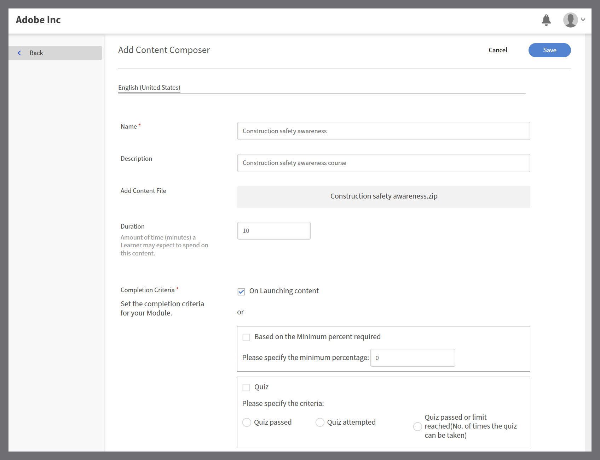
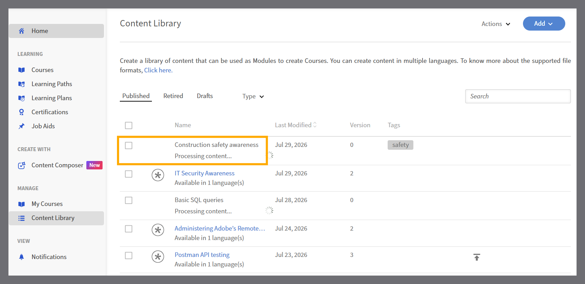

# How Adobe Learning Manager Content Composer and Adobe Learning Manager work together

Content Composer handles authoring. Adobe Learning Manager handles delivery, enrollment, tracking, and reporting. The two products connect through a publishing step. Once you publish from Content Composer, the course becomes a module in the ALM Content Library, where it can be assembled into a course and assigned to learners.

## What Content Composer controls

- Lesson and topic structure

- Course content - text, images, videos, components, and knowledge checks

- End-of-lesson quizzes, including question types and answer options

- Visual theme

- Completion criteria and success criteria

- SCORM version used for reporting

## What Adobe Learning Manager controls

- Learner enrollment and access

- Module metadata - duration, tags, unique IDs, expiry

- Course assembly - combining Content Composer modules with other learning content

- Learner tracking, reporting, and transcripts

- Course versioning

- Notifications and reminders

## From course creation to learner completion

1. **Author the course in Content Composer**: create your course in Content Composer, including lessons, topics, themes, quizzes, and completion settings. Configure course settings - completion criteria, success criteria, and quiz scoring - before publishing.
For more information, see [Configure course settings](#settings).

2. **Publish to Adobe Learning Manager:** when authoring is complete, connect Content Composer to your ALM account through the **Export** settings and publish the course. Content Composer sends the course to the ALM Content Library as a SCORM-compliant module.

3. **Configure the module in ALM:** once published, the course appears as a module in the ALM Content Library. An ALM Author configures module metadata - including duration, tags, unique IDs, and expiry settings - and adds the module to an ALM course alongside other learning content.

>[!NOTE]
>
>If you set completion and success criteria in Adobe Learning Manager (ALM), those settings take precedence over the ones defined in Content Composer.

4.**Publish the ALM course:** An ALM Author assembles the module into an ALM course, adds course images and settings, and publishes it. Only after this step can learners be enrolled.

For more information, see [Adobe Learning Manager](https://experienceleague.adobe.com/en/docs/learning-manager/using/get-started/getting-started-author).

For more information, see [Course creation as an author on ALM](https://experienceleague.adobe.com/en/docs/learning-manager/using/authors/courses).

5.**Learners complete the course:** learners access the course through Adobe Learning Manager, launch the Content Composer module, complete lessons and quizzes, and receive scores based on the completion and success criteria you configured in Step 1.

For more information, see [Access course as a learner](https://experienceleague.adobe.com/en/docs/learning-manager/using/get-started/getting-started-learner).

6.ALM records learner progress: completion status, quiz scores, and learner data are recorded in ALM and made available through learner transcripts and administrative reporting.

7.**Update the course using versioning**: when you update content in Content Composer and republish, ALM creates a new version of the module. ALM Authors can update existing courses to use the latest version.
