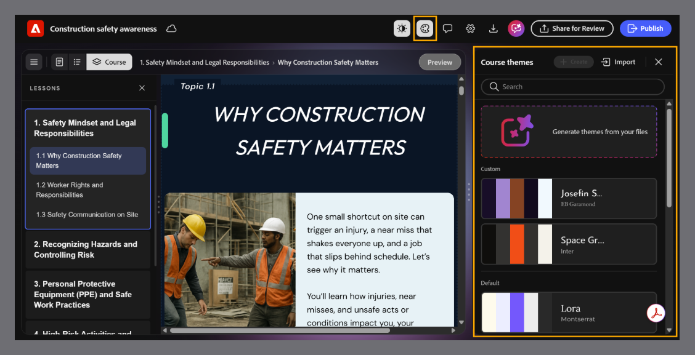

# Apply a theme

Course themes control fonts, colors, headers, footers, and component styling across your entire course.

Apply a theme to your course without any customization for a quick, polished, and consistent look.

1. Select **Themes** from the toolbar. The **Course themes** panel opens showing all available themes.

2. Browse the available themes:

   1. **Default:** displays the built-in themes that come with Content Composer.

   2. **Custom:** displays the themes you have created and saved.

   3. Use the **Search** bar to locate a theme by name.

3. Select a theme to apply it. The course preview updates automatically.
