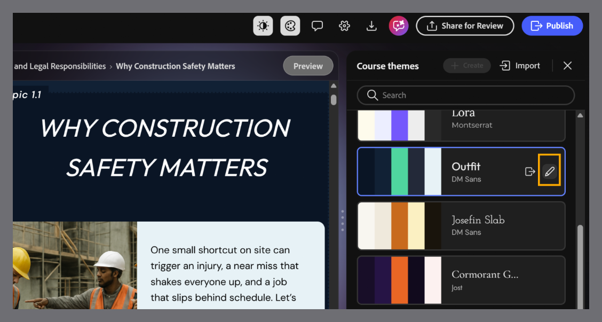
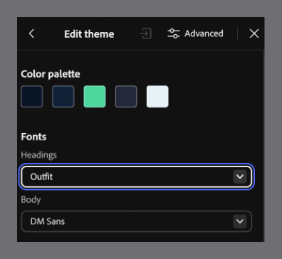
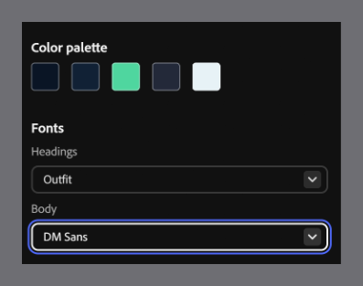
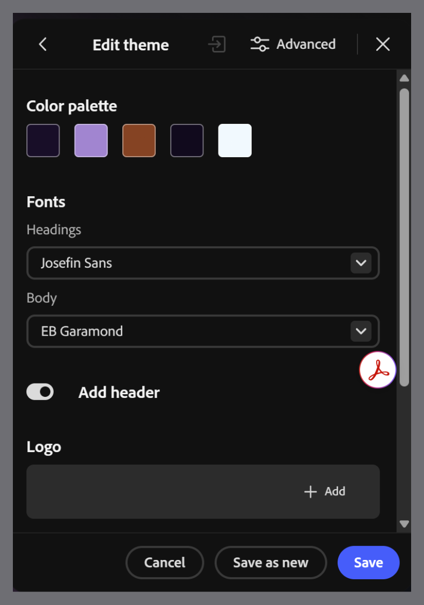

# Change fonts

Update the heading and body fonts to better match your content or brand.

1. Select **Themes** from the toolbar, then hover over the applied theme and select **Edit**. The **Edit theme** panel opens, displaying the theme's color palette and fonts.

2. Under **Fonts**, select the **Headings** dropdown and choose a font for all headings in your course. For example, select **Outfit**.

3. Select the **Body** dropdown and choose a font for the body text in your course. For example, select **DM Sans**.

4. Select **Save** to overwrite the existing theme with your changes or **Save** **as new** to create a new custom theme while keeping the original unchanged.

>[!NOTE]
>
>Default themes cannot be edited directly. To customize a default theme, edit it and then select Save as new to create a custom theme based on the original.
