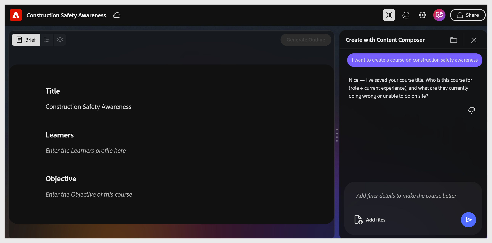
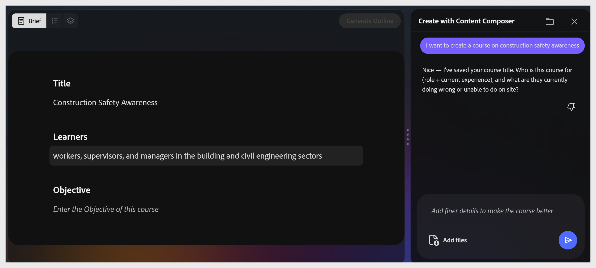
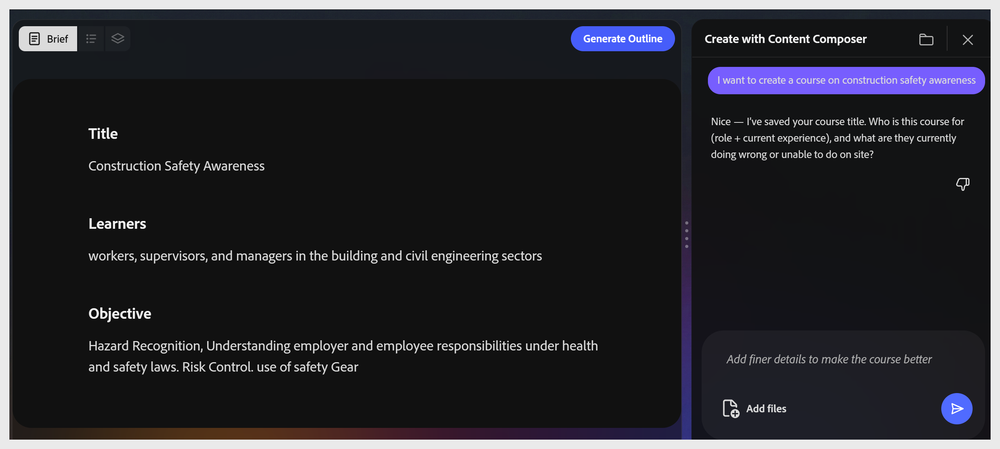

# Complete the course brief

The **Brief** stage has three fields: **Title**, **Learners**, and **Objective**. The assistant fills these in conversation, suggesting values, offering alternatives, and asking for confirmation in each field. All three fields must contain content before the **Generate Outline** button activates.

## Set the course title

The assistant suggests two title options based on your prompt. Select the option you prefer, or type your own in the chat input. The canvas updates immediately.

### Define the learners

The assistant asks who the learners are- their role, experience level, and what they currently struggle with. Type your answer in the chat or select a suggested option.

**Tip:** Mention both what learners already know and what they don't. This shapes vocabulary and scenario choices throughout the generated course.

## Write an objective

The assistant asks what learners will be able to do on the job after completing the course. Write the objective as a behavior starting with an action verb.

**Example objective:**

Hazard Recognition, Understanding employer and employee responsibilities under health and safety laws. Risk Control. use of safety Gear.

Once the objective is accepted, **Generate Outline** turns blue and becomes active.

>[!TIP]
>
>The objective drives everything downstream. It controls which parts of your source file the AI uses, how the outline is structured, and what the quiz tests.
