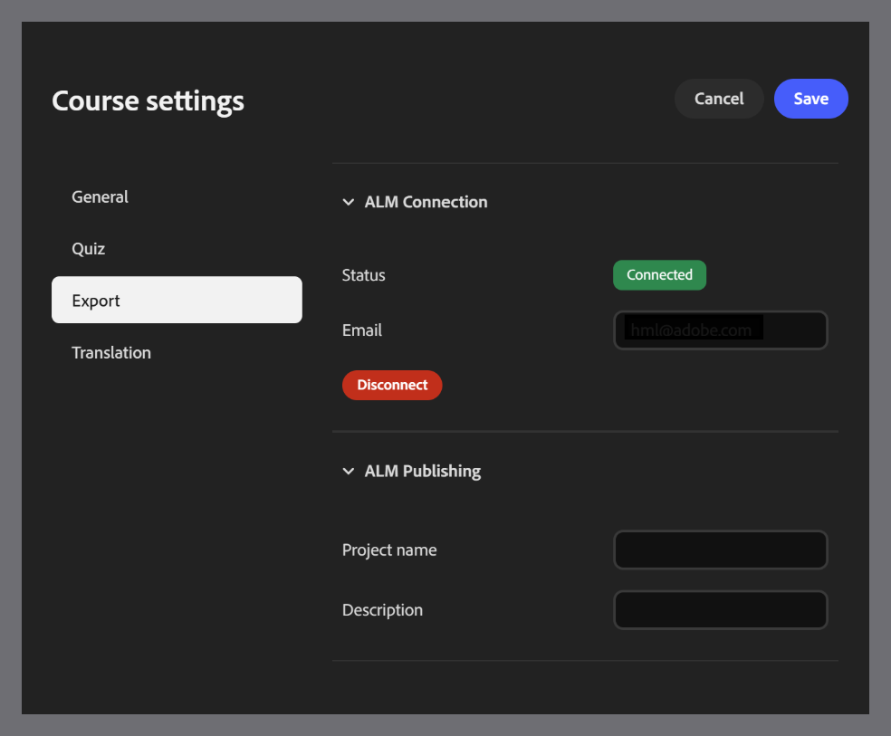
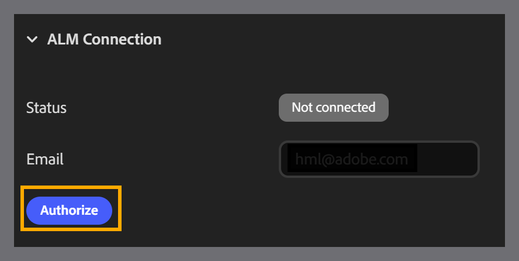
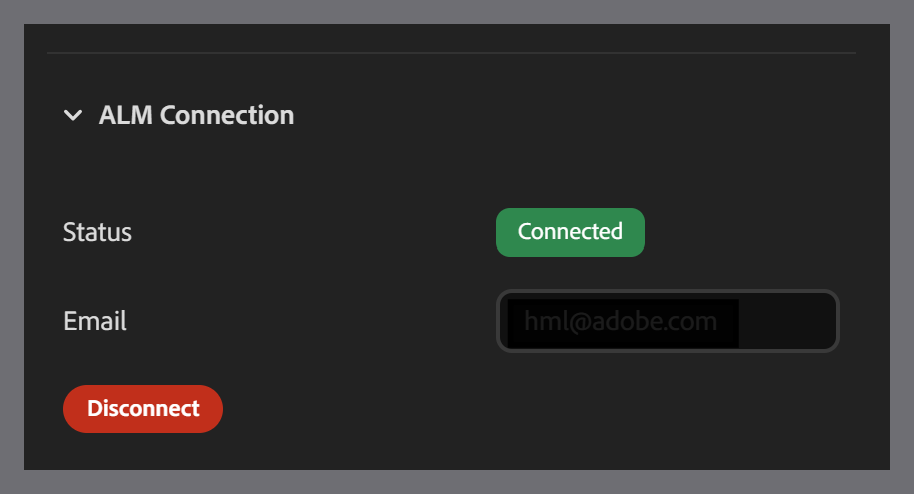

# Connect and publish to Adobe Learning Manager

The **Export** tab lets you connect your course to Adobe Learning Manager (ALM) and publish it directly to the ALM Content Library. To set up the connection, enter your email in the **Email** field. Make sure you have an ALM account with the same email login ID. Once connected, you can publish the course to ALM as a module.

This connection is a one-time setup per course. Once established, you don't need to reconnect each time you publish or export.

It has two sections:

- ALM Connection section

- ALM Publishing section

**To configure export settings**

1. Open **Course settings** and select the **Export** tab on the left.

2. Expand the **ALM Connection** section (if not already expanded).

   - Enter your **Email** address associated with your Adobe Learning Manager account.

   - Select **Authorize** to sign in and connect the course to your ALM account.
   

   - Once authorized, confirm the **Status** field updates from **Disconnect** to **Connected**.
   

## Adobe Learning Manager Publishing details

After connecting your account, configure the publishing details in the ALM Publishing section.

- Enter a **Project** name to identify the course. This name appears as the course title in the ALM Content Library.

- Enter a **Description**- a short summary of the course that appears alongside it in the ALM Content Library, helping learners and administrators understand its purpose.

- Select **Publish** to send the course to the ALM Content Library as a module.
