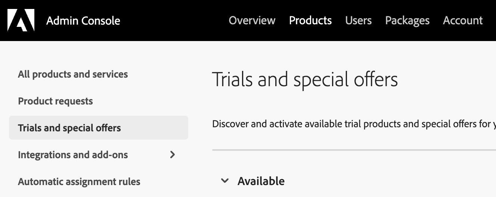

>[!IMPORTANT]
>
>Who this document is for: Administrators who need to enable Creative Cloud storage for Adobe Learning Manager users so they can access and use Content Composer. It is especially useful for admins troubleshooting storage-related sign-in or access errors and assigning the Free Membership offer through Adobe Admin Console.

Adobe Learning Manager (ALM) Content Composer requires users to have Creative Cloud storage associated with their Adobe account. Users who do not have Creative Cloud storage may be unable to access Content Composer and can encounter sign-in or access-related errors.

To help organizations provision storage for affected users, Adobe provides a Free Membership offer that administrators can assign through the Adobe Admin Console. This offer includes Creative Cloud storage and can be used when a user does not already have a plan that provides storage entitlement.

## Before you begin

Ensure that:

* You have Adobe Admin Console administrator access.
* The user requiring Content Composer access is identified.
* You have verified whether the user already has a plan that includes Creative Cloud storage.

## Why users need Creative Cloud storage

Content Composer uses Creative Cloud storage to store courses. Users who do not have storage assigned to their Adobe profile may receive an error when attempting to use Content Composer.

Many Adobe customers already have Creative Cloud storage through existing Adobe products and are unaffected. However, some Adobe Learning Manager customers may not have storage provisioned by default and may need an administrator to enable it.

## Enable free Creative Cloud storage for users

If a user does not have Creative Cloud storage, assign the Free Membership offer from Adobe Admin Console.

1. Sign in to [Adobe Admin Console](https://adminconsole.adobe.com/) using an account with administrator privileges. Only administrators can assign products and offers to users.
2. From the Admin Console, select Products > Trials and special offers.

   

3. Find the Free Membership offer that is available under Trials and Special Offers. This is the offer discussed as the recommended method for enabling Creative Cloud storage for users who do not already have storage entitlement.

   

4. Assign the Free Membership offer to the required users. Assignment can only be completed by an administrator with appropriate Admin Console permissions.
5. After assignment, verify that the user has Creative Cloud storage available and ask the user to sign in again to Content Composer.

## Storage provided through Free Membership

Users with Free Membership offer receive approximately 2 GB of Creative Cloud storage, which allows them to use Content Composer.

## Troubleshooting

**User receives an error when accessing Content Composer**

Verify whether the user has Creative Cloud storage available in their Adobe profile.

**User cannot see the Free Membership offer**

Confirm that:

* You are signed in as an administrator.
* You are viewing the Products area of Adobe Admin Console.
* The organization is eligible to access the offer.

## Frequently asked questions

**Does every Adobe Learning Manager user automatically receive Creative Cloud storage?**

No. Some ALM users may not have storage provisioned by default and may require additional entitlement through the Free Membership offer.

**Can users enable storage themselves?**

No. The storage entitlement must be assigned by an Adobe administrator through Admin Console.

**Is Creative Cloud storage required for Content Composer?**

Yes. Content Composer depends on users having Creative Cloud storage associated with their Adobe account.

**What should administrators do if a user encounters a storage-related error?**

Verify that the user has Creative Cloud storage entitlement. If not, assign the Free Membership offer through Adobe Admin Console and have the user try again.

**What should administrators do if they still have access or entitlement issues?**

If the Adobe Admin Console administrator faces an issue while assigning Creative Cloud storage or debugging access-related problems, the issue might require enterprise account-level support. In such cases, contact Adobe Enterprise Support through the available support options in Admin Console.

For more information, view [Adobe Enterprise Support options](https://helpx.adobe.com/business/enterprise/get-help/support-options/support-for-enterprise.html)
