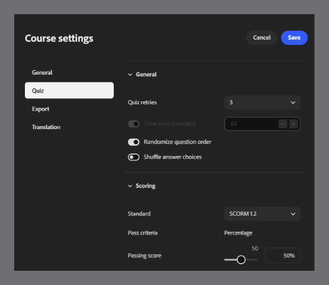
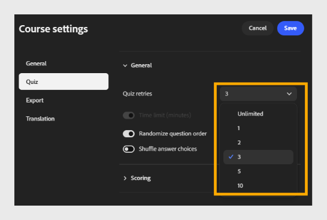
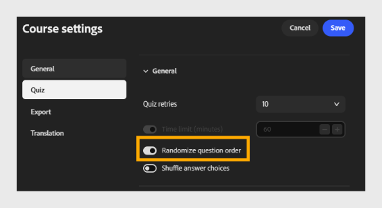
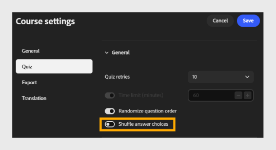

# Configure quiz settings

Select **Quiz** to configure how the quiz behaves and how it is scored.

This tab has two sections: **General** and **Scoring**.

## General section

- **Quiz retries**: Choose the number of attempts a learner gets to complete the quiz. For example, select **3** to allow up to 3 attempts.
  

- **Time limit (minutes)**: Select the toggle to enable a time limit, then enter the duration in minutes. For example, enter **60** to give learners 60 minutes to complete the quiz.

- **Randomize question order**: Select the toggle to show questions in a random order for each learner.
  

- **Shuffle answer choices:** Select the toggle to shuffle answer choices for each question.
  

## Scoring section

- **Standard**:

Select the SCORM version used to report quiz results to your LMS. Choose the version that matches your LMS's compatibility requirements.
For example, select **SCORM 1.2**.

>[!NOTE]
>
>If you're unsure which SCORM version to choose, check with your LMS administrator.

