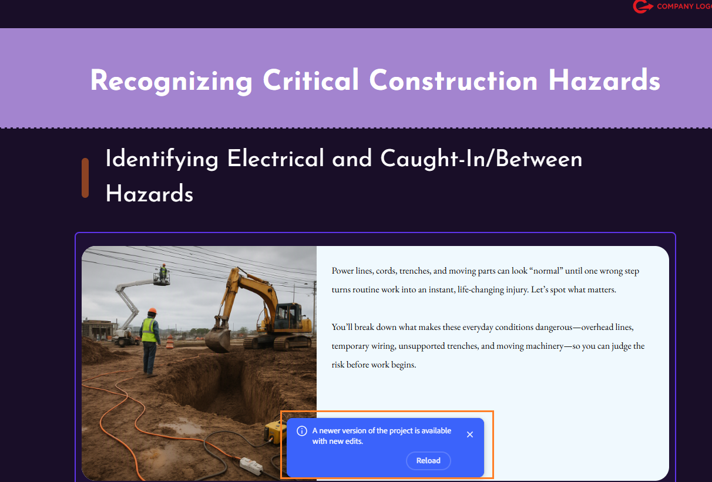
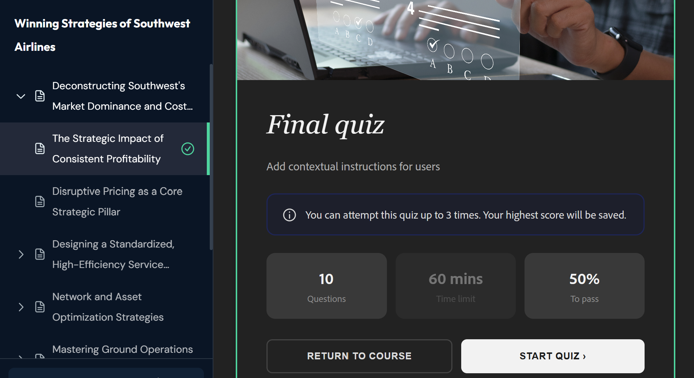
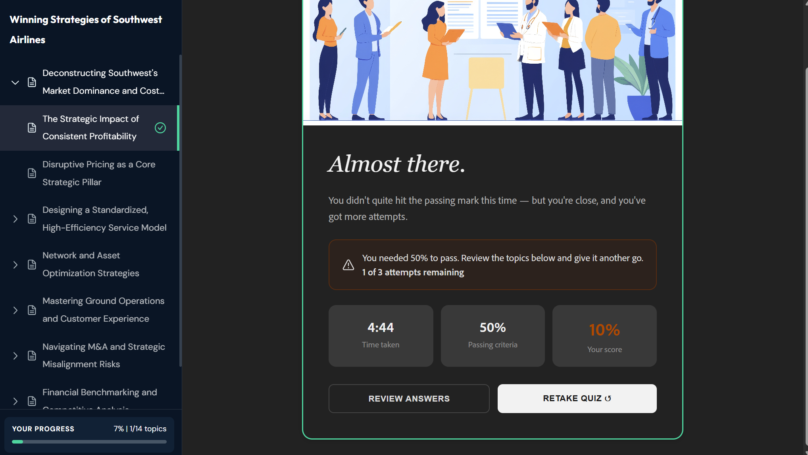

# Adobe Learning Manager Content Composer FAQ

Get answers to frequently asked questions about using Content Composer.

**The Generate Outline button is grayed out. What do I do?**

All three **Brief** fields, **Title**, **Learners**, and **Objective,** must contain content before **Generate Outline** activates. Check the canvas for any field still showing placeholder text in italics, such as *Enter the Learners profile here* or *Enter the Objective of this course*. Fill in the empty field and the button activates immediately.

**I can't select the outline to rename a lesson. Why?**

Outline editing is conversational in the current beta. You cannot select a lesson or topic on the canvas to rename or reorder it. Type your change in plain language in the assistant chat panel.

Examples:

- "Rename Lesson 1 to 'How Phishing Works'"

- "Move topic 1.3 to be the first topic in Lesson 2"

- "Delete Lesson 4 and distribute its topics across Lesson 3"

**The generated outline doesn't match what I wanted. What went wrong?**

The outline reflects the prompt and brief. If the structure feels off, the most common causes are a prompt that covers too many topics at once, or a learning objective that doesn't name the specific skills or behaviors the course should develop.

**The AI skipped an important section of my uploaded file. How do I fix this?**

Content Composer prioritizes sections of your source file that are most relevant to your learning objective. If a section was skipped, it likely wasn't reflected in the objective.

To fix this:

1. Return to the **Brief** panel and update the objective to explicitly name the missing topic.

2. Ask the assistant to regenerate the outline: "Regenerate the outline, making sure to include the data retention policy section."

You can also add the missing content manually as a new topic in the outline conversation: "Add a new topic to Lesson 2 called 'Data Retention Policy'."

**Can I use Content Composer with Adobe Captivate?**

No. Content Composer and Adobe Captivate do not share a round-trip workflow. You cannot open Content Composer projects in Captivate, and you cannot open Captivate projects in Content Composer.

A Captivate-exported MP4 can be inserted as a **Video** component in Content Composer.

**Can I use Content Composer for compliance or regulated training?**

Yes. This is one of its strongest cases. Upload your policy or procedure documents in Manage source files, and select Restrict output to content in files so the AI generates only from what you provided rather than supplementing with general knowledge.

**Why are knowledge checks not graded?**

Knowledge checks in Content Composer are designed for learning reinforcement during a lesson, not for scoring. They provide immediate feedback to the learner but do not produce a grade or completion record.

Only end-of-lesson quiz assessments are graded. If you need an assessment that contributes to a learner's score, use the quiz, not a knowledge check component.

**The quiz questions don't match what the course teaches. How do I fix this?**

Content Composer uses AI to generate quiz questions, and AI output is non-deterministic. The questions may not always reflect exactly what you expect. Review all quiz questions after the course is generated, edit any that need adjustment directly in the Course editor, and verify the content is accurate before publishing.

## About Share for Review  

**What is Share for Review in Content Composer?** 

Share for Review lets you distribute a course to reviewers for feedback before publishing. Reviewers open the course in a browser, add comments on any component, and attempt the quiz — without installing Content Composer or needing a subscription.  

**Do reviewers need a Content Composer license?** 

No. Reviewers do not need a Content Composer subscription or installation. Anyone with the review link can open the course in their browser.

**Do reviewers need an Adobe ID to participate?** 

Not for basic review. Reviewers can open the course, add comments, and attempt the quiz without an Adobe ID. An Adobe ID is required only to use @mentions to tag the author or other reviewers.

**Can reviewers edit the course content?**

No. Review access is comment-only. Reviewers can add, reply to, resolve, and filter comments, but cannot change course text, images, or structure.  

Where are review files stored? Review files are hosted in Adobe's cloud. Authors do not need to manage file storage or send course files to reviewers directly.

### Sharing and access  

**Who can access a review link?**  

By default, only people you invite by name or email can access the project. Verify this in the Who has access section of the Share project panel before sending the link.

**Can I invite external stakeholders who are not Adobe users?**

Yes. You can invite anyone by email address — they do not need an Adobe account to review the course.

**Can I add reviewers after the review has already started?** 

Yes. Open the Share project panel at any time, add names or email addresses, and select Invite to comment. New reviewers receive an invitation immediately.  

**Can I remove a reviewer after sharing?** 

Yes. In the Share project panel, locate the reviewer under Who has access and remove them. If they try to open the course using a previously shared link, they see an access-denied message.  

**What happens if a reviewer loses access?** 

They can select Request access on the access-denied screen. The course owner receives a notification to restore access.

### Commenting and feedback  

Can reviewers comment on a specific part of the course? 

Yes. Reviewers select any course component — a text block, image, or quiz question — and add a comment directly on that element. Comments stay contextually linked to the component they were added on.

**Can multiple reviewers comment at the same time?**  

Yes. All reviewers see each other's comments in the Comments panel and can reply, resolve, or @mention each other.  

**Can I filter comments to find unresolved feedback?**  

Yes. Use the Resolved filter in the Comments panel to show only unresolved comments. You can also filter by Reviewers to see feedback from a specific person, or by Time to find the most recent comments.  

**How do I tag another reviewer in a comment?**

Type @ followed by their name or email address and select them from the dropdown. Tagged users receive a notification. This requires the reviewer to be signed in with an Adobe ID.

#### Quiz and learner access  

**Can reviewers attempt the quiz?** 

Yes. Reviewers can attempt the quiz up to the specified number of retries. Their scores are not recorded and do not affect the course or any LMS reporting.

**What is the difference between sharing for review and sharing for learners?** 

Share for review gives access to the course with the comments panel enabled — intended for colleagues and stakeholders giving feedback. Share for learners gives access to the course without comments — intended for learners who are not enrolled through an LMS. Learner scores are also not recorded through a direct link.

### Updating and closing a review

**Do I need to create a new review after making changes?**

No. The review URL stays the same after you update the course. Select Save after making changes, then select Share to notify reviewers that an updated version is available.

**Will reviewers be notified when I update the course?**
Reviewers see a notification banner when they open the review link after an update. They can select Reload to view the latest version.  

**Do old comments remain after a course update?** 

Yes. Existing comments persist across updates. Reviewers and authors can continue resolving comments on the updated version.

**What happens to a learner link after I update the course?** 

The existing learner link continues to show the previous version. Generate a new link after each update and share it with learners to ensure they access the latest content.  

**How to view project updates?**

If the author updates the course while you're reviewing it, a notification is displayed.

- Select **Reload** to load the latest version, or dismiss the notification to continue reviewing the current version. Reloading is safe — your existing comments persist even after the project updates, so you won't lose any feedback you've already added.

## Attempt the quiz as a reviewer

As a reviewer, you can attempt the quiz up to the specified number of times, but your scores aren't recorded.  

- Select **START QUIZ** to attempt the quiz.  

    

- Upon completion the results are displayed. From here, you can select Review answers to see which questions they got right or wrong, or Retake quiz to try again.  

    

