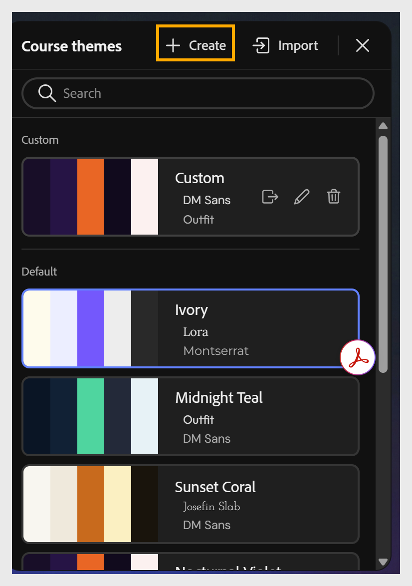
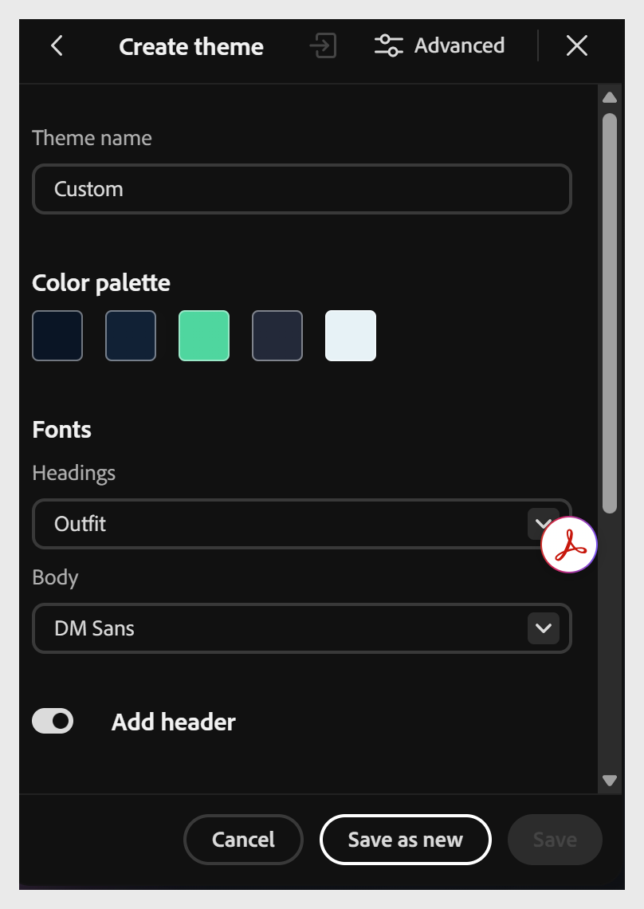
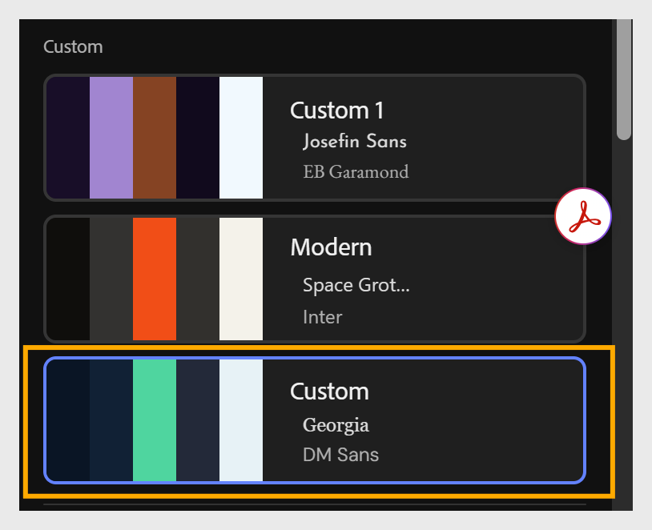

# Create a theme

Two ways to create a custom theme, both of which add the result to your **Custom** themes list:

- **Build from scratch** using the **Create** option in the toolbar - configure the color palette, fonts, and other properties, then **Save as new**.

- **Import a customized JSON file** - export an existing theme as JSON, edit it in a text or code editor, then import it back in.

**Need more control?**

For per-element typography (lesson names, topic names, block headings, captions), color-token-level customization, and full JSON schema access - the kind of control a platform or brand team typically wants, see [Advanced theme customization](advanced-theme-customization.md).

## Create a theme from scratch

1. Select **Create** from the toolbar to open the **Course themes** panel.
    

2. Configure the theme's color palette, fonts, and other properties as needed.
    

3. Select **Save as new** to add the theme to your **Custom** themes list.
    

## Create a theme by importing JSON

1. Select **Themes** from the toolbar to open the **Course themes** panel.

2. Hover over the theme you want to use as a base, and select **Export** to download it as a JSON file.

3. Open the JSON file in a text or code editor, and update its properties, such as radius, spacing, color palette, or fonts.

4. Save the JSON file.

5. In Content Composer, select **Import** from the **Course themes** panel.

6. Choose the updated JSON file from your computer.

7. Select **Save as new** to add the theme to your **Custom** themes list.
