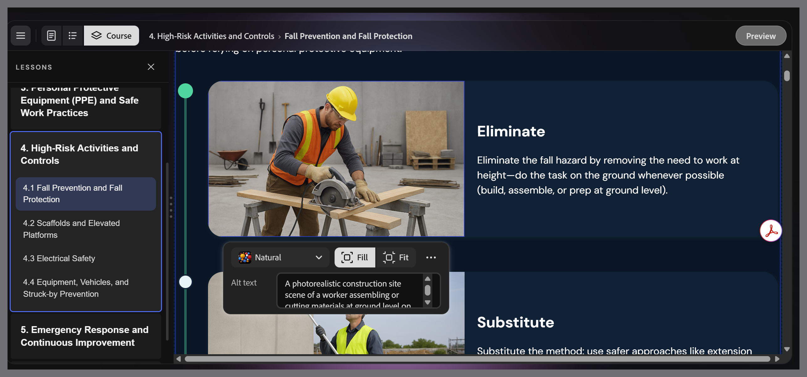

# Edit or add an image

Select any image to open the image toolbar. Controls include:

- **Fill**, **Fit:** how the image is sized within its frame

- **Alt text** field: displays the image description. 
  **Note**: This text can't be modified. It updates automatically based on the image.

- **More options** icon: **adjusts** brightness, saturation, and transparency of the image.

To replace the image, select **image** icon to change the image. Choose to upload your own file, search Adobe Stock, or generate one with AI.
