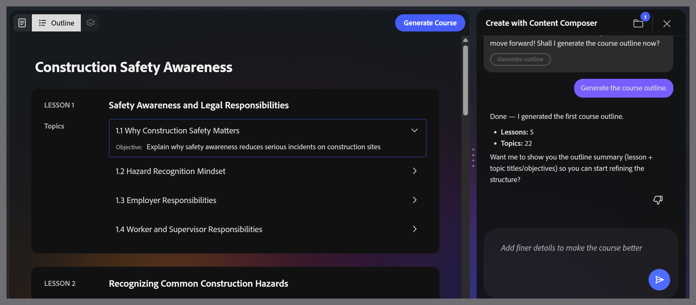

# Edit the course outline

Adobe Learning Manager Content Composer generates a lesson and topic structure from your brief and source file. The outline appears on the canvas showing all lessons and their topics.

**Note:** Outline editing is currently conversational in the beta release. You cannot select a lesson or topic on the canvas to rename or reorder it. Type your change as a plain-language request in the chat panel.

The assistant works conversationally. You can phrase requests in your own words. Here are some examples of what you can do:

| **Action**               | **Example request**                                                       |
|--------------------------|---------------------------------------------------------------------------|
| Rename a lesson or topic | "Rename Lesson 1 to 'How Phishing Works'"                                 |
| Add a lesson or topic    | "Add a topic to Lesson 2 about QR code phishing"                          |
| Delete a lesson or topic | "Remove topic 1.3"                                                        |
| Split a lesson           | "Split Lesson 3 into two. One for spam filters, one for patch management" |
| Merge lessons            | "Merge Lessons 3 and 4 into one lesson"                                   |
| Regenerate the outline   | "Regenerate with more focus on password hygiene"                          |

Use plain-language requests in the chat panel to modify lessons, topics, or the full outline structure.

The outline hierarchy is fixed as Lessons > Topics. You cannot create sub-topics or three-level structures.

When the outline looks right, select **Generate Course** in the top toolbar.
