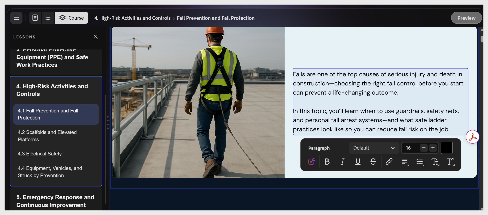

# Edit the course text

    

Select any text element to place the cursor inside it. A formatting toolbar appears at the bottom of the canvas with bold, italic, underline, strikethrough, link, alignment, and list controls.

>[!NOTE]
>
>Topic names and lesson names are part of the outline structure. To rename them after the course is generated, ask the assistant: "Rename Lesson 2 to 'Password Hygiene'." You cannot rename them by selecting a heading in the Course editor.

