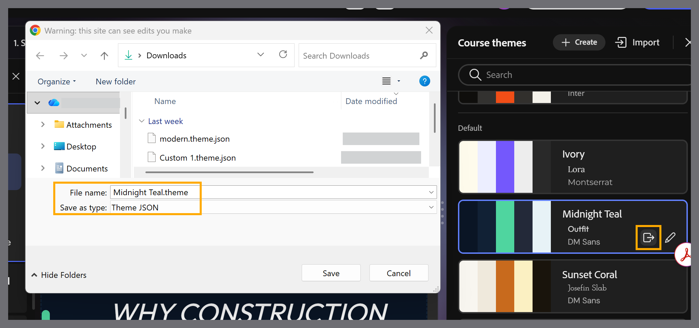

# Export a theme

Export a theme as a JSON file to customize it outside Content Composer or share it with other authors.

1. Select **Themes** from the toolbar to open the **Course themes** panel.

2. Hover over the theme you want to export and select the **Export** icon.

3. In the dialog that appears, choose a location, enter a **File name.**
