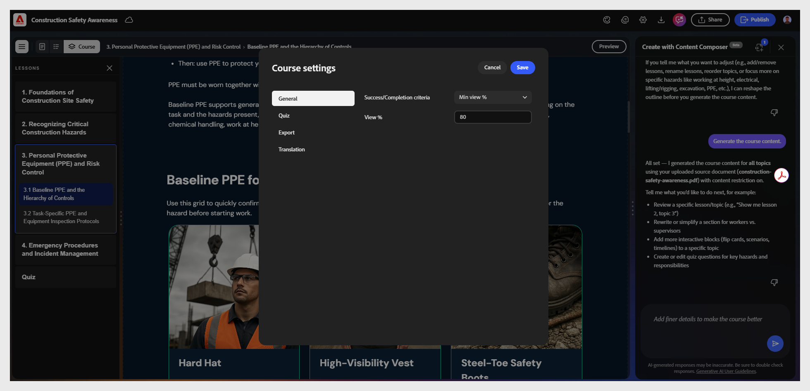

# General course settings

1. Open your course.

2. Select **Settings** to open **Course settings**.
    

3. Select **General** to configure **completion** and **success** criteria:

Completion criteria determines when a course is marked complete in the LMS, based on learner progress, not performance.
