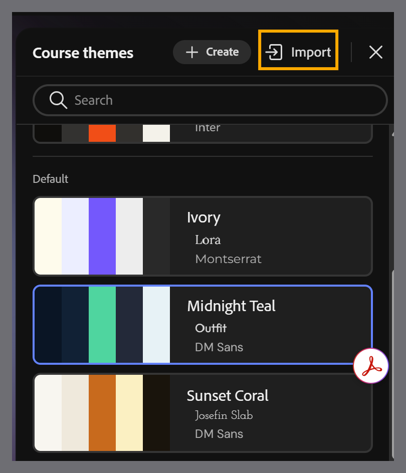

# Import a theme

Import a customized JSON file to apply your changes as a new theme in Content Composer.

1. Select **Themes** from the toolbar.

2. Select **Import** from the **Course theme** options.

3. Choose the customized JSON file from your computer.

4. Select **Save as new** to create a new custom theme.

## Theme JSON structure overview

A theme JSON file has five main areas:

| Section                                                              | Controls                                                                                                                                                                                                                                                                                |
|----------------------------------------------------------------------|-----------------------------------------------------------------------------------------------------------------------------------------------------------------------------------------------------------------------------------------------------------------------------------------|
| Metadata (id, name, version, description, author, source, isDefault) | Theme identity and display info                                                                                                                                                                                                                                                         |
| foundation.palette                                                   | The 7 core color tokens (foreground, background, accent, backgroundSubtle, secondary, textPrimary, textInverse) referenced throughout the theme via var(--tokenName)                                                                                                                    |
| foundation.fonts                                                     | Heading and body font stacks                                                                                                                                                                                                                                                            |
| foundation.spacing and foundation.radius                             | Horizontal/vertical spacing scale and corner-radius tokens                                                                                                                                                                                                                              |
| elements                                                             | Typography and structural styling for every text role (lessonTitle, topicTitle, blockHeading, subheading, question, caption, paragraph, buttonLabel) and every component (paragraphBlock, imageBlock, videoBlock, imageGrid, accordion, carousel, flipCard, tabs, timeline, assessment) |

Because most values reference palette tokens using var(--tokenName), updating a single token, such as accent, automatically cascades that change across every element that references it. You don't need to search for individual color values.

