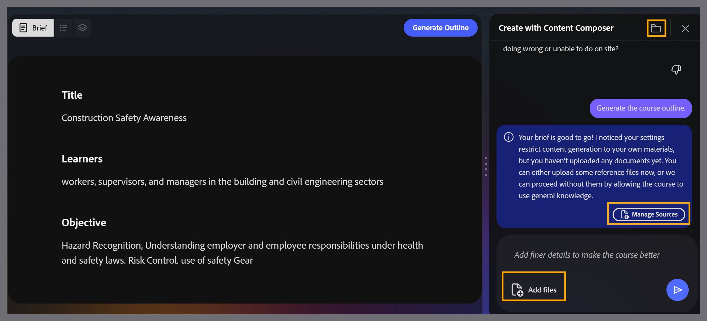
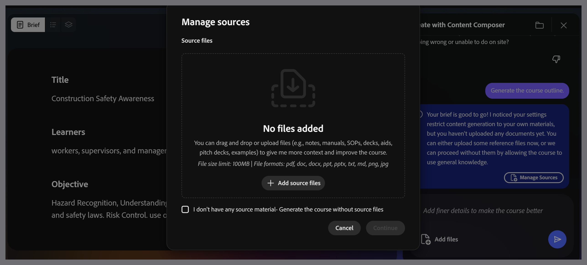
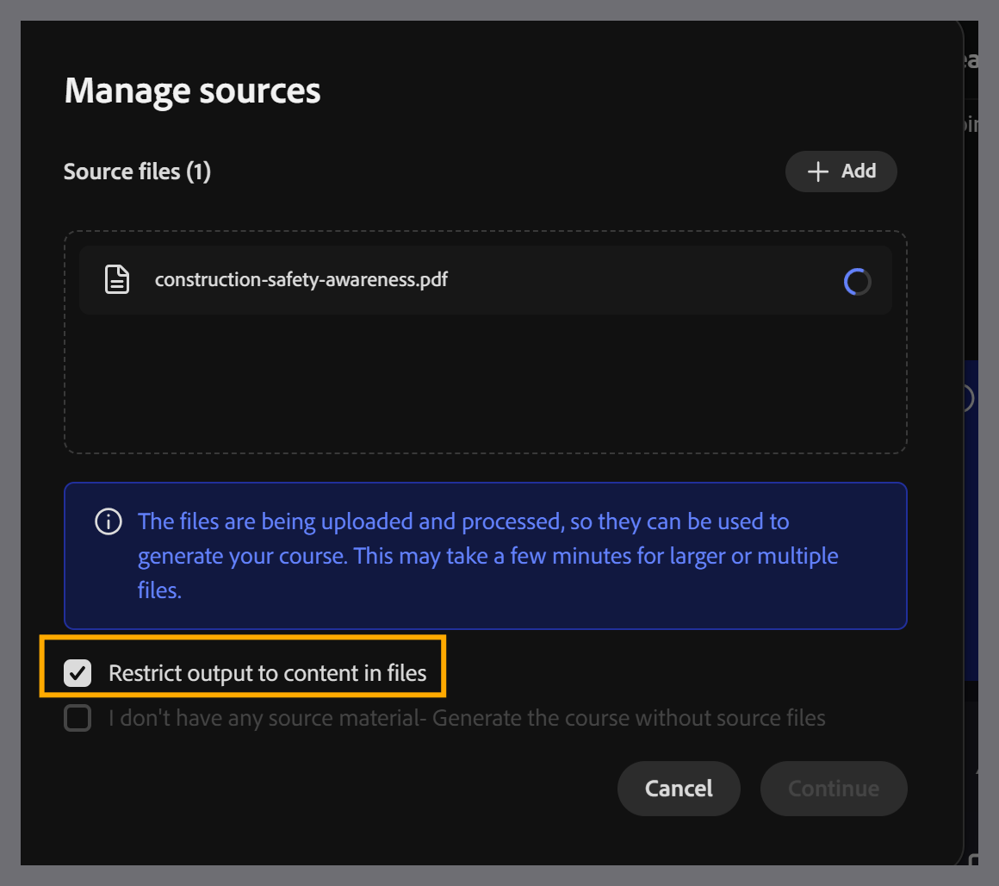
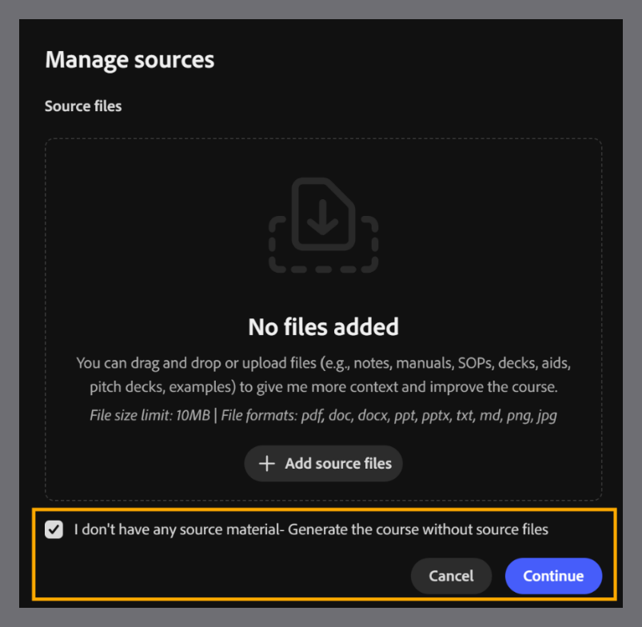
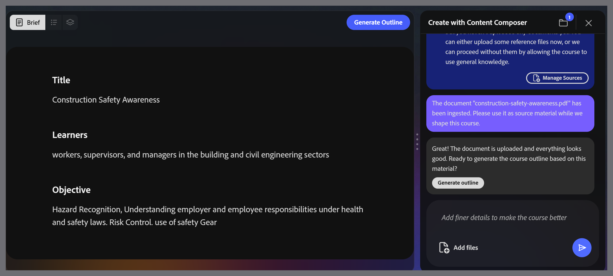

# Manage source files

**Manage sources** lets you control what content Content Composer uses to generate your course. Add your own documents to a course, then choose whether to restrict the AI to only that content, or let it supplement your material with its own knowledge. If you don't add any documents, Content Composer generates the course using the AI model's existing knowledge.

## Generate a course using source material

1. Select **Manage Sources** or **Add files** in the chat panel or toolbar.

2. Drag a file into the dialog or select **+ Add source files** to browse. You can add multiple source files.

3. Select **Restrict output to content in files**. This allows Content Composer to use only source content to generate the course. If this option is unchecked, Content Composer also uses the web to create a course.

Supported formats:

| **Format**              | **Max size** |
|-------------------------|--------------|
| PDF                     | 100 MB       |
| Markdown (.md)          | 100 MB       |
| PowerPoint (.ppt/.pptx) | 100 MB       |
| MS Word (.doc/.docx)    | 100 MB       |
| Text file (.txt)        | 100 MB       |
| Images (.png, .jpg)     | 100 MB       |

Select **Continue** to generate the course outline.

### Generate without source material

Perform the below steps to generate the course outline, when you do not have a source file as a reference document.

1. Select **Manage sources**. The **Manage sources** dialog opens.

2. Select **I don't have any source material - Generate the course without source files** to allow the AI to generate content from its general knowledge. When this option is not selected, and files are uploaded, the AI restricts generated content to your uploaded documents only.

3. Select **Continue** to generate the course outline.

### Update a course when source material changes

Source documents can go out of date after a course has already been generated - a policy is revised, a SOP gets a new version, or a pitch deck is updated. Use this workflow to bring the course back in line with current material.

1. Select **Manage Sources** from the chat panel, or the toolbar, to reopen the dialog.

2. Add the new or revised files using **+ Add source files**.

3. Remove or replace any outdated files so the source list reflects only current material.

4. Select Continue to save the updated source list.

5. Regenerate the affected lessons in Content Composer, review the changes, then republish the course. Republishing sends the update to Adobe Learning Manager as a new module version - see Module versioning in ALM.

### Confirm the file upload

Once a file is attached, the file icon in the toolbar shows a badge count. The assistant confirms the upload and offers a **Generate outline** shortcut. Select it, or select **Generate Outline** in the top toolbar.
