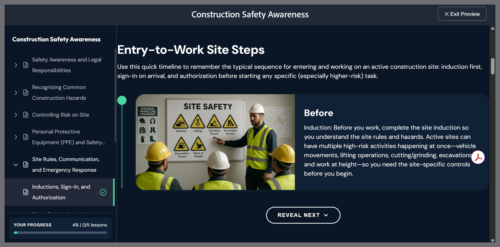

# Preview the course

- Select **Preview** in the top toolbar. The course displays exactly as a learner will see it, with the applied theme, interactive components, and the quiz in answer mode.

- Navigate using **Next** and **Previous**, or select any topic in the lesson panel on the left. Select **Exit Preview** in the top-right corner to return to editing.
