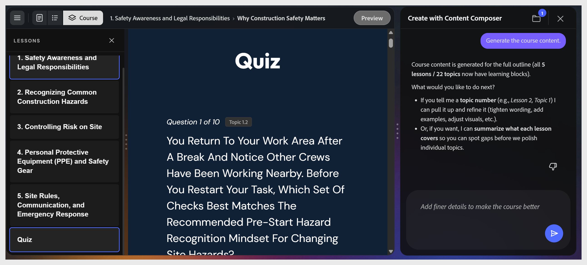
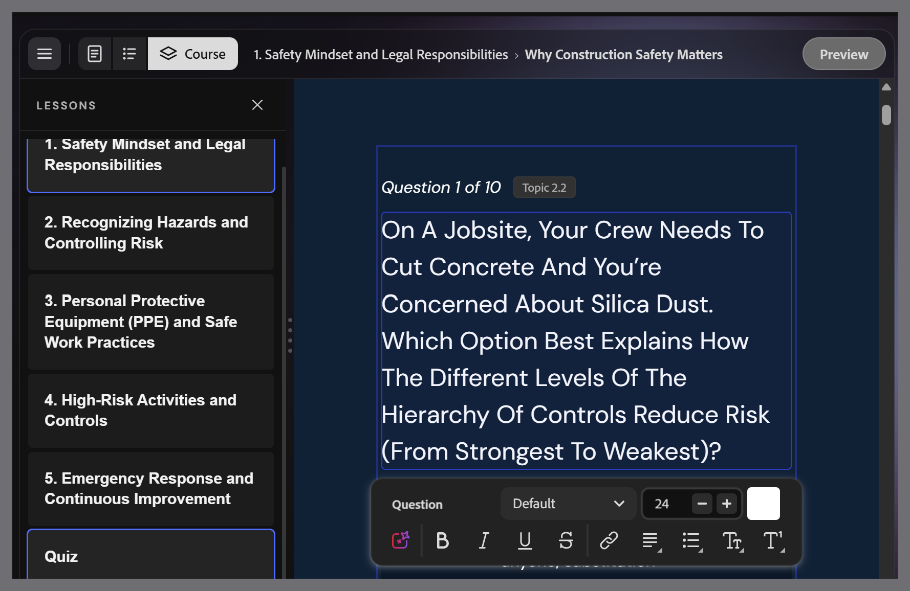
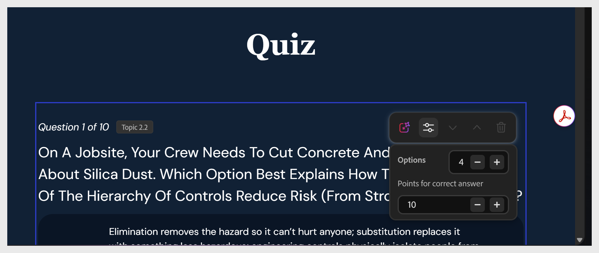

# Review and edit the quiz

A graded quiz appears at the end of the course. Each question is tagged with the topic it tests.

>[!NOTE]
>
>Knowledge checks embedded within lessons are not graded. Only the end-of-lesson quiz is graded.

To edit a question:

1. Select the question text to edit it and use the text-edit options to adjust styling.
    

2. Select the radio button next to the option you want to mark as correct.

3. You can also assign a score to the correct answer.
    

4. To delete a question, select **Remove option**.

5. To regenerate questions, ask the assistant: "Regenerate the quiz for Lesson 1."
