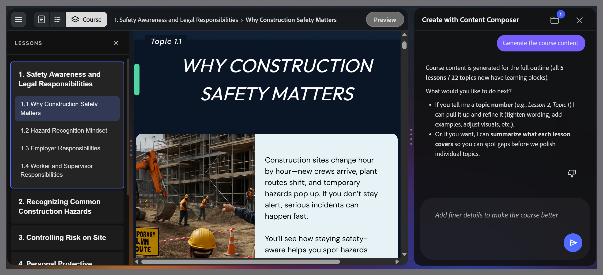

# Review the generated course

Adobe Learning Manager Content Composer generates the full course with text, images, knowledge checks, and a quiz, in a single pass. The **Course** editor opens automatically when generation is complete.

The left panel shows lesson and topic navigation. The canvas shows the content of the selected topic. The chat panel remains open for conversational editing.

>[!CAUTION]
>
>Review all generated content before sharing or publishing. AI output may vary between generations and can contain inaccuracies. Author review is required before distribution.

