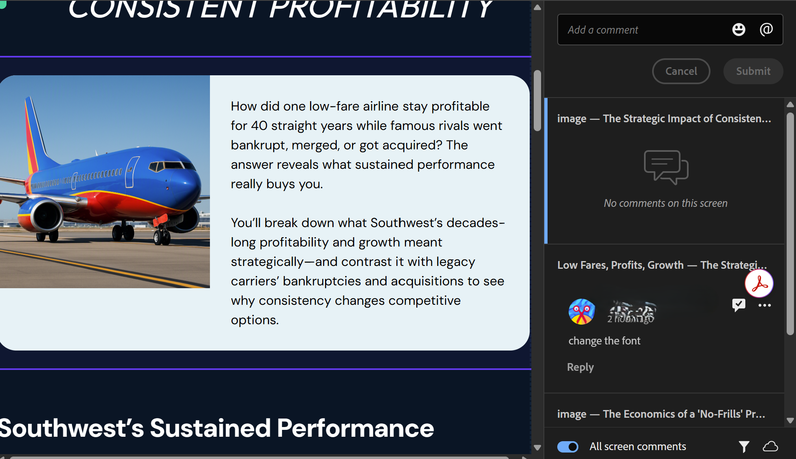
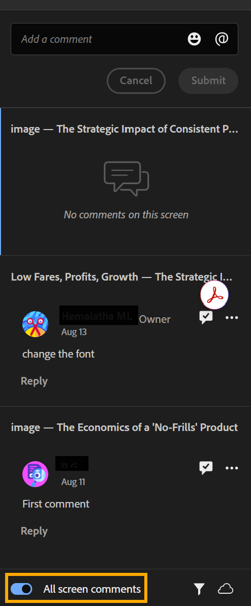
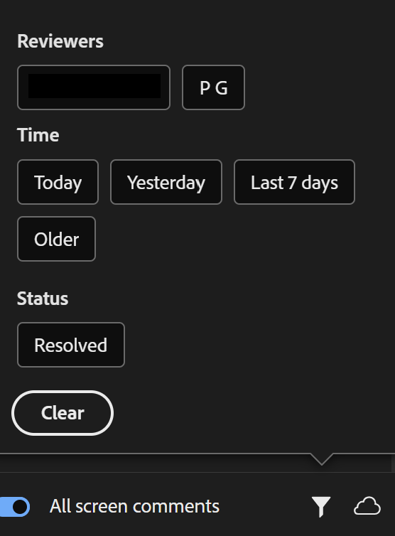
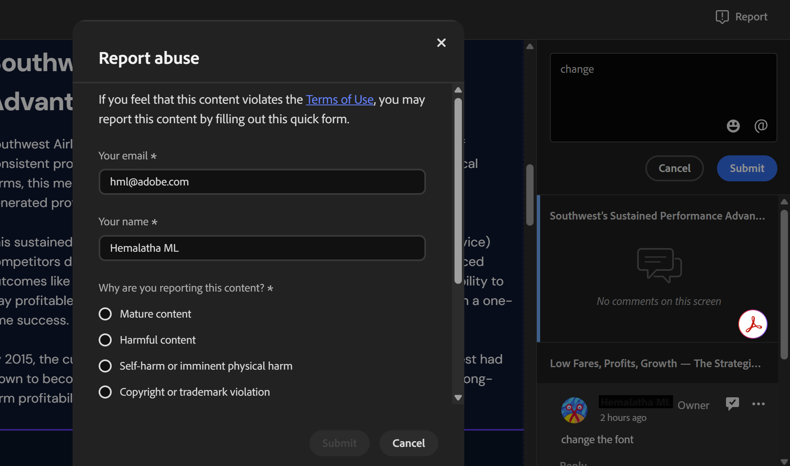

# Review and comment on a shared project

When a project is shared for review, you access the course as a reviewer through the link shared by the author.  

1. Open the review link shared with you.

2. In the **Comments** panel on the right, select any course component that needs changes. The component's name appears at the top of the comment field, so your feedback stays linked to the right part of the course. Add your comment below it.

    

    In the **Comments** panel, you can:  
    * Add, edit, delete, reply to, and resolve comments.
    * View comments from other reviewers.
    * Use **@** to mention the project owner or another reviewer (only if you signed in with your Adobe ID).
    * Add emojis in your comments.
    * View all comments on the course: by default, the Comments panel shows comments only for the course component you're currently viewing. Turn on the All screen comments toggle to view every comment across the entire project, regardless of which component or screen you're on.

    

    * Filter comments by **Reviewers**, **Time**, and **Resolved** status.

    

3. Select **Submit** to post your comment, or **Cancel** to discard it.

## Report offensive content 

If you encounter content that violates Adobe's [Terms of Use](https://www.adobe.com/legal/terms.html) while reviewing a shared Content Composer course, you can report it. 

Select **Report** from the top right and fill out the form. Alternatively, you can report abuse via email to [abuse@adobe.com](mailto:abuse@adobe.com).  

