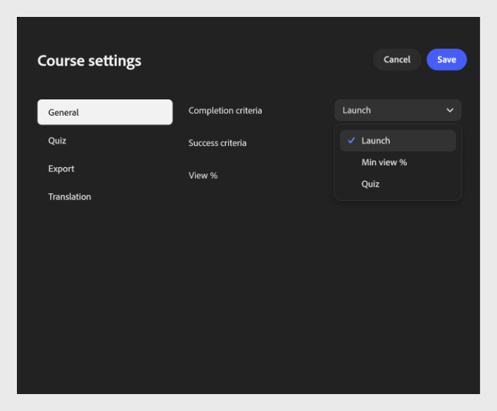
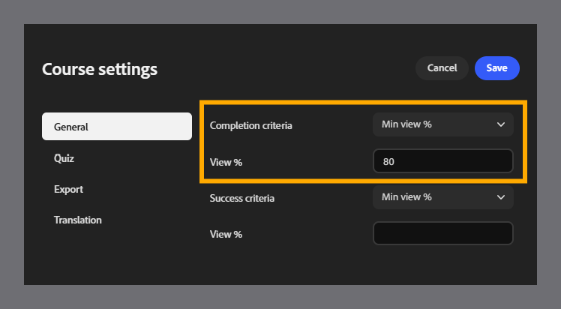
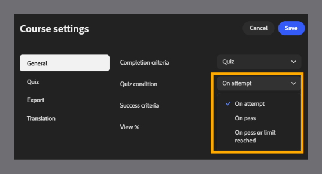
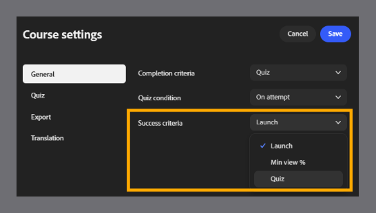
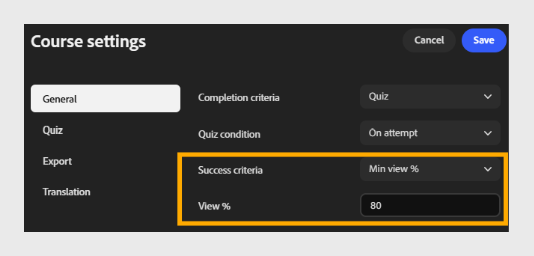
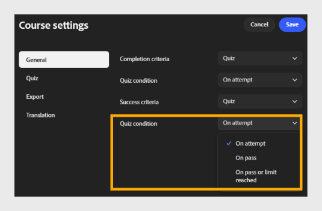

# Set Completion and Success criteria

## Completion Criteria

**Completion criteria**: Select the dropdown and choose when the course is marked to complete.

- **Launch:** marks the course complete as soon as a learner opens it, regardless of how much they view.

- **Min view %:** marks the course complete once a learner views the specified percentage of the course content.

- **Quiz: marks the course complete based on the learner's quiz activity. Select a quiz condition:**

  - **On attempt:** marks complete as soon as the learner attempts the quiz, regardless of outcome.

  - **On pass:** marks complete only when the learner passes the quiz.

  - **On pass or limit reached:** marks complete when the learner passes, or reaches the maximum number of attempts allowed, whichever comes first.

## Success criteria

**Success criteria** determine whether a learner is marked passed or failed after taking the course. Unlike completion criteria, success criteria are score-based.

>[!NOTE]
>
>The options available depend on the SCORM version selected in **Export settings**. If you select **SCORM 1.2**, completion and success criteria are combined into a single setting. If you select **SCORM 2004**, completion and success criteria appear as separate settings, as described below.*

- **Success criteria**: Select the dropdown and choose how the course measures success.

- **Launch:** marks the learner as passed simply by launching the course.

- **Min view %**: marks the learner as passed once they view the specified percentage of content. For example, enter 80 to require learners to view at least 80% of the course.

- **Quiz:** marks the learner as passed or failed based on whether their quiz score meets the passing score threshold. Select a quiz condition:

  - **On attempt: marks as successful as soon as the learner attempts the quiz.**

  - **On pass: marks as successful only when the learner passes the quiz.**

  - **On pass or limit reached: marks as successful when the learner passes or reaches the maximum attempts allowed.**

>[!NOTE]
>
>A learner can complete a course but still fail it, for example, if they finish all content but don't score high enough on the quiz. Completion and success criteria are independent; set both carefully based on how you want learner progress and performance tracked. When you select Quiz for either criterion, configure quiz retries and pass score in the **Quiz settings** tab.

## Why completion and success criteria matter for reporting

- Completion criteria control when a learner's status changes to Completed in ALM transcripts, completion dashboards, and any compliance or audit export pulled from the LMS - they measure progress, not performance.

- Success criteria control the Pass/Fail value recorded alongside completion status - the value most compliance and certification reports rely on.

- If completion and success criteria are also configured in the **Adobe Learning Manager** content library for the same module, those settings take precedence over the ones set in Content Composer. Decide early which product should own these rules, and avoid setting conflicting values in both places.

- Match the criteria to what you need to prove: Launch or Min view % is enough for awareness content, while Quiz-based criteria give you a defensible record that a learner demonstrated knowledge - not just that they opened the course.
