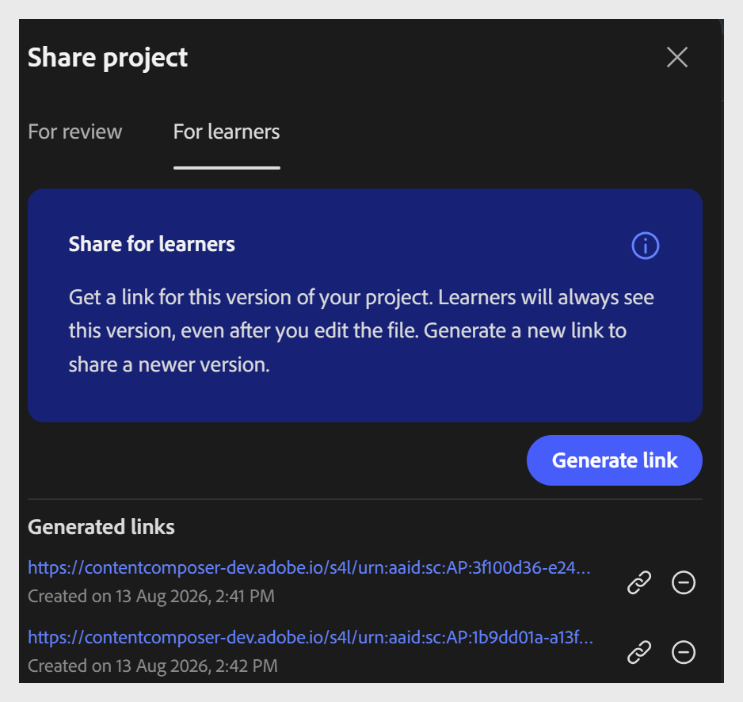

# Share a course with learners

Sharing with learners gives them direct access to the course without requiring an LMS connection or login. This is useful when you want learners to preview or complete a course quickly — for example, during a pilot, an informal training session, or before the course is published to Adobe Learning Manager for formal enrollment and tracking.  

1. Select **Share** in the top toolbar.

2. Select the **For learners** tab.

3. Select **Generate link** to create a learner access link.

    

4. Share the link with your learners.

>[!IMPORTANT]
>
>Learner links are version-specific. Every time you update the course, generate and share a new link so learners access the latest version. The previous link continues to show the earlier version.  
>
>Learner access does not include the comments panel. Learners cannot add comments or interact with the review workflow.  

