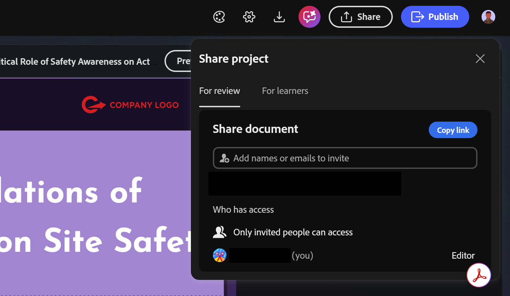
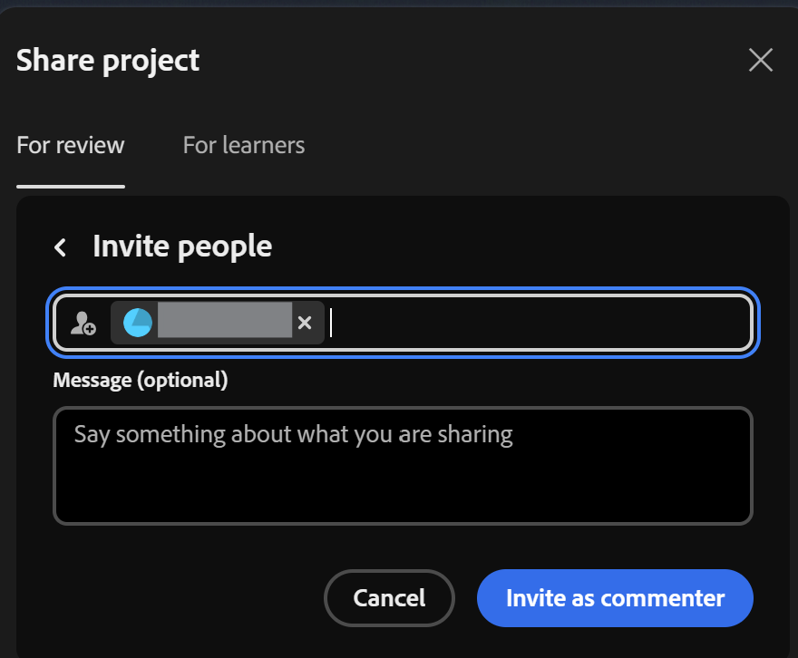
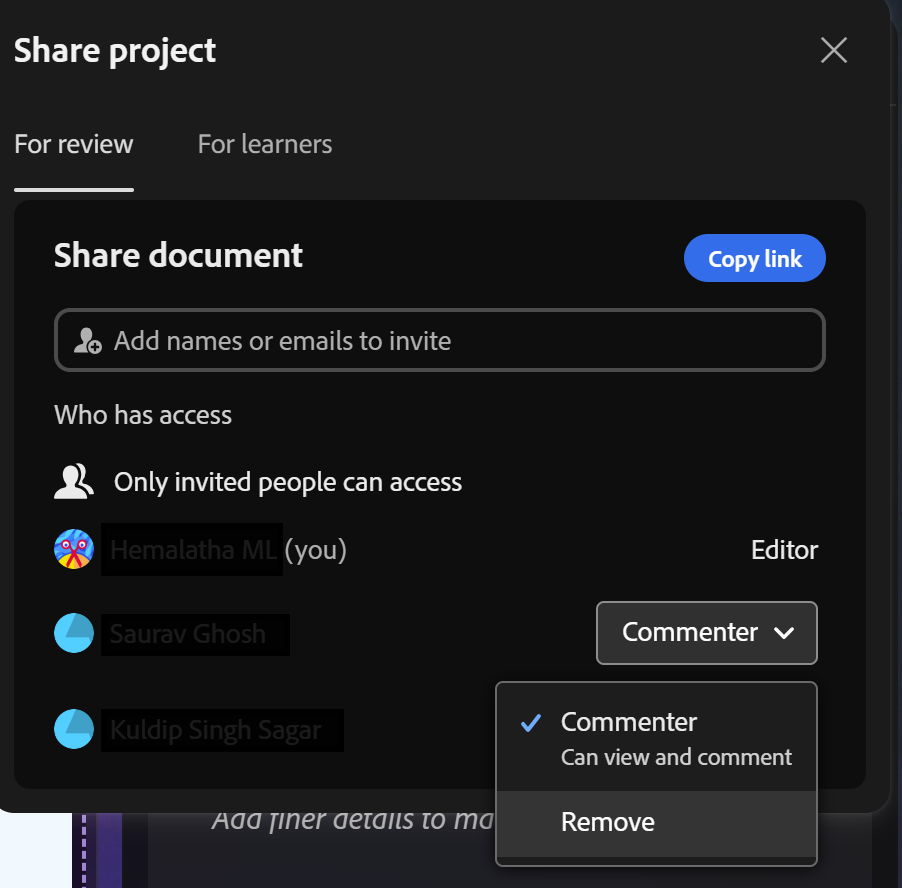
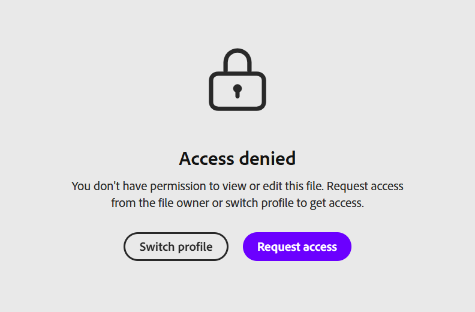
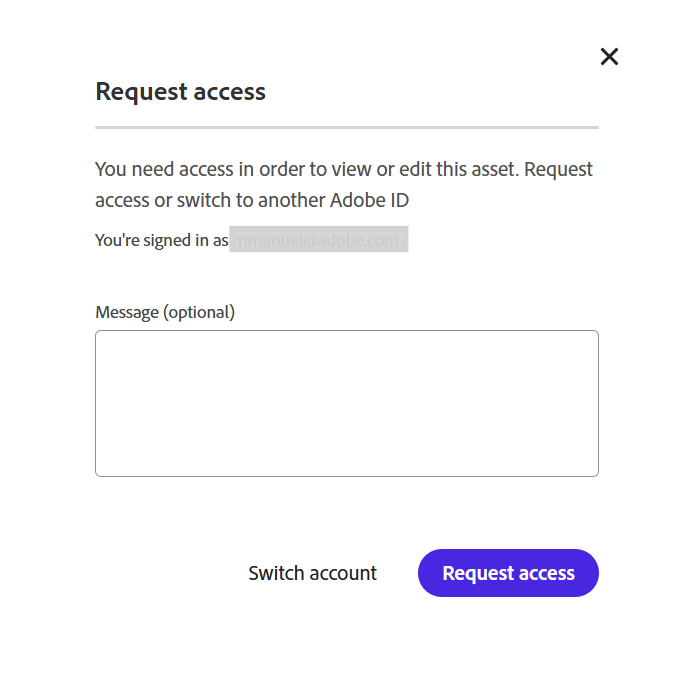

# Share project for review

Content Composer lets you share a project with reviewers or learners without requiring them to install the application, giving you a fast, structured way to collect feedback and get sign-off before publishing.  

As an author, you can invite reviewers by name or email, control exactly who has access, and revoke that access at any time. Reviewers can open the shared link, add comments directly on any course component, and even attempt the final quiz without affecting recorded scores, so they can preview the full learner experience.  

Comments stay organized and actionable: reviewers and owners can reply to, resolve, filter, and mention each other in comments, all from the same panel, whether reviewing externally or working inside the project. Once you address the feedback and update the project.  

To share a project for review: 

1. Select **For review**.

    

2. Enter the names or email addresses of your reviewers in the **Invite people** field.  

    
3. Review who has access to confirm only invited people can access the project.

4. Select **Invite as commenter** to add reviewers by name or email. You can add as many reviewers as you need. Or select **Copy link** to copy the review URL and share it directly with reviewers who already have access. These are two separate ways to share the project.  

    

## Remove a reviewer's access 

You can remove a reviewer from the list of people who have access to the project. If that reviewer tries to open the project again using a previously shared link. 

You have an option to remove a selected commenter. When a commenter is removed from list of people who have access to the document.  

To remove access: 

* Select the reviewer's name and choose Remove from the displayed options.  

* If the reviewer tries to access the document with a previously shared link. The Access denied message is displayed.  

    

## Request access 

If you try to open a shared project you no longer have access to, you must request access before you can view it. This can happen, for example, if the owner removed you, or if you're opening the link with a different Adobe ID. In either case, you see an Access denied screen. 

* Select Request access to ask the owner for permission to review the project and add comments.  

    

 
