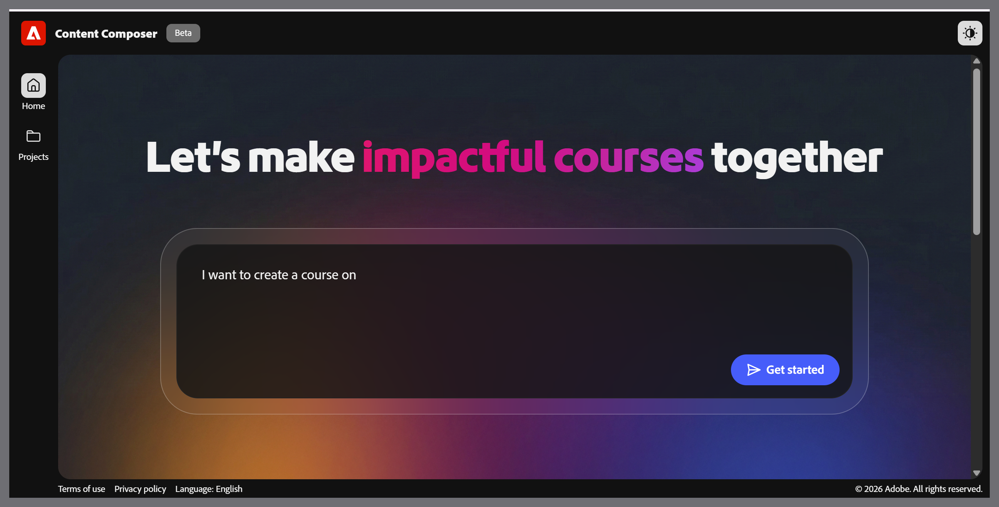

# Write a prompt

On the Content Composer home screen, type a description of the course you want to create. Write in plain language- one or two sentences naming the subject, audience, and goal.

**Example prompts:**

- I want to create a course on IT security awareness, including phishing simulations, password hygiene, and other safeguard methods.

- I want to create an onboarding module for new customer support agents covering how to log a ticket, escalate an issue, and close a case in our helpdesk system.

- I want to create a refresher course for warehouse staff on manual handling procedures, for example, correct lifting techniques, when to use equipment, and how to report a near-miss.

Select **Get started**. Content Composer opens the **Brief** stage and reads your prompt to begin filling in the course details.

**Tip**: Your prompt doesn't need to be perfect. The assistant asks follow-up questions at each step to refine the title, learner profile, and objective before generating anything.

## Write effective prompts

Write prompts that produce accurate course briefs, better outlines, and stronger AI-generated content in Content Composer.

The prompt is the first input you give Content Composer, and the most important. A clear, specific prompt means the AI pre-fills the brief more accurately, generates an outline that matches your intent, and produces course content that needs less editing.

### What makes a prompt work?

Content Composer reads your prompt and uses it to pre-fill three brief fields: the course title, the learner profile, and the learning objective. The more your prompt reflects these three dimensions, the less correction the brief requires, and a more accurate brief produces a more relevant outline.

A prompt that says "Create a course on security" gives the AI almost nothing to work with. A prompt that names the audience, specifies the topics, and signals the scope gives the AI enough to generate a brief you can accept with minimal changes.

The brief fields also amplify whatever is in the prompt. If your prompt is vague, the AI generates a vague brief. A vague brief generates a generic outline.

See [Write effective prompt](write-effective-prompts.md) for more information.
