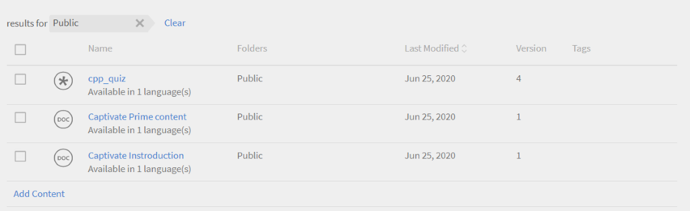

# Content library

Learn how to create content to align with courses as self-paced content.

## Content library {#contentlibrary}

Content is the building block of a course. Authors create a library of content that can be aligned to courses as self-paced content. Only authors have access to this content library.

## Supported content types {#supported}

You can upload both interactive and static content in the library.

The table below shows the type of interactive and static file types that you can upload to the library.

<table>
 <tbody>
  <tr>
   <td>
    
<b>Interactive content</b>
</td>
   <td>
    
<b>Content type</b>
</td>
   <td>
    
<b>Extensions</b>
</td>
  </tr>
  <tr>
   <td>
    
 
</td>
   <td>
    

    <ul>
     <li>SCORM 1.2</li>
     <li>SCORM 2004</li>
     <li>AICC</li>
     <li>TinCan</li>
    </ul>
    

</td>
   <td>
    
zip
</td>
  </tr>
  <tr>
   <td>
    
<b>Static content</b>
</td>
   <td>
    
<b>Content type</b>
</td>
   <td>
    
<b>Extensions</b>
</td>
  </tr>
  <tr>
   <td>
    
 
</td>
   <td>
    
Video
</td>
   <td>
    
mp4, wmv, 3gp, 3g2, 3gp2, asf, avi, f4v h264, mpe, mpeg, mpg, mpg2, m4v, mov, wmv
</td>
  </tr>
  <tr>
   <td>
    
 
</td>
   <td>
    
Audio
</td>
   <td>
    
mp3, wav, aac, m4a, wma, vorbis, pcm, eac3, amr, ac3
</td>
  </tr>
  <tr>
   <td>
    
 
</td>
   <td>
    
PDF
</td>
   <td>
    
pdf
</td>
  </tr>
  <tr>
   <td>
    
 
</td>
   <td>
    
MS PowerPoint
</td>
   <td>
    
pptx, ppt
</td>
  </tr>
  <tr>
   <td>
    
 
</td>
   <td>
    
MS Word
</td>
   <td>
    
docx, doc
</td>
  </tr>
  <tr>
   <td>
    
 
</td>
   <td>
    
MS Excel
</td>
   <td>
    
xlsx, xls
</td>
  </tr>
 </tbody>
</table>

## Add new content in the library {#addnewcontentinthelibrary}

As mentioned in the previous section, you can add both interactive and static content in the library.

## Add static content {#addstaticcontent}

1. Click Content Library on the left pane after you log in as Author and click Add.

   Alternatively, you can click Create Content from the Getting Started page.

1. In the Name field, specify a name for the content that you want to upload.
1. In the Description field, enter the description for the content. Make sure that the description you want to enter is meaningful. The character limit is 400 characters.
1. To add the content, Click Add Content File, and upload your resource file. When you add content for multiple languages, you cannot combine static and interactive content in a single group. Either all your content in all the locales should be static, or all the content should be interactive.

   If you want to replace the content, you can replace a static content with a different static content. The same applies to interactive content.

1. In the Duration field, you can optionally enter the expected time a learner would spend in this module. The duration is in minutes.

   The learning time spent by the learner is calculated based on the duration specified if the learner has marked a course as complete. If learner consumes the content in the player, thenthe time spent in the player gets added to learning time spent. If the actual content time is less than the specified duration, nothing happens as the player always honors the content time for display.

1. In the Content Tags field, enter the tags for the uploaded content so that your content becomes discoverable.

   An author can use these tags to search for the content while adding the content to the course.

### Versioning {#versioning}

The content library also maintains versioning of your uploaded contents. If you make any change in the content, for example a PowerPoint presentation, and re-upload the PPT in the library, the version number gets incremented by one. This helps you to track changes in your content.

## Add interactive content {#addinteractivecontent}

1. Click Content Library on the left pane after you log in as Author and click Add.

   Alternatively, you can click Create Content from the Getting Started page.

1. In the Name field, specify a name for the content that you want to upload.
1. In the Description field, enter the description for the content. Make sure that the description you want to enter is meaningful. The character limit is 245 characters.
1. To add the content, Click Add Content File, and upload your resource file. When you add content for multiple languages, you cannot combine static and interactive content in a single group. Either all your content in all the locales should be static, or all the content should be interactive.

* [Supported file types](content-library.md#supported)*

   The interactive content can be a SCORM, AICC, or a Captivate published project. The file must be a zip file.

   You can also add HTML content generated from Captivate, Presenter, or Presenter Video Express. 

   [Supported file types](content-library.md#supported)

1. Captivate Prime supports captions for video content uploaded in Captivate Prime. Now, authors can upload the file containing captions, along with the video file. 

   Then, the learners can view the captions during the playback of the video module.  

   The format supported is  [Web Video Text Tracks (webVTT)](https://www.w3.org/TR/webvtt1/).

   Caption support is available for video content uploaded in Content library in Captivate Prime. 

   As an author, when you’ll upload a video or audio content, you can also upload the .vtt file that contains the captions.

   The subtitles then appear in the Fluidic Player. The captions are also compliant to  [WCAG2.0 standards](https://www.w3.org/TR/WCAG20/). 

   When you add a video content to the library, you can also add the vtt file, which **must **be a valid file.

   

   The uploaded VTT file corresponds to the existing version of the content. Thus uploaded webVTT file does not link to the older version of content.

   In case you are creating the content in different languages, you can upload a different webVTT file for each language. Learners will be able to see the captions corresponding to the language selected during playback.

   **NOTE:** One VTT file supports one language. To support multiple languages, upload multiple video files for each content language and then upload its respective VTT file for each video file.

   As an author, every time you change the content, video or audio, Captivate Prime prompts you for a new vtt file.

   After you add this content to a course, and when you preview the course as learner, you can see the captions on the video.

   On the player, toggle the CC button on the Fluidic player to display or hide the captions.

   The same view is present in the **learner app** as well as in **Preview as learner**.

   When you **add, update, or delete **the vtt file, you receive a notification.
   WebVTT support is not available for:

   1. Video announcements.
   1. Video played within the eLlearningcontent. This is driven by the content.
   1. Video uploaded in Social Learning.
   1. Video created in Captivate Prime desktop app.
   1. Video content created using migration process.
   1. Video playback in mobile app in offline mode.

1. In the Duration field, you can optionally enter the expected time a learner would spend in this module. The duration is in minutes.
1. In the Content Tags field, enter the tags for the uploaded content so that your content becomes discoverable.

### Support for shared catalog

If a seller account shares a catalog that contains the courses, and the courses contain the modules, audio or video with the subtitles, the courses must behave the same in the purchaser account.

Module propagation should work correctly from Seller to Purchaser account. This may include – edit/delete/addition of the vtt file in the module.

Once you have uploaded the content, you can see a notification by clicking the Bell icon on top-right hand corner of the page. Each time you modify a content and re-upload it, you get a notification. If you make the changes, only you get the notification, not other authors.

## Add to folder {#add-folder}

After an Administrator creates the content folders, you, an author, can upload a content to a content folder, so that the content is only visible to you or a select group of authors in the account. You can also make the content public and make it visible to all authors in the account.

**Example usage**

For example, agencies want to maintain full control of the content and someone overlooking the content must have access to all content. At the same time, content creators in agencies must have access to their own content only, and in some cases, access to someone else’s content.

Content library with existing content (i.e. content uploaded before configuring Content folders) gets defined as **Public folder**. This folder cannot be retired or deleted. Content that is part of Public folder is accessible to all types of authors. Once Content Folders are configured, standard authors and custom authors should select the folder where the content should be placed, while uploading new content.

>[!NOTE]
>
>Public folder and private folders are mutually exclusive. This means that content **cannot **be associated with Public folder and private folder at the same time. It can either be associated to Public folder, **or **it can be associated with one or more private folders at any point of time.

When you add a content, you can choose the folder where the content will reside. 

If you choose **Public**, the content will be visible to all authors. All content that existed in the account that are not part of any folder will in the public folder, by default.

Note that content folders are simply virtual compartments to link the content. In case one content is placed in two folders, it means that content file is always one single file but linked to multiple folders. Thus, in case the content is updated by the custom-author-1 having access to custom-folder-1, the same updated content will also reflect in custom-folder-2 accessed by custom-author-2.

In the Content Library, there are two options for managing the content folders:

**All Folders**

It’s a list that displays all folders that were created in the account.

**All Authors**

It’s a list that displays the authors who’ve created content and uploaded it in the library.

This is available **only **when an Administrator creates a new folder.

## Move content to folder {#movecontenttofolder}

To move a public folder content to any private folder, 

1. Select **Public **folder from the **All Folders** drop-down list.

   

1. Choose the content that you’d like to move it to a folder. Then click **Actions > Organize Content > Move Content to Folder**. 

   

1. Choose the folder where you want to move the content to. Click **Move**.

## Copy content to folder {#copycontenttofolder}

Copying a folder means that you’d be adding a tag to the folder. The copy operation will not create copies of content, but only add an association with specified folders.

## Unlink folder {#unlinkfolder}

Unlinking means to remove the content from the selected folder.

Content can be unlinked from a specified folder **ONLY **if it is also associated with other folders. If content being unlinked, is only associated with one folder, then it is advisable to use MOVE operation instead.

>[!NOTE]
>
>The organize menu, under Actions, is disabled initially. To use that, you must first select a folder in the folder drop-down list.

## Add content for different languages {#addcontentfordifferentlanguages}

1. To add the content for different languages, click the Add New Language tab, and choose the required languages. Using this approach, you can add multi-lingual support for your content.

   

1. Repeat the content upload process for the new languages.
1. If you want to remove a language, click the Add New Language tab, and clear your selection.

   After you’ve made the changes, click Save. In the library, the new content now is available for consumption.

## Set completion criteria {#setcompletioncriteria}

<table>
 <tbody>
  <tr>
   <td>
    
<b>Static content</b>
</td>
   <td>
    
<b>Interactive content</b>
</td>
  </tr>
  <tr>
   <td>
    
You can only set the <b>Completion</b> Criteria for the content for the following options:

    <ul>
     <li>On Launching content</li>
     <li>Based on the Minimum percent required</li>
    </ul></td>
   <td>
    
You can set both <b>Completion</b> and <b>Success</b> criteria for the content for the following options:

    <ul>
     <li>On Launching content</li>
     <li>Based on the Minimum percent required</li>
     <li>Quiz passed or attempted options</li>
    </ul>
    
<b>NOTE:</b> Only HTML content from Captivate, Presenter Video Express, or Presenter can be edited.
</td>
  </tr>
 </tbody>
</table>

After you’ve added the content, you can modify the completion criteria for the content. 

In Prime, badges and skill are awarded based on Success  and Completion. If the learner has completed a course but is not successful, then the learner does not receive the badge and skill corresponding to the LO.

For example, if you had used Adobe Captivate to create your course and set the learning parameters on the Preferences dialog, the same settings get migrated to Captivate Prime in the Completion Criteria options.

In the Completion Criteria section, you can set the options mentioned below:

**On Launching Content:** If you enable this option, you define the completion criteria for the content when a learner opens the content.

**Based on the Minimum percent required:** Set a value as minimum percentage of consumption by your learner. For example, if you set the percentage as 50, your learner can consume 50% of the content and still meet the completion criteria.

**Quiz:** Choose one of the following criteria:

* **Quiz passed:** The status is reported as Complete only if a learner passes the quiz.
* **Quiz attempted:** The status is reported as Complete if learners attempt the quiz irrespective of whether they pass or fail the quiz.
* **Quiz passed or limit reached:** The status is reported as Complete if learners pass the quiz or have taken all the attempts. For example, if the number of attempts set in the course is two, and:

            o   If learners take the first attempt and pass, then the status is reported as Complete and Passed.

            o   If learners take the first attempt and fail, then the status is reported as Incomplete and Failed as the attempt limit is still not reached.

            o   If learners retake the quiz and fail, the status is reported as Complete and Failed.

            o   If learners attempt the quiz again and pass, the status is reported as Complete and Passed.

## Set success criteria {#setsuccesscriteria}

Similarly, you can define the success criteria for the course. A success criterion indicates a learner’s performance as Passed or Failed. If you had created a course in Captivate, you can set the success criteria for the course in the Preferences dialog, as shown below:

For example, you have uploaded a module that has a quiz in it. Now, you have set the Completion Criteria for that module to On Launching content and Success Criteria to Quiz Passed.

If the learner has launched the course and failed the quiz, then the course will be marked as Completed, however the Success Criteria is only be met when the learner passes the quiz.

## Content filter options {#contentfilteroptions}

## Sort according to date {#sortaccordingtodate}

Arrange the content according to when the content was modified last. You can either sort the content in ascending or descending order.

## Sort according to usage {#sortaccordingtousage}

Arrange the content according to whether the content is being used in any course. In the Type drop-down, choose In Use or Unused.

## Search for content {#searchforcontent}

In the Content Library, you can search for a content by choosing either the name of the content or the tags associated with the content.

On the Search bar, enter the name of a course or a tag, and you can see the recommendations.

## Retire content {#retirecontent}

Once you publish a content, you cannot delete the content. You must retire the content first. When you mark a content as Retired, the content is no longer visible to learners. The content also moves to the Retired section. You can also move the content into the published state later.

To retire content, follow these steps:

* In Content library, select the content you want to retire.
* Select Action > Retire.

Any content that is being used in any learning objects do not get affected. Learners can still continue to access the content.

## Republish retired content {#republishretiredcontent}

Once you retire a content, you can republish the content and make the content appear in the Published list. For example, if you have retired version 1 of a content and want to replace that with version 2, you can move version1.pptx, for example, to the Published list, and update the file with version2.pptx. The new file becomes available for consumption in various courses.

To republish the retired content,

1. Navigate to the **Retired** tab and select the content that you want to republish.
1. Select **Action > Republish**.

The content now appears in the Published list.

## Delete content {#deletecontent}

After you have retired a content, you can delete it.

* Navigate to the Retired tab and select the content you want to delete.
* Select Action > Delete.

Note that existing courses that use the content, which are deleted from the content library, will continue to use the content.

## Frequently Asked Questions {#frequentlyaskedquestions}

1. **How to upload a SCORM content in Adobe Captivate Prime?** Create a SCORM-compliant eLearning course in any tool, such as, Adobe Captivate, and publish the content as a zip file. Then in Captivate Prime, upload the zip file in the catalog, and set the completion and success criteria. 2. **How do I upload a new version of the same content to Captivate Prime?** In Captivate Prime, the content library also maintains versions of your uploaded contents. If you make any change in the content, for example, a PowerPoint presentation, and re-upload the presentation in the library, the version number gets incremented by one. This helps you to track changes in your content. A new version of the content can be applied to all Learning Objects simultaneously or you can apply individual updates for each course. 3. **How to edit the details of a course in a different language?** After adding a language/languages, as described in an earlier section, click each language tab, and then add/edit the course information. 

