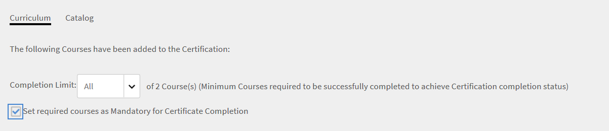
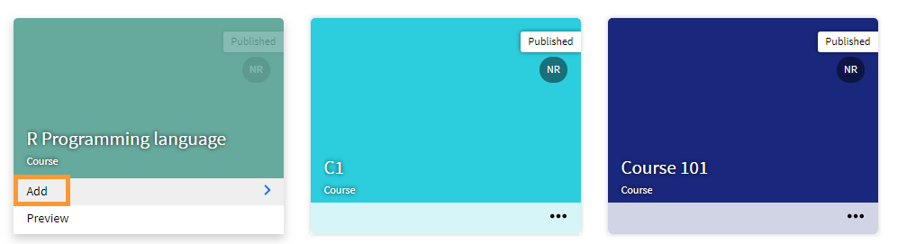

# Creating, modify, and publish courses {#creating-modify-and-publish-courses}

To learn how to create courses, certifications, and learning programs in Learning Manager, read this article.

Authors can create learning objects such as courses, certifications, and learning plans. Learners can consume these learning objects, while administrators can track learners' progress.

# Courses in Learning Manager {#coursesincaptivateprime}

Adobe Learning Manager enables authors to create courses using one or more modules related to virtual training, self-paced training, classroom training, and activities. Administrators can further use these courses to create course instances, enroll learners, assign badges, and enable feedback for these courses. They can also create learning programs, learning plans, and certifications using these courses.

Authors can use e-learning content that is created using any eLearning tool. Other supported course formats include video files, PDF, doc, docx, PPT, and PPTX.

# Create a course - Basic workflow {#createacoursebasicworkflow}

To create a course, follow the steps below:

1. Log in to Adobe Learning Manager as an Author, as only authors have the rights to create courses. Now, on the Getting Started page, click **Create Courses**.
1. On the **Course Overview** page, enter the name of the course. Now, enter a short description for this course, which is displayed on the course card. This description must not be more than 140 characters. Then enter the detailed overview for the course, which is displayed on the Course Details page. The description must not exceed 1500 characters.

   As an author, you can see the description of the modules while adding the module to a course.

1. To make your course available in other languages, click Add New Language from the upper-left corner of the page. Select the language or languages in which you want to make your course available. Click **Save**. For more information, see [Add content for different languages](https://helpx.adobe.com/captivate-prime/authors/feature-summary/content-library.html#Addcontentfordifferentlanguages).
1. **Modify course settings**-

   1. On the Course Settings page, choose a skill for the course. From the Skill drop-down list, choose the required skill. Then, from the Level drop-down list, choose the required level.
   1. Choose the course skills, level, and set the credits for the skill. Add more skills, if required.
   1. From the **Enrollment Type** drop-down list, choose the type of enrollment.

   The following are the types of enrollments:

   * **Manager nominated:**&nbsp;Only managers can nominate these courses. A learner cannot enroll to these types of courses.
   * **Manager approved:**&nbsp;Managers approve these courses. Learners can sign up for these courses, but they are not enrolled directly to these types of courses without Manager’s approval. A notification request is sent to Managers when learners sign up for these types of courses. Upon Manager approval, these courses are listed as enrolled for learners.
   * **Self-enrolled:**&nbsp;Learners can directly enroll themselves to these types of courses.

1. To save the changes, click **Save**. To publish the course, click&nbsp;**Publish**.

# Create a course - Advanced workflow {#createacourseadvancedworkflow}

1. Log in to Adobe Learning Manager as an Author, as only authors have the rights to create courses. Now, on the Getting Started page, click **Create Courses**.
1. On the **Course Overview** page, enter the name of the course. Now, enter a short description for this course, which is displayed on the course card. This description must not be more than 140 characters. Then enter the detailed overview for the course, which is displayed on the Course Details page. The description must not exceed 1500 characters.
1. To make your course available in other languages, click Add New Language from the upper-left corner of the page. Select the language or languages in which you want to make your course available. Click **Save**. For more information, see [Add content for different languages](https://helpx.adobe.com/captivate-prime/authors/feature-summary/content-library.html#Addcontentfordifferentlanguages).
1. **Modify course settings**-

   1. On the Course Settings page, choose a skill for the course. From the Skill drop-down list, choose the required skill. Then, from the Level drop-down list, choose the required level.
   1. Choose the course skills, level, and set the credits for the skill. Add more skills, if required.
   1. From the **Enrollment Type** drop-down list, choose the type of enrollment.

   The following are the types of enrollments:

   * **Manager nominated:**&nbsp;Only managers can nominate these courses. A learner cannot enroll to these types of courses.
   * **Manager approved:**&nbsp;Managers approve these courses. Learners can sign up for these courses, but they are not enrolled directly to these types of courses without Manager’s approval. A notification request is sent to Managers when learners sign up for these types of courses. Upon Manager approval, these courses are listed as enrolled for learners.
   * **Self-enrolled:**&nbsp;Learners can directly enroll themselves to these types of courses.

1. Choose if you want to set a price for your course or make it free. If you want to make the course paid, choose the option **Paid**, and specify a price. The price then appears on the Course card and the Coure overview page for a learner.

   **NOTE:** This is only enabled when Adobe Commerce connector is configured.

1. If you want to provide the ability for learners to unenroll themselves from your course, enable the check-box&nbsp;**Learners can unenroll themselves**.
1. Select the pre-requisite courses that must be completed before taking up your course. Click the Courses field and choose from the list of courses.
1. Enable the **Enable**&nbsp;**Prerequisites**&nbsp;check-box if you want the pre-requisite courses to me made mandatory.
1. Add keywords as tags related to your course. These tags help the learners to locate your course easily during search. All these tags are automatically added based on the modules that we have added. If you have other tags that you want to add to this course, you can go ahead and enter it.
1. To save the changes, click&nbsp;**Save**. To publish the course, click&nbsp;**Publish**.

# Rich Text Formatting

While creating a Course, Learning&nbsp;Program,&nbsp;Certification, or Job Aid, Authors can&nbsp;input different types of content such as text, image, or apply various text formatting options.

When creating a course,&nbsp;you can see the Rich Text Editor in the Course Overview field. You can format your content, add images,&nbsp;add hyperlinks, and so on.


Similarly, you can use the Rich Text Editor to modify the description when creating a:

**Learning Program**


**Certification**


**Job Aid**


In addition, you can use the Rich Text Editor for other languages.&nbsp;

## Rich text description support for headless user Interface

### Why is CSS required?

Rich text is composed of HTML markup. Rendering the markup as-is would result in default styling applied by the browser. This often doesn't go well with the style guidelines of the company. A CSS is required to meet the guidelines.

### Default style

The attached CSS stylesheet contains the styling that is applied by Learning Manager. The styling is tweaked considering majority of the usecases. Download the attached CSS file and import it to your webapp according to your conventions and build system. The CSS classes defined are namespaced under&nbsp;ql-editor&nbsp;class and they don't interfere with your existing styles.

### Customize styles

The default styling may not meet everyone's needs. The customisations can be done by overiding CSS supplied. All the styling is wrapped under ql-editor as descendant selectors. The following classes are used:

* Indenting: **li.ql-indent-$number**. $number varies from 1-9
* size: **ql-size-small**, **ql-size-large**, **ql-size-huge**

* alignment: **ql-align-center**, **ql-align-justify**, **ql-align-right**

* color: **ql-color-$color**. $color = white, red, orange, yellow, green, blue, purple
* background: **ql-bg-$color**. $color = black, red, orange, yellow, green, blue, purple
* html tags: p, ol, ul, pre, blockquote, h1, h2, h3, h4, h5, h6

[CSS file to be used for customization.](assets/ql-headless.css) 

### **API CHANGES TO ENABLE RENDERING RICH TEXT OVERVIEWS**

When customers build a headless interface, they have a need to display the learning objects in that custom user interface they are developing. For doing this, one would typically use the [GET /learningObjects](https://captivateprimeeu.adobe.com/docs/primeapi/v2/#!/learning_object/get_learningObjects) API that is exposed. Now that Prime supports capturing “rich text” for the overview field, the data model of Learning Objects in the API responses also exposes the same. See the field named “richTextOverview” in the fragment of the model in the API response below. Also note that the field exposed earlier (“overview”) remains unchanged for backward compatibility.

```
\{ 
 "data": [ 
 { 
 "id": "string", 
 "type": "string", 
 "attributes": { 
 … 
 “localizedMetadata": [ 
 { 
 "description": "string", 
 "locale": "string", 
 "name": "string", 
 "overview": "string", 
 "richTextOverview": "string" 
 } 
 ], 
 … 
 }, 
 "relationships": { 
 … 
 } 
 } 
 } 
 ] 
} 

```

Customers who are already using the overview field remain unaffected in their headless interface will see just plain text as before. If customers want to take advantage of the rich text overview, they will have to create richly formatted overviews for their learning objects in the Author UI and after that Prime will start returning the rich text overview as well, in addition to the plain text (as before) in the API response model.

However, to render this rich text in their UI, the customer will need to include a CSS. This is explained in detail in the following sections.

# Allow multiple attempts {#allowmultipleattempts}

Once the admin has enabled multi attempts, as an author you can configure multi attempts for an interactive e-learning module at a course or module level.

 

<table> 
 <tbody>
  <tr> 
   <td><p>Option</p></td> 
   <td><p>Description</p></td> 
  </tr> 
  <tr> 
   <td><p>Set Attempts at</p></td> 
   <td><p>You can set the number of attempts for a module to infinite or provide a definite limit.<span style="font-size: 0.8125rem;">The attempt information will be shown to the learner once it is enabled. The learner can choose to reattempt&nbsp;the module by clicking on the ‘Reattempt’ button.</span></p></td> 
  </tr> 
  <tr> 
   <td><p>Stop new attempt once module is completed or passed</p></td> 
   <td><p>To configure when to stop learners from selecting the new attempt option, enable the check-box “Stop new attempt once module is completed or passed”. The ‘Reattempt’ option will be removed from the learner view once they successfully complete the module.</p></td> 
  </tr> 
  <tr> 
   <td><p>Lock module between attempts 0:0:1 Format: Days/Hours/Minutes</p></td> 
   <td><p>You can lock modules for a specific time between attempts, by enabling the check-box “<b>Lock module between attempts 0:0:1 Format: Days/Hours/Minutes</b>”. When a module is locked, the learner cannot visit the module until the lock time provided elapses.&nbsp;</p><p>ou can define the end criteria of an attempt by selecting the ‘<b>Player close</b>’ or ‘<b>Completion</b>’ check-boxes.</p></td> 
  </tr> 
  <tr> 
   <td><p>Player Close</p></td> 
   <td><p>Every module launch is treated as a new attempt if the criteria is selected as '<b>Player Close</b>'. A learner is prompted with module lock details and attempt details on closing the player.</p></td> 
  </tr> 
  <tr> 
   <td><p>Completion</p></td> 
   <td><p>If the end of an attempt is based on&nbsp;<b>Completion</b>, then it will be calculated based on the content success criteria. Learners are not allowed to re-attempt the module until the content sends the completion information. Module lock and attempt details are communicated to the learner once an attempt ends.</p></td> 
  </tr> 
  <tr> 
   <td><p>Set time limit to complete module</p></td> 
   <td><p>Authors can set a time limit to complete a module by the enabling the check-box, “<b>Set time limit to complete module</b>”.</p><p>Every player launch is considered as a new attempt and the learner is prompted with the time details during launch.</p><p><b>Note:</b><span style="font-size: 0.8125rem;">The attempt will end automatically once the time elapses. Closing the player as well will end the current attempt.</span></p></td> 
  </tr> 
  <tr> 
   <td><p>Multi attempts at Module level</p></td> 
   <td><p>Selecting an attempt at 'Module level' from the 'Set Attempt at' drop-down list allows you to configure the options at individual module level.</p></td> 
  </tr> 
 </tbody>
</table>

# Course modules {#coursemodules}

### Add modules {#addmodules}

You can now add Content, Prework, and Testout modules. **Content** modules are the main modules that make up the course. **Prework** modules include some basic information, which can help learners get ready for the course. These modules are not mandatory for the learners to complete. **Testout** modules help learners skip the content and take the test if they are already aware of the content and want to take the test to fulfill the compliance requirement.

To add a content module, perform the steps below:

1. Click **Add Modules**. You can see four options to add modules. The first option is to add Self Paced Modules. These are the modules that you create and add to the module library in Adobe Learning Manager. These second option is to set up the Virtual Classroom. The third one is to set up a Classroom Module, and the fourth is Activity Module.

   

   **Self Paced Module:** In this mode, you can start and complete a course module at your own pace. You can set your own schedule.

   After you click the option, you can see the list of self-paced modules that have been already added to your module library. Here you can either scroll through the list and select the ones you want to add, or you can search for the modules by typing the module's name in the search field or the module tags.

   After you have selected the modules, click **Add**. These modules now appear under the Content section.

   You can also rearrange the modules. Drag any module and move it up or down and arrange the modules in a proper sequence.

   **Virtual Classroom Module:** In this mode, learners can attend live online lectures, facilitated by a trained instructor. Enter the title, description, and set the duration of the session. You can also specify the conference url and the instructors to conduct the session. To save the changes, click **Done**.

   

   When creating a course using the Virtual Classroom configuration dialog box, set the **Conferencing System** to the Teams connection that you created. Select whether you want a meeting organizer for the event.

   If you select **Yes **for a meeting organizer, you must enter the name of the organizer. Type the name and select the organizer.

   **Lobby bypassing**

   * If you select **Yes**, any learner can join the meeting.
   * If you select **No**, a request is sent to the organizer to allow or prevent the learner from joining the meeting.

   **Note:** A learner must be available on Microsoft Teams. However, the learner can join Learning Manager as a guest.

   **Classroom Module:** In this mode, learners attend in-person lectures, facilitated by a trained instructor. Enter the title, description, and set the duration of the session. You can also specify the location of the class and the instructors to conduct the session. To save the changes, click **Done**.

   

   When&nbsp;creating a course, in the Virtual Classroom configuration dialog&nbsp;box, set the conferencing system&nbsp;to&nbsp;the&nbsp;Microsoft&nbsp;Teams connection&nbsp;that you created.&nbsp;Select&nbsp;whether you want a meeting organizer for the event.

   If you&nbsp;select&nbsp;Yes&nbsp;for a meeting organizer, you must enter the name of the organizer. Type the name of the organizer and select the organizer.

   **Lobby bypassing**

   * If you select&nbsp;Yes, any learner can join the meeting.
   * If you select&nbsp;No, a request is sent to the organizer to allow or prevent the learner from joining the meeting.

   **Note:**&nbsp;If a learner wants to join Microsoft Teams as guest, he/she must enter&nbsp;the&nbsp;email. The&nbsp;email must be present in&nbsp;Captivate&nbsp;Prime.

   **Activity Module:** In this mode, learners must complete a set of activities, such as, workshops, exercises, questionnaire, and other learning activities. Enter the title, description, and the external url for reference. To save the changes, click **Done**.

   

   You can specify the duration&nbsp;while adding an activity module in a course for activity type File Submission and&nbsp;xAPI-based modules.&nbsp;

1. After you've added a module, you can mark the module as previewable by a learner. Enable the checkbox, **Learner Preview**. When a learner visits the course, they can preview the course.

   An Author, while creating a course, can mark a course as free or paid.

   The data about the courses are copied to Adobe Commerce. The data is synced on demand.

   Unless the data is synced, a learner cannot buy a course. The **Buy Now** or **Add to Cart **button is disabled.

   ### UNSUPPORTED FEATURES

   * Recurred Certifications.
   * A manager approved/nominated courses.
   * LinkedIn Content Marketplace courses.
   * Harvard Manage Mentor courses are not available for purchase.
   * Acquired courses are not available for purchase.

1. Similarly, add modules for Prework and Testout modes.
1. Choose the sequencing type for modules as Ordered or Unordered based on your preference.

   If you choose **Ordered**, the modules appear in the same sequence as you created them. If you choose **Unordered**, the modules are not sequenced. Learners can complete the modules in any order.

1. From the Mandatory Modules drop-down list, choose the number of modules that the learner must take to complete the course.
1. Add a cover image and the banner image for the course. The catalogs are created by the administrator. For more information, see [Catalogs](https://helpx.adobe.com/captivate-prime/administrators/feature-summary/catalogs.html).

   **Note:** The recommended dimensions are:

   * **Cover image: **300 px x 300 px
   * **Banner image:** 1600 px x 140 px

1. On the top-right corner of the page, click **Save**.

## Checklist {#create-checklist}

Evaluation is an important aspect of any LMS. Online assessments are one of the top ways of evaluating a learner’s understanding of a topic. But often, it’s necessary to evaluate a person’s understanding while she’s/he’s on the job by observing him/her carry out the necessary tasks.

Consider store employees or warehouse workers undergoing evaluation for the tasks they are supposed to carry out on a day to day basis. It could be the steps carried out to repair a coffee machine or the steps involved in packing a material. Instructors can evaluate employees for such tasks based on a checklist and evaluate them as Pass or Fail in the evaluation activity.

### Create a checklist {#createachecklist}

Only an Author can create a checklist. A checklist is a type of Activity module. While setting up an Activity module, you, an Author, can select an Activity as **Checklist**, as shown below:&nbsp;


Once you choose the option **Checklist**, you see a few additional options.

**Checklist Type:** Choose any option, **Yes/No** or **1-5**. If you choose Yes/No, the checklist will contain questions that can only be answered with Yes or No. If you choose 1-5, you can see a Likert checklist, where you can grade a question on a five-point scale.

**Pass Criteria:**

<table> 
 <tbody>
  <tr> 
   <td><p>If you had chosen <b>Yes/No</b>, then...</p></td> 
   <td><p>If you had chosen <b>1-5</b>, then...</p></td> 
  </tr> 
  <tr> 
   <td><p>Set the pass criteria as the number of responses as Yes. For example, if you enter 3, then the learner passes the course, if he/she receives at least three <b>Yes </b>responses, when evaluated by an Instructor.</p></td> 
   <td><p>Set the pass criteria as a threshold of any number between 1-5. For example, if you enter 2 and 4, then the learner passes the course, if he/she attains at least <b>two </b>evaluations that have score greater than or equal to <b>four</b>.</p></td> 
  </tr> 
 </tbody>
</table>

Choose an instructor or instructors who will evaluate the learner.

Also, if you have anything to comment or a note, you can add that in the **Note to instructor **text field.

Now, add the checklist questions. Click **Add**. You can only add up to 150 questions.


To add more questions, click **Add more**.

Save the changes, add the module, and publish the course.

### Add skills {#addskills}

On this page, enter the following details:

1. Choose the course skills, level, and set the credits for the skill. Add more skills, if required.

   

   When adding a course skill,&nbsp;you can set maximum credits for a particular skills level in a course. You can either use the new checkbox to select maximum credits for a specific skill level, or manually enter the credits.

1. Choose the type of enrollment. The following are the options:

   * **Manager nominated:** Only managers can nominate these courses. A learner cannot enroll to these types of courses.
   * **Manager approved:** Managers approve these courses. Learners can sign up for these courses, but they are not enrolled directly to these types of courses without Manager’s approval. A notification request is sent to Managers when learners sign up for these types of courses. Upon Manager approval, these courses are listed as enrolled for learners.
   * **Self-enrolled:** Learners can directly enroll themselves to these types of courses.

1. If you want to provide the ability for learners to unenroll themselves from your course, enable the check-box **Learners can unenroll themselves**.
1. Select the pre-requisite courses that must be completed before taking up your course. Click the Courses field and choose from the list of courses.

   

1. Enable the **Prerequisites** check-box if you want the pre-requisite courses to me made mandatory.
1. Add keywords as tags related to your course. These tags help the learners to locate your course easily during search. All these tags are automatically added based on the modules that we have added. If you have other tags that you want to add to this course, you can go ahead and enter it.
1. Add the profiles of your target audience for this course by clicking the text area and choosing the profiles from the suggestions.
1. Add resource files for your course as extra material. Drag your materials such as text, or video, or audio files.
1. Now this course will be available for these learners having these profiles as a recommended course. You can also attach additional resources for your learners in this section. Learners will be able to download these files for later reference. Once you are done with all these changes, go ahead and click **Save** on the top-right corner. This will save your course as a draft. Your course is saved as draft, by default.

## Assign instructors for modules {#assigninstructorsformodules}

1. After you create modules for your course, you can assign instructors to the modules. From the Author dashboard, click **Course Catalog**.
1. Click the course whose module you want to assign instructors to.
1. From the **Add** **Modules** section, click the module to which you want to assign an instructor.
1. In the **Instructor** field, specify the user name of the user to who you want to assign the instructor role.

   

1. To republish the course with the updates, click **Republish.**

## Preview a course {#previewacourse}

Once the course is created and saved as a draft, you can preview the course as a learner, and then publish it to make it available in the course catalog.

To preview the course, click **Preview as learner**.


This opens the course **Overview** page for you where you can see the modules, their order, and other details related to the course.


To see how the learners can experience this course, click each of these modules to start playing it. This starts playing the course in the Fluidic Player.

## Publish a course {#publishacourse}

After previewing the course as a learner, you can publish the course, so that it becomes available for learners to consume. Note that the course is still in a draft mode.

A typical course life cycle looks as follows:

* **Draft** –When an author completes creating a course and saving it. At this state, course is not available yet for learners.
* **Published** –When an author completes publishing a course. At this state, the course is available for learners to enroll. You can also edit a course at this state.
* **Retired** – After publishing a course, an author can move it to a retired state if the author doesn’t want the course to appear in course catalog for learners.
* **Deleted** – A course under deleted state is when it is removed completely from the Adobe Learning Manager application. Only authors can delete courses when they are in Draft or Retired states.&nbsp;


To publish the course that you had created, click **Publish** on the top-right corner of the page.


On the confirmation pop-up message that appears, click **OK**.

The course is now available in the course catalog.

## View a course {#viewacourse}

You can view a list of all available courses as an author. To view all the courses in Learning Manager account, click Course Catalog. To view all your authored courses in Learning Manager, click **My Courses**.

On the course card, hover on the options, and click **View Course**.


The course information window displays. The course is in a read-only mode. To modify the course, click **Edit**.

## Retire a course {#retireacourse}

If you retire a course, you cannot enroll new learners to the course. Learners who are already enrolled can take the course.

To retire a course, on the course card, hover on the options, and click Retire Course.


On the confirmation pop-up that appears, click **Yes**.

## Duplicate a course {#duplicateacourse}

You can create a copy of the course and then modify the course. If you want to back up your course, you can duplicate the course.

# Search for courses {#searchforcourses}

Adobe Learning Manager makes it easier for you to find the courses of your choice quickly. You can search for your courses in the following ways:

**Search field:** Click the search bar on the upper-right corner of the **Course Catalog** page. Type the course name or any keywords associated with your courses. You can also search using tags that are added during course creation. Tags are searchable inside Search Courses field, which means the tags are displayed in search field as you type.


**Filter list of courses:** You can filter the courses by state such as All, Published, Draft, and Retired. Based on your choice, you can view the filtered list of courses and select the required courses.

As an author, you can also sort the courses to better locate your required course. Click **Sort b**y and choose alphabetical ascending order, alphabetical descending order, course created date, course updated date, and effectiveness of courses.

 

# Enroll learners in a course {#enrolllearnersinacourse}

To enroll learners to the courses, or to allow managers to nominate learners for the courses, you must switch to the Administrator mode, as only administrators have the rights to enroll learners for the courses.

To switch to the Admin mode,

1. Click your profile picture and then select Administrator.
1. In the Admin mode, click **Courses** on the left pane. On this page, you can see all the courses created by all the authors in your Prime account.
1. To enroll the learners, hover over the course card, and you can see the option **Enroll Learners**. Click this option.

   

1. On the Enroll Learners dialog box, on the top-right corner you an see that the option **Default Instance** is selected. As soon as a course is created by an author, a default instance of the course is created.&nbsp;

   

1. Start typing the name of a learner in the Include Learners field and choose a learner. You can also add user groups here. If you want to enroll all the learners in your Prime account, start typing all. You can also enroll learners in a team.

   

1. If you want to exclude any learner from the course., enter the name of the learner in the **Exclude Learners** field.
1. After you have enrolled the learners, click **Proceed**. On the Enroll Learners dialog box, you can view the summary of the enrollment.

   

1. To enroll all learners in the course, click **Enroll**. These learners are now successfully enrolled for this course. The learners get a notification to go ahead and take the course. To enroll more learners, repeat the enrollment procedure.

## Changes to the Course Instance page for Connect VC modules {#connect-vc}

While retrieving a Connect course, you can create two types of rooms:

* Dynamic
* Persistent

A persistent url is always fixed. But for users who do not have Connect and their own meeting room, then they must use a dynamic meeting room at runtime. People can then join their meeting.


You can now change the url of the persistent room on the **Course Instance** page.

|  

| 

|
|---|---|

# Unenroll learners from a course {#unenrolllearnersfromacourse}

While creating a course, an author can enable the option **Learners can unenroll themselves**, so that learners who are taking the course can unroll from the course.

An Administrator can also unenroll learners from the course.


For more information see [Unenrolling learners](https://helpx.adobe.com/captivate-prime/administrators/feature-summary/courses.html#Enrollinglearners).

# Add course modules for Captivate and Presenter {#addcoursemodulesforcaptivateandpresenter}

You can also publish the course modules to Learning Manager from Adobe Captivate and Adobe Presenter software using the Publish menu.

1. In Captivate, click **Publish > Publish to Learning Manager**.
1. Provide the sub-domain name or email id and click **Submit**. If you have multiple accounts, you are prompted to choose the account.
1. Log in with Adobe credentials. If you do not have an Adobe id, click **Create Account**. After authorization, you are directed to module publishing page.
1. Provide all the basic information about the module and click Publish.

You can see the published module on the Learning Manager modules page. For more information, see [Publish project to Adobe Learning Manager](https://helpx.adobe.com/captivate/using/publish-project-to-captivate-prime.html).

# Course effectiveness {#courseeffectiveness}

Course effectiveness score helps the authors to evaluate the courses which are not working as per learners needs and modify them accordingly. Course effectiveness is evaluated to understand the usefulness of a course to the learner. It is a combination of results from learner feedback on the course content. The course quiz results for a learner and the manager’s feedback evaluating a learner based on learning from the course.

In **My Courses**, an author can view the course effectiveness rating on the course thumbnails as shown in the below snapshot. You can see the rating for this course as 100.


The course effectiveness rating value is arrived considering L1, L2 & L3 feedback values. To view the breakup of each feedback, click the course effectiveness value. A pop-up menu appears as shown below.


In this sample snapshot, 1 out 1 user received all the three types of feedback, hence the score is 100/100. From this table, you can understand the missing feedback to improve overall effectiveness. To view how course effectiveness is calculated, click the down-arrow at the lower-right corner of the pop-up menu.


As per the pie-chart shown above, more weightage is given to L3 feedback from manager.

# Certifications and Learning Programs {#certificationsandlearningprograms}

Both Author and Admin can create certifications and learning programs for learners from the Author app. From the home page, click either Certifications, or Learning Programs to create the respective learning objects.

To know how to create and manage certifications and learning programs, see&nbsp; [Certifications](https://helpx.adobe.com/captivate-prime/administrators/feature-summary/certifications.html)&nbsp;and&nbsp; [Learning Programs](https://helpx.adobe.com/captivate-prime/administrators/feature-summary/learning-programs.html).

# Mandatory courses for external certification {#mandatorycoursesforexternalcertification}

In earlier releases of Learning Manager, course completion from learner in External certification was not mandatory to complete a Certificate.

You can now make courses mandatory by enabling the option **Set required courses as Mandatory for Certificate Completion** in the Curriculum tab.



When courses are set as mandatory:

* The submission page of the Manager lists the learners only after the learners complete the courses.
* The learner can only upload a file after completing the course.

# Frequently Asked Questions {#frequentlyaskedquestions}

+++How to remove "seek manager nomination" for a course?

Perform the following steps:

1. Log into Learning Manager as an Author.
1. Open the course.
1. On the left pane, click **Settings > Edit**.
1. On the **Enrollment Type** drop-down list, change the enrollment type from **Manager Nominated** to **Manager Approved** or **Self Enrolled**.

1. Once you have changed the type of enrollment, republish the course.

+++

+++How to combine courses?

You can combine courses via a Learning Program.

1. Log in to Learning Manager as an Administrator.
1. On the left pane, click **Learning Programs**.
1. To add a Learning Program, click **Add**.
1. Enter the details of the Learning Program and to save the Learning Program, click **Save**.
1. After creating the Learning Program, click **Catalog**.
1. On a course card, click **Add**, as shown below. Repeat the process for as many courses that you want to add to the Learning Program.



Once you have added all the courses required in the Learning Program, click **Publish**.

In a Learning program, you can only add self-enrolled courses and not Manager Nominated or Manager Approved courses. This is a default behavior in Learning Manager.

+++

+++How to make sure that all learners cannot see all courses?

You can achieve this via catalogs.. A default catalog contains all courses added to Prime by default.

You must disable the default catalog and create custom catalogs.

1. Log in to Learning Manager as an Administrator.
1. On the left pane, click **Catalogs**.
1. Create a Catalog by clicking **Create**. Enter the details and click **Save**.

1. On the newly created Catalog options,&nbsp;you can select different types of learning that you can add, for example, Learning Program, certification, or course.
1. In the Learning Program section, click **Add Content**.
1. On the left pane, click **Share Internally** or **Share Externally** depending on the audience that you want to target.

1. To add a user group, click **Add User Groups**.
1. On the Catalogs page, disable the **Default Catalog**, and enable the catalog that you have created.


+++

+++How to re-enroll in a completed course?

A course completion cannot be reverted. A learner **cannot be re-enrolled** to a completed course.

+++

+++How can learners view course even after they have completed it?

A learner can view a course after completion by clicking the Revisit button in the course.

Perform the steps below:

1. Login as a learner.
1. Open the course that you have completed.
1. Click **Revisit**.

+++

+++How to add resource file in the course?

While creating a course, you can add video, audio, pdf, or text files to the course that are relevant to the course so that the learner can access additional training material.


+++

+++How to set multiple attempts on module?

**Pre-requisite:** The Administrator must enable the option&nbsp;**Multiple Attempts** in **Settings > General** in the Admin app.

As an Author, on the Course overview page, enable the option **Allow multiple attempts**.

For more information, see the [section on multiple attempts](courses.md#Allowmultipleattempts).

+++

+++Can you download the content that has been uploaded on Adobe Learning Manager to modify the content?

No, the content uploaded on Prime is a published zip file and is not the source file. Therefore, even if the content is downloaded, the content cannot be edited in an authoring tool. You would require a source file to edit the content.

+++

