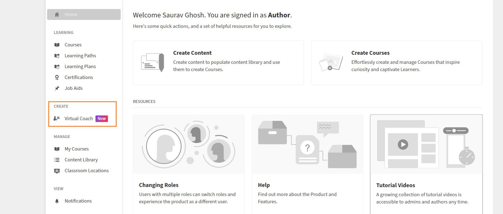
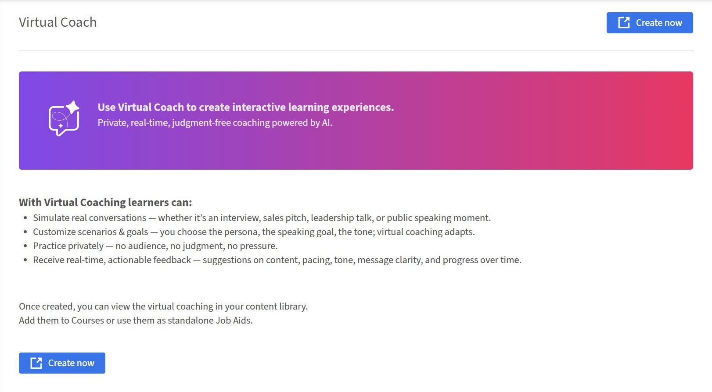
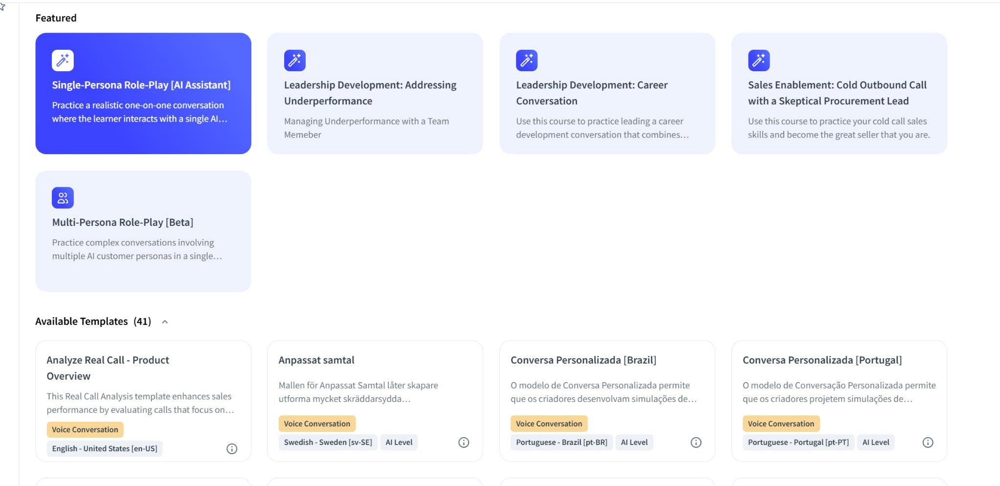
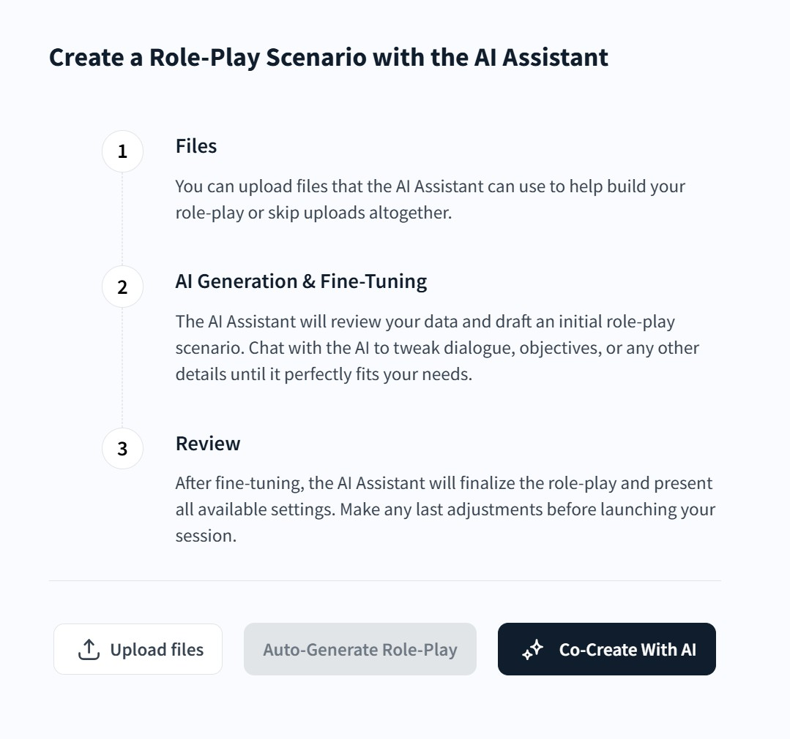
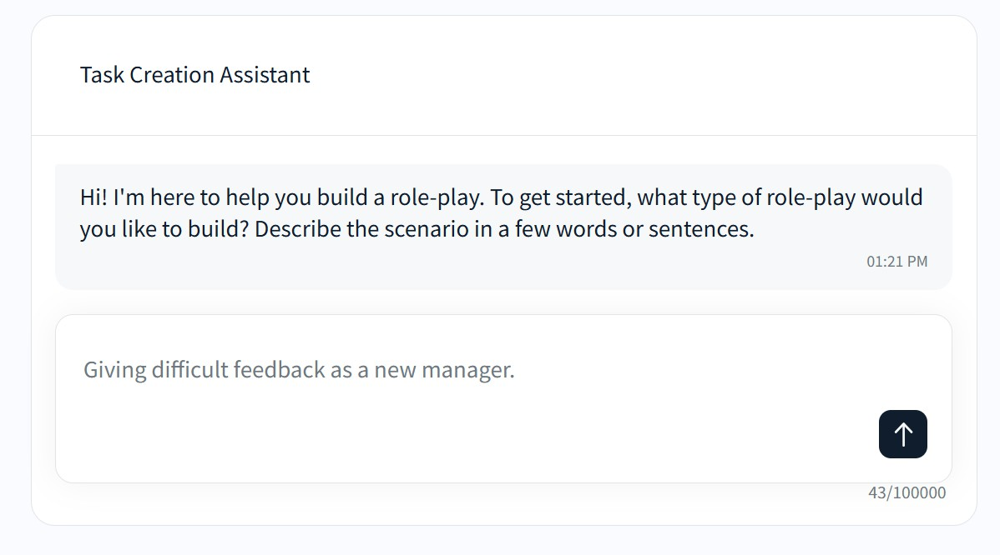
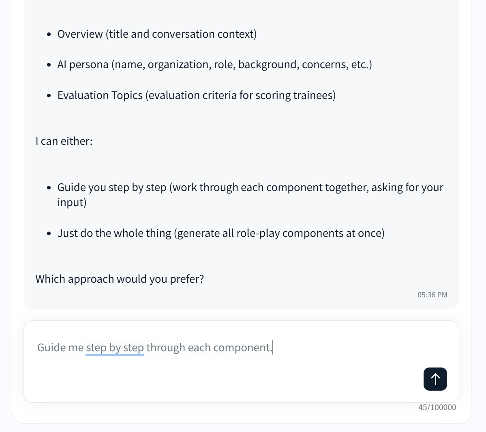
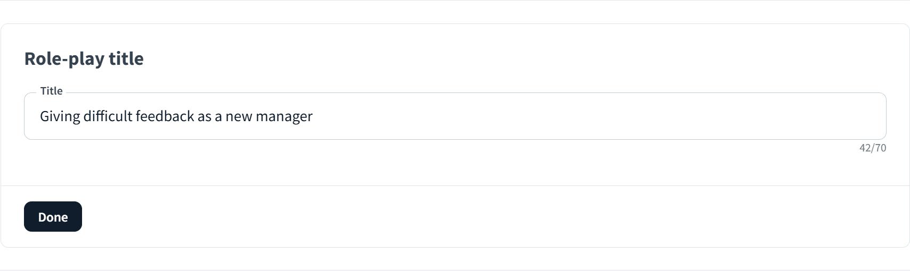

# Create and publish a Virtual Coach roleplay

Create, configure, and publish an AI roleplay scenario in Adobe Learning Manager so learners can practice real-world conversations as part of a course or job aid. Before you begin, confirm that Virtual Coach is enabled on your account and that you are signed in as an author.

## Add basic scenario details

1. Sign in to Adobe Learning Manager as an author.
2. Select **Virtual Coach** in the left navigation pane.
    
3. On the Virtual Coach page, select **Create now**.
    
4. Featured role-plays appear at the top of the page, and available templates appear below.
    
    
5. Select **Co-Create With AI** to begin the guided chat. The **Auto-Generate Role-Play** button becomes active only after you upload at least one file; it remains greyed out if you skip the previous step. Adobe Learning Manager displays a confirmation and warning message before proceeding with the generation of the roleplay.
6. Select **Generate** and the **Task Creation Assistant** appears.
7. Enter a description for your roleplay. Use a description that outlines the scenario, such as '_Handling price objections in enterprise sales_' or '_Giving difficult feedback as a new manager_'
    
8. Type some more description to give the AI more context about the roleplay.
    
9. Continue adding more information to the scenario or select **Approve content and continue**.

## Review and configure your roleplay settings

After the AI generates your scenario, the **Edit Role-Play** screen opens. Your progress is automatically saved, as shown by the **Saved** indicator in the upper-right corner. You can leave and return to this screen at any time without losing your work.

From here, you have three options on the right side of the screen:

* **Save** saves the current state without publishing. The roleplay is added to the **Available Templates** section of your **Virtual Coach** library, where you can return to edit it later.
* **Preview** runs a live test session so you can experience the roleplay as a learner before anyone else does. Use this to check that the persona sounds natural and the topics flow correctly.
* **Publish** adds the roleplay to the **Content Library** so it can be assigned to a course or job aid.

To make changes to the generated content without editing fields manually, select Edit with AI. This opens the AI chat interface and lets you describe the changes you want in plain language, for example, make the persona more formal or add a topic about pricing objections.
The Settings section below the AI editing banner is where you configure the persona, conversation opening, topics, scoring, and advanced options.

Change the roleplay title or type a new one.

## Create a role-play using a template

The **Featured** or **Available Templates** section contains a library of pre-built role-play scenarios covering a wide range of sales, leadership, and skills-assessment situations. Using a template is the fastest way to create a roleplay — the persona, conversation opening, topics, and scoring are already configured, and you can publish immediately or customize any detail before publishing.

Templates are organized by domain, simulation type, and language. Use the filters on the left to narrow the list by the interaction type you need, **Voice Conversation**, **Chat Conversation**, **Webcam Practice**, or **Real Call Analysis**, or search by keyword to find a scenario closest to your use case.

>[!NOTE]
>
>Selecting a template does not lock you into its default configuration. Every field, including the persona background, topics, scoring weights, and conversation opening, can be edited after you select the template. Treat templates as a starting point, not a final design.

1. Sign in to Adobe Learning Manager as an author.
2. Select **Virtual Coach** in the left navigation pane.
3. Select **Create now**.
4. Browse the **Available Templates** section or use the Search bar and domain, simulation type, and language filters to find a template that matches your scenario.
5. Select the template tile to open it. Review the persona, topics, and scoring configuration.
    
6. To use the template as-is, select **Publish**. To customize it first, select any section and edit the relevant fields before publishing.

Once published, the roleplay is added to the **Content Library** and is ready to be added to a job aid and assigned to a course.

