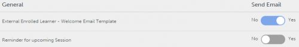

# Email templates {#email-templates}

Learning Manager Learning Programs are renamed to Learning Paths. This change happens immediately after the October 2021 release and the terminology of Learning Path is reflected for all roles.

Read this article to know how to configure email templates for events related to all the learning objects.

Learning Manager application sends email notifications to multiple roles of users based on events.

As an author, you can customize e-mail templates by adding or modifying content and sending notifications to users for various events triggered by learners, managers and author activities. For example, you can send a customized email whenever a learner enrolls into your course. On enrolling, the learner will receive the course specific email automatically.

You can also choose not to send e-mail notifications for certain events by disabling the email template option.

# Setting email notifications {#settingemailnotifications}

1. From the Author app, click the learning object for which you want to configure the email template. For example, Courses.
1. From the Learning Object page, click the course, certification, or learning program that you want to configure the email settings.
1. From the learning object details page, click Email Templates.

You can see the list of templates that are available for the learning object that you chose.

1. Click the event name to view the template in the preview mode.

You can customize each template by clicking the text in the body of the template. You can insert variables in the text by clicking the appropriate icons as shown in the snapshot. Hover your mouse over each icon to view the names.

The following variables are available:

* LPName
* LPCompletionDeadline
* LearnerName
* LearnerEmail
* CourseName
* CourseDescription
* CourseCompletionDeadline
* CourseSkillDetails
* CourseBadge

You can reset message to the default content by clicking Revert to Original link above the template.  
As you see at the top of the template you can customize the template for multiple roles (Manager, Learner, and so on)  depending upon the type of e-mail notification.

1. Click Save at the bottom of the templates page.
1. From the Email Templates page, click the Yes/No circular toggle button to send or disable the notification.

If the circle in the notification button against each event name is adjacent to Yes (with blue shade as background), then the notification is enabled. If it is in gray shade and the circle is adjacent to No, then the notification is disabled.

Whenever you configure an email template at the course level, it takes precedence over the administrator level settings for that particular course.
