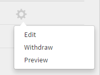

# Job Aids

**Job Aids** is a repository of training content that is accessible to learners without any enrollment or completion criteria. Learners can refer to these job aids to get assistance for performing any activity or task in an organization.

Job Aids can be consumed independently or along with course consumption in Learning Manager.

Authors can create Job Aids for learners. Use Job Aids to provide learners with reference material like tips, checklists, guides that they can use on an ongoing basis to complete their tasks.

## Create job aid {#createjobaid}

1. In author login, select **[!UICONTROL Job Aids]** at the left pane.
1. Select **[!UICONTROL Create]** at the upper-right corner of the page that appears.
1. Type the name, description, and tags. Choose the skills and associated levels. Select the content as private if you do not want the job aid to be accessed by any other authors for assigning to their respective courses.

   Only existing skills can be used for job aids. Skills are not mandatory.

1. Upload the job aid content at the content section.

   Videos, pdf, pptx and docx are the supported file formats for upload. Project zip files or any interactive content is not supported for upload.

1. Enter the duration, in minutes, for the job aid.
1. Click **[!UICONTROL Save]**.  

   The Job Aid is published.

## Add job aid in different languages {#addcontentfordifferentlanguages}

1. To add the job aid in different languages, select the **Add New Language** tab, and choose the required languages. Using this approach, you can add multi-lingual support for your content.

   

   *Add new language for a content*

1. Repeat the job aid upload process for the new languages.
1. If you want to remove a language, select the **[!UICONTROL Add New Language]** tab, and clear your selection.

   After you've made the changes, select Save.

## Types of supported job aids {#typesofsupportedjobaids}

The following are the file formats supported for job aids.

* PDF
* PPT
* PPTX
* XLS
* XLSX
* DOC
* DOCX
* All video file formats

>[!NOTE]
>
>Zip files and image files are not supported.

## Withdraw/re-publish job aids {#withdrawrepublishjobaids}

You can withdraw the published job aid by clicking settings icon adjacent to the job aid and choosing withdraw.

*Edit, withdraw, or preview a published Job Aid*

View withdrawn job aids by clicking the withdrawn tab. You can re-publish the withdrawn jobs by clicking settings icon and choosing Publish.

## Support for HTML packages in Job Aids

Job Aids now support standard HTML packages as a new type of content. With this enhancement, learners can open view and download the HTML package from within the Job Aid player. 

When creating a Job Aid, an Author can upload a standard HTML package along with other supported file formats.

*Support for HTML packages*

An HTML package must have the following:

* An Index.html file. 
* The Index.html file must reside in the root folder of a zip file. 

Specify the content to be uploaded as a zip file, within which the Index.html file is located. 

All the contents, resources and assets must be referenced within the HTML package and be accessible through Index.html.

## Frequently Asked Questions {#frequentlyaskedquestions}

+++How to create a job aid?

As an author, on the Job Aid page, click **[!UICONTROL Create]**. Add the required details and save the Job Aid.

After you create the Job Aid, you can add the Job Aid to a course, while creating the course.

+++

### More like this

* [Job Aids for Administrators](../../administrators/feature-summary/job-aids.md)
* [Job Aids for Learners](../../learners/feature-summary/job-aids.md)
