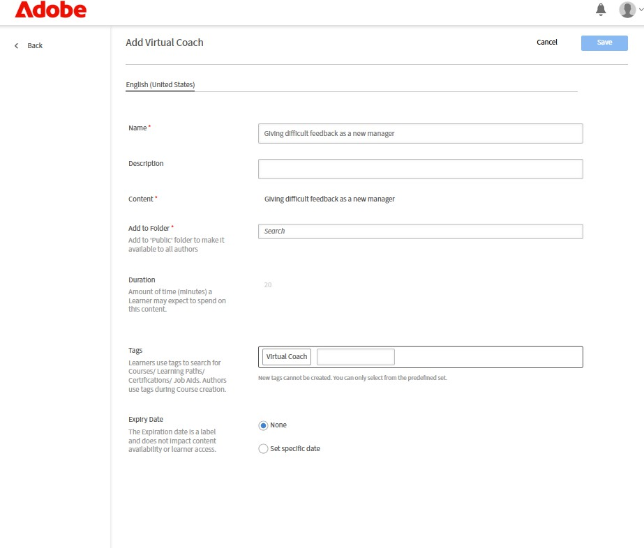
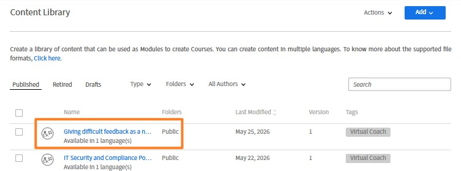
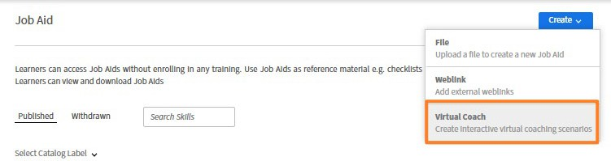
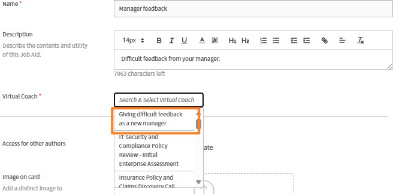
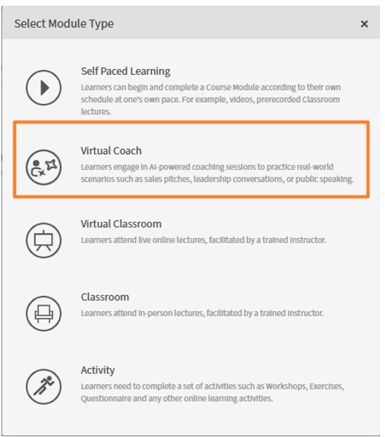
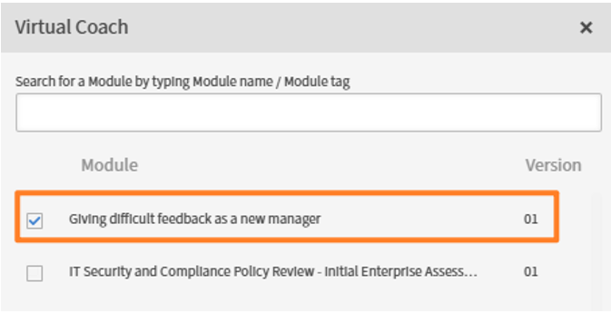

# Publish the Virtual Coach roleplay

After configuring the role-play options, select **Publish** to publish it. The role-play becomes a part of the Content Library.

Select the folder where you want to add the role-play. Select **Save**. The role-play is added to the Content Library.

## Add the roleplay as a Job Aid

Virtual Coach roleplays are not added to courses directly. Instead, you first publish the roleplay as a job aid, then add the job aid to a course as a module. This two-step process lets you reuse the same roleplay across multiple courses without duplicating it.

1. In the left navigation pane of the Author homepage, select **Job Aids**.  
2. Select **Create > Virtual Coach** at the upper-right corner.
      
3. Enter a name and description for the job aid.  
4. Select the **Virtual Coach**.
      
5. Set visibility:  
   - Leave the default **Shared** setting to allow other authors to assign this job aid to their courses.  
   - Select **Private** to restrict access to your courses.  
6. Optionally, enter the expected completion time in minutes in the **Duration** field.  
7. In the **Tags** field, enter keywords to make the job aid discoverable in search and the catalog.  
8. Optionally, assign skills and skill levels. Only skills that already exist in your Adobe Learning Manager account can be used. Skills cannot be created from this screen. Skills are not mandatory.  
9. Select **Save**. The job aid is published and available to add to a course.  

## Add the roleplay to a course

Once the job aid is published, you can add it to any course as a module. The roleplay appears to learners as part of the course sequence alongside other content such as videos, documents, or quizzes.

**Prerequisite:** The job aid must be published before it can be added to a course.

1. In the left navigation pane of the author homepage, select **Courses**.  
2. Open the course you want to add the roleplay to or select **Create** to start a new course.  
3. Add the course name and description.  
4. Navigate to the **Modules** section of the course editor.  
5. Select **Add Module** and then select **Virtual Coach**.
      
6. Search the Virtual Coach you have created and select it.  
    
7. Select **Add**.  
8. Configure the module's completion and success criteria according to your course design.  
9. Select **Save** to update the course.  

    >[!NOTE]
    >
    >A single job aid can be added to multiple courses. Any updates you make to the job aid, including changes to the roleplay content, are reflected automatically in all courses it has been added to. If the roleplay is part of a formal assessment, republish the job aid after making changes to ensure learners see the latest version.

10. Select **Publish** to publish the course and make it available for learners.
