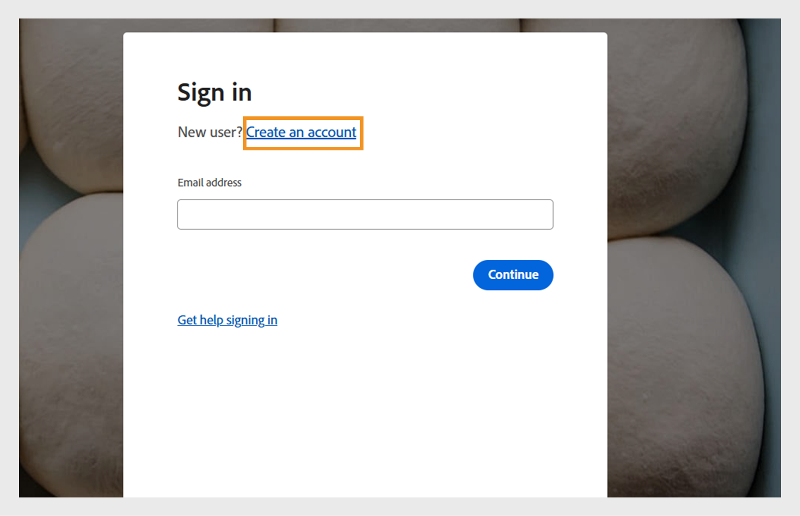

# Create a trial account in Adobe Learning Manager

You can easily set up a free 30-day trial account in Adobe Learning Manager to explore features and test learning workflows. This guide explains where to start, how to sign up, and how to find your account details once you're set up.

To create a trial account:

1. Go to [Adobe Learning Manager](https://business.adobe.com/products/learning-manager/adobe-learning-manager.html).
2. Select **[!UICONTROL Free 30-day trial]**.

   

3. Select **[!UICONTROL Create an account]** on the log in page.

   

4. Type your **[!UICONTROL Email address]** and **[!UICONTROL Password]**.
   
   

5. Type the following details and select **[!UICONTROL Create account]**:
    * First name
    * Last name
    * Date of birth

   

6. Type and complete the form with the required details to set up your trial account.
7. After setup, find your account ID in the URL of your Adobe Learning Manager URL.

   
   
