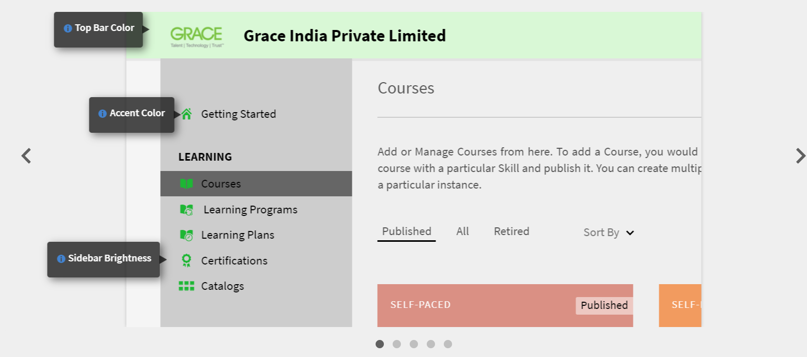

# Learning Manager Deployment Guide

## Introduction {#introduction}

Learning Manager is a Learning Management System (LMS) that allows training professionals to deliver engaging and trackable learning materials that can contribute to an organization's needs or goals. Learning Manager primarily allows trainers or managers to assign courses and other learning objects, in a specific order, for learners. This tool also offers several powerful features including a multi-format fluidic player, gamification, badges, easy-to-use learner dashboard. However, to leverage all these features, it is essential to first configure and setup Learning Manager.

This guide provides step-by-step instructions on how to get up and running with Learning Manager. This document also provides the configuration and setup information, in detail. Read on to know how to get started with Learning Manager.

## Who is this guide intended for? {#whoisthisguideintendedfor}

As a Learning Manager user, you can wear the hat of an administrator, author, instructor, manager, or a learner. This guide is meant for users who are likely to be involved in setting up an LMS for an organization or a client:

* **IT Administrator** -  As an IT Administrator, you might activate or integrate Learning Manager in your organization. An IT Administrator can also add single or multiple users, and can perform the role of an Integration Administrator or an administrator who integrates Learning Manager with third-party applications.
* **Author** - As a Learning Manager author, you can create learning content that are required for an organization's learning requirements. An author is involved in creating the basic content that is uploaded in Learning Manager. 

* **Learning Manager Administrator** - A Learning Manager Administrator performs the configuration and set-up activities related to the application. In some companies, an IT Administrator may also play the role of a Learning Manager Administrator.

## Get started with Learning Manager deployment {#getstartedwithcaptivateprimedeployment}

After you purchase Learning Manager, activate your Learning Manager account using the license key that you received. Proceed on to the following configurations, as indicated in the following visual:

 

## Configure your site in Learning Manager {#configureyoursiteincaptivateprime}

Before you start adding and implementing learning objects in Learning Manager, there are a few key configurations that are required. Start by configuring your site to suit your organization. Site configuration comprises of the following steps:

* Setting up branding and logo for your organization
* Configuring email templates
* Configuring basic account settings
* Configuring feedback settings
* Configuring learner dashboard settings

### Set up branding and logo {#setupbrandingandlogo}

As the administrator, you can set the branding and themes to match your organization's branding requirements. To set the branding and themes for your site, do the following:

### Setting the logo and banner: {#settingthelogoandbanner}

Use the logo and banner settings to display your company's logo in Learning Manager. Configure the branding options to set the company's domain in the URL, display the organization name, and display color schemes that match the organization's brand. To configure the branding settings:

* Log in to your Learning Manager account as an administrator.
* From the left pane, click **Branding**.
* On the Branding page, you can configure the following options by clicking **Edit** against the option that you want to modify:

  * **Organization Name** : The value that you specify here will determine the name that appears on the banner on each page of your site.
  * **Subdomain**: This value determines the URL for your site.
  * **Logo Styling**: The image in this field appears as the logo in the upper-right corner of each page. Here, you can either choose to display only the logo, or the name of your organization, or the logo and the name of the organization.

>[!NOTE]
>
>You can only configure the name and the logo using Branding. You cannot change the position of the logo or the image.

***Learning Manager supports the following file formats for logo images: .png, .jpeg, .jpg, .gif, .bmp***

### Setting the themes for your site {#settingthethemesforyoursite}

Learning Manager allows you to change the look and feel of your site using Themes. The application provides the following color themes for you to choose:

* Prime Default
* Pebbles
* Carnival
* Autumn
* Winter Sky

You can choose one of the color schemes to align with your corporate branding.

1. From the Learning Manager left navigation pane, click **[!UICONTROL Branding]**.
1. In the **Themes** section, click **[!UICONTROL Edit]**. The application allows you to pick a new theme. As you select a theme, you can immediately see the color schemes that are used for the key interface elements.

   

1. Further, you can edit the **Top Bar Color**, **Accent Color**, and the **Sidebar Brightness**.  You can use your own brand colors for these key interface elements.
1. To reset the values to the default color scheme for your theme, click **[!UICONTROL Reset Theme]**. The colors for the key UI elements are set to the default options for the chosen theme.
1. After you choose the theme, click **[!UICONTROL Show Hints]** to view the labels or hints in the preview.

   

   Notice a slideshow with several images in the **Themes** section. This slideshow allows you to instantly preview the theme or color scheme. You can instantly preview selected pages such as the Home page, Learner dashboard and so on.

1. If you want to preview the changes in a browser, click **[!UICONTROL Live Preview]**. A Live Theme Preview pop-up appears, where you can either modify the color scheme, or continue with the default options. To preview your options in a browser, click **[!UICONTROL Preview]** in this pop-up window.

   

1. The chosen options are temporarily applied to your site. If you want to save the selected theme and color settings, Click **[!UICONTROL Apply]**.
1. After you select and apply a theme, click ****[!UICONTROL Save]**** to save your choice.

## Configure email templates {#configureemailtemplates}

As an administrator, your next step would be to configure email templates for various events. You can enable, disable, and modify email templates that are to be sent to users. There are three main categories of email templates:

* General email templates: These emails are triggered for generic events. For example, a welcome notification when a user logs in for the first time.
* Email templates associated with a learning object or activity: These emails are sent to learners, authors, or managers whenever there is a learning activity. For example, emails that are triggered after course enrollment, classroom participation, course completion, and so on.
* Reminders and Updates: These emails are triggered when users need updates or reminders for any event. For example, a learner receiving a reminder for an upcoming course, or an administrator receiving an email notification for a report shared.

You can enable and configure any of these email notifications from the Administrator dashboard. To learn how to set email templates, perform the following steps:

1. In the left navigation pane, click **[!UICONTROL **Email Templates**.]**
1. Click one of the following tabs:**[!UICONTROL **General**/**Learning Activity**/**Reminders & Updates**.]** As an example, let us assume you click **[!UICONTROL **Learning Activity**.]**
1. Click the toggle button for whichever activity you want to trigger an email. In this example, let us assume you click **[!UICONTROL **Learning Program - Enrolled by Admin/Manager**.]**

   

   The system displays the "Enabled Successfully" pop-up message. Now, whenever a manager or an administrator enrolls a learner for a course, the learner receives an email from this Learning Manager account.

1. You can modify the default email template. To do so, click on the event. In this example, click **[!UICONTROL  Learning Program - Enrolled by Admin/Manager.]**
1. In the **[!UICONTROL Template Preview]** pop-up dialog box, notice that there are two tabs: [!UICONTROL Learner] and [!UICONTROL Manager].

   

   For each of these tabs, click on the email body to modify the content. To save the changes to the email template, click **[!UICONTROL Save]**.

   Now, whenever a learner is enrolled to a course by the manager or the administrator, the learner and his manager receive an email notification.

   ***Note: The modifications are applicable only for the email template associated with the selected event.***

1. Notice that you could not modify the Account URL or the Signature in the email template. To modify the **[!UICONTROL Account URL]** or **[!UICONTROL Signature]**, click the **[!UICONTROL Settings]** tab. In this tab, you can modify the Email banner, Email Signature, the Account URL.

   The account URL link is shown in all emails, just before the signature. Enter your preferred URL and click **[!UICONTROL Save]**. This URL is visible only to the internal users.

   For Email banner, you can change the color of the banner by selecting  **[!UICONTROL **Banner Background**.]** You can also use a custom image as a banner by selecting the **[!UICONTROL Custom Image]** option. Click  **[!UICONTROL Save]** after making the changes.

   ***Note: The custom image size for the Email banner must be 1240x200px. Images bigger than the recommended size are cropped.***

   ***Learning Manager only supports .jpg, .jpeg and .png file types for Email banners.***

   

1. You can also choose to enable Optional Manager Emails. If you select the **[!UICONTROL Enable]** checkbox, whenever a direct report receives an email from this Prime account, the manager is also included in the mailing list.

   ***Note: The settings in this tab are applicable for all the templates, globally.***

### Configure email templates for a learning object {#configureemailtemplatesforalearningobject}

Apart from setting email templates at a global level, as an administrator, you can also configure email templates for a specific learning object. In this case, any changes you make to the email template are applicable only for that learning object.

This option is also available for authors, when authors setup a learning object.

To configure email templates for a learning object:

1. Click the course, learning program, or certification for which you want to configure the email template.
1. From the left pane, click **[!UICONTROL **Email templates**.]** The system displays a ****[!UICONTROL Template Preview]**** pop-up dialog box.
1. Modify the subject or body of the email template, and click **[!UICONTROL **Save**]**to apply the changes.
1. To cancel the changes, click **[!UICONTROL **Revert to Original**.]**

### Restrict users from receiving emails {#restrictusersfromreceivingemails}

As an Administrator, you can select who will receive emails from Learning Manager and who will not. You can achieve this using the ****[!UICONTROL Restricted User]**** option under the ****[!UICONTROL Settings]** **tab. Users can be added to this list using their name, email id, or unique user id. The users listed under this option will be restricted from receiving any email communication from Learning Manager.

## Configure your account settings {#configureyouraccountsettings}

Learning Manager allows you to configure some account settings such as basic settings, feedback settings, general settings, and settings for the Learner dashboard. The following procedures tell you how to configure each of these settings:

### Configure basic settings {#configurebasicsettings}

1. In the Learning Manager Home page, click ****[!UICONTROL Settings]****. By default, the system displays the Basic Info page, with the default language and location fields.
1. Click ****[!UICONTROL Change]**** at the upper-right corner of the page to edit the Basic Info.
1. Configure the following options:

   * **Country**: Select the country from this drop-down field.
   * **Timezone**: Set the appropriate Timezone for your location.
   * **Locale**: Select the language of your choice. If you change the language in this field, the change is applied for all the users who use this application. However, individually, each user can modify the language of preference.   
   * **Financial year starts from**: Select the month when the financial year for your organization starts.

    

   

## Configure feedback settings {#configurefeedbacksettings}

Learning Manager allows you to gather feedback for a course from learners. It is also possible to gather feedback about learners using Learning Manager. To solicit feedback, you must first configure L1 and L3 types of feedback.

L3 feedback is the feedback that a manager provides about a learner. You can use this type feedback to track learners' performance over time. L1 feedback is the feedback that a learner provides about a course. This type of feedback helps an administrator gather direct feedback about a course.

As an administrator, you can configure the feedback settings globally. To do so, follow this procedure:

1. In the Learning Manager Home page, click **[!UICONTROL Settings]**.
1. In the left pane, click **[!UICONTROL General]**.
1. To configure L1 feedback, click the **[!UICONTROL L1 Feedback]** tab. You see the options to configure one mandatory question and several optional questions. These are the questions that a learner views while provide feedback after completing a course. The questions are worded as statements so that learners can select their response on a scale of 1 to 5.

   The first part of the L1 feedback is a mandatory question on how it is for a learner to recommend this course to a friend or a colleague.

   ***Note: You cannot edit or modify the mandatory question.***

   

1. To configure the other questions for your feedback questionnaire, click the questions in the ****[!UICONTROL Self-Paced Courses]****, or ****[!UICONTROL Classroom Courses]****. When you click a question, the system allows you to edit the default questions.

    

   

1. You can either enable or disable the default questions, or completely modify the default questions to suit your requirement. For example, you can remove the default question "The training matter was relevant to me.", and add replace the question with "I found the training to be useful and relevant."
1. After you finalize the questions for learners, you can configure the reminder settings. By default, there is an existing reminder, where the application sends automatic reminders to learners on successful completion of a course. This reminder is also set to recur every two weeks until the learner responds. You can either modify the existing reminder by clicking on the reminder, or add a new reminder.

   

1. Configure the reminder settings by completing the following options:

   * **When to send**: Specify whether you want to send the feedback request either on course completion or after course completion.
   * **Days after completion**: Specify the number of days after which you want to send the feedback request. This field is visible only if selected ****[!UICONTROL After course completion]****.
   
   * **Recurrence**: Specify whether you want to send the feedback reminder every day, every week, or every month. You can also specify for how many weeks you want the reminder to be sent.

1. Click the tick mark to save your reminder settings.
1. After you finalize all the feedback settings, click **[!UICONTROL **Save**]**on the upper-right corner of the page.

## Configure L3 Feedback: {#configurel3feedback}

L3 Feedback contains the questions that are sent to a learner's manager after the learner completes a course. L3 Feedback enables an administrator to track changes in the behavior or skill of a learner over time. To configure this feedback, on the Feedback page, click the ****[!UICONTROL L3 Feedback]**** tab. You see one, default question. The manager must answer this question using a five-point rating scale. 

Similar to the L1 Feedback, you can configure the reminders for L3 feedback. You can either modify the existing reminder, or add a new feedback reminder.

After you finalize the feedback question and the reminder settings, click ****[!UICONTROL Save]**** to apply your settings.

## Configure feedback at an instance level {#configurefeedbackataninstancelevel}

The previous procedure outlined the steps to configure the feedback settings at a global level. That is, the settings are applied to all the courses. In addition to these global questions, as an administrator or an author, you can configure additional L1 and L3 feedback questions at an instance level.

To configure the feedback settings at an instance level:

1. On the Learning Manager Home page, click **[!UICONTROL Courses]**.
1. Hover over the course where you want to configure the feedback settings. Click [!UICONTROL **View Course**.]

   

1. In the course details page, click **[!UICONTROL Instance Defaults]** in the Configure section. 
1. In the [!UICONTROL **Language**] drop-down list, select the language in which you want the feedback questionnaire to be displayed.
1. Enable the L1 Reaction Feedback if you want to solicit feedback from learners. You can add up to two questions in this section. Leaners can provide descriptive answers to these questions.
1. Select the **[!UICONTROL Make Mandatory]** check box if you want to make either or both questions mandatory.
1. Select the **[!UICONTROL Show questionnaire immediately after course completion]** if you want learners to view the feedback questionnaire immediately after they complete the course.

   

1. To configure the L3 Behavior Change feedback at an instance level, ****[!UICONTROL Enable]**** the L3 Feedback. The application displays a predefined, mandatory question and a blank question where you can enter a question of your choice.
1. For the predefined question on the learner's improvement after taking the course, the answer is in the Likert Scale format. That is, managers must choose an option on a scale of Strongly Agree to Strongly Disagree.
1. Specify the second question for the manager. Managers can provide a descriptive answer to this question.
1. Select the ****[!UICONTROL Make Mandatory]**** check box if you want to make the second question mandatory.

   

1. Optionally configure the reminder settings at the instance level. If you do not configure reminder settings here, the global reminder settings are automatically assigned.
1. After you finalize the feedback questions and the reminder settings, click **[!UICONTROL **Save**]**to apply your settings.

   ***Note: Feedback settings are not applicable for certifications.***

## Configure general settings {#configuregeneralsettings}

The general settings in Learning Manager allows administrators to configure generic settings that affect other features in the application. For example, you can use general settings to specify whether course effectiveness can be made visible to learners. To configure the general settings:

1. In the Learning Manager Home page, click ****[!UICONTROL Settings]****.
1. In the left pane, click ****[!UICONTROL General]****.
1. In the General settings page, you can configure the following options:

   For all these options, the feature each option affects is varied. We can give crosslinks to each of the detailed feature if required.

   * **Show Course Effectiveness**: Enable this option if you want learners to see the effectiveness of a course on the course title.
   * **Module Reset Option**: Enable this option if you want to give learners the ability to reset a module. Learners can then reset their modules if they have failed, or if they have partially completed the module and want to start again.
   * **Course Moderation**: Enable this option if you want the changes to a course to be approved by an administrator before the changes are visible to learners.
   * **Discussion Board**: Enable this option if you want learners to view and participate in discussion boards for courses. If you enable the **Discussion Board** check box, learners and instructors can post comments for courses. However, if course level settings indicate that this feature is not selected, then the course level settings take precedence over administrator settings.
   
   * **Explore Skills Option**: Enable this option if you want learners to explore peer and leadership skills.
   * **Unique Learning Objects IDs**: Enable this option if you want to provide authors the ability to add unique IDs to learning objects.
   * **Show Catalog Listing**: Enable this option if you want learners to see all the catalogs that are available. This option helps learners refine their learning object listing.

    

   

## Configure Learner Dashboard settings {#configurelearnerdashboardsettings}

Learner Dashboard in Learning Manager allows learners to view their mandatory and recommended courses apart from their achievements, skills, and announcements. Administrators can decide how this Learner Dashboard should appear, by configuring the Learner Dashboard settings. These settings decide allows administrators to set the widgets on the Learner page. These settings also specify how and where the widgets are placed on the Learner Dashboard. As an administrator, you can preview the layout of the Learner Dashboard before applying the settings.

1. In the Learning Manager Home page, click **[!UICONTROL Settings]**.
1. In the left navigation pane, click **[!UICONTROL **Learner Dashboard**.]**
1. Select the widgets that you want to enable. If you deselect a widget, the widget is immediately removed from the preview. Learners cannot see this widget in their dashboard.
1. Click ****[!UICONTROL Save]**** to apply the settings.

   

1. To apply the default settings, click **[!UICONTROL Restore to Default.]** In this case, all the widgets except **[!UICONTROL Welcome and Sticky Announcements]** are visible.

   ***Even after you enable the Learner Dashboard settings, learners can modify and move around widgets in their respective dashboards.***

